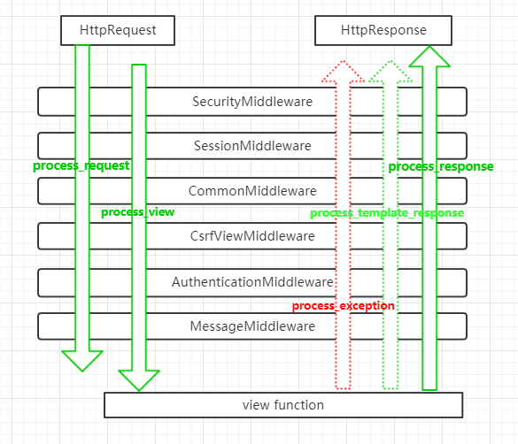
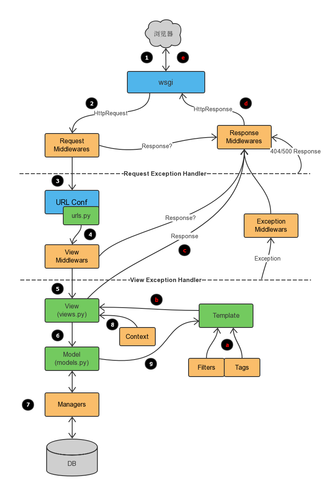

# Django中间件

------

中间件是 Django 用来处理请求和响应的钩子框架。它是一个轻量级的、底层级的“插件”系统，用于全局性地控制Django 的输入或输出，可以理解为内置的app或者小框架。

在`django.core.handlers.base`模块中定义了如何接入中间件，这也是学习Django源码的入口之一。

每个中间件组件负责实现一些特定的功能。例如，Django 包含一个中间件组件 `AuthenticationMiddleware`，它使用会话机制将用户与请求request关联起来。

中间件可以放在你的工程的任何地方，并以Python路径的方式进行访问。

Django 具有一些内置的中间件，并自动开启了其中的一部分，我们可以根据自己的需要进行调整。

## 一、如何启用中间件

若要启用中间件组件，请将其添加到 Django 配置文件`settings.py`的 `MIDDLEWARE` 配置项列表中。

在 `MIDDLEWARE` 中，中间件由字符串表示。这个字符串以圆点分隔，指向中间件工厂的类或函数名的完整 Python 路径。下面是使用 `django-admin startproject`命令创建工程后，默认的中间件配置：

```
MIDDLEWARE = [
    'django.middleware.security.SecurityMiddleware',
    'django.contrib.sessions.middleware.SessionMiddleware',
    'django.middleware.common.CommonMiddleware',
    'django.middleware.csrf.CsrfViewMiddleware',
    'django.contrib.auth.middleware.AuthenticationMiddleware',
    'django.contrib.messages.middleware.MessageMiddleware',
    'django.middleware.clickjacking.XFrameOptionsMiddleware',
]
```

实际上在Django中可以不使用任何中间件，如果你愿意的话，`MIDDLEWARE` 配置项可以为空。但是强烈建议至少使用 `CommonMiddleware`。而笔者的建议是保持默认的配置，这有助于你提高网站的安全性。

## 二、 中间件最关键的顺序问题

`MIDDLEWARE` 的顺序很重要，具有先后关系，因为有些中间件会依赖其他中间件。例如： `AuthenticationMiddleware` 需要在会话中间件中存储的经过身份验证的用户信息，因此它必须在 `SessionMiddleware` 后面运行 。

**在请求阶段，调用视图之前，Django 按照定义的顺序执行中间件 `MIDDLEWARE`，自顶向下。**

你可以把它想象成一个`洋葱`：每个中间件类都是一个“皮层”，它包裹起了洋葱的核心--`实际业务视图`。如果请求通过了洋葱的所有`中间件`层，一直到内核的视图，那么**响应将在返回的过程中以相反的顺序再通过每个中间件层，最终返回给用户**。

**如果某个层的执行过程认为当前的请求应该被拒绝，或者发生了某些错误，导致短路，直接返回了一个响应，那么剩下的中间件以及核心的视图函数都不会被执行。**

## 三、Django内置的中间件

Django内置了下面这些中间件，满足了我们一般的需求：

### Cache

缓存中间件

如果启用了该中间件，Django会以`CACHE_MIDDLEWARE_SECONDS` 配置的参数进行全站级别的缓存。

### Common

通用中间件

该中间件为我们提供了一些便利的功能：

- 禁止`DISALLOWED_USER_AGENTS`中的用户代理访问服务器
- 自动为URL添加斜杠后缀和`www`前缀功能。如果配置项 `APPEND_SLASH` 为`True` ，并且访问的URL 没有斜杠后缀，在URLconf中没有匹配成功，将自动添加斜杠，然后再次匹配，如果匹配成功，就跳转到对应的url。 `PREPEND_WWW` 的功能类似。
- 为非流式响应设置`Content-Length`头部信息。

作为展示的例子，这里额外贴出它的源代码，位于django.middleware.common模块中，比较简单，很容易读懂和理解：

```
class CommonMiddleware(MiddlewareMixin):
    """
    去掉了doc
    """
    response_redirect_class = HttpResponsePermanentRedirect

    def process_request(self, request):
        # Check for denied User-Agents
        if 'HTTP_USER_AGENT' in request.META:
            for user_agent_regex in settings.DISALLOWED_USER_AGENTS:
                if user_agent_regex.search(request.META['HTTP_USER_AGENT']):
                    raise PermissionDenied('Forbidden user agent')

        # Check for a redirect based on settings.PREPEND_WWW
        host = request.get_host()
        must_prepend = settings.PREPEND_WWW and host and not host.startswith('www.')
        redirect_url = ('%s://www.%s' % (request.scheme, host)) if must_prepend else ''

        # Check if a slash should be appended
        if self.should_redirect_with_slash(request):
            path = self.get_full_path_with_slash(request)
        else:
            path = request.get_full_path()

        # Return a redirect if necessary
        if redirect_url or path != request.get_full_path():
            redirect_url += path
            return self.response_redirect_class(redirect_url)

    def should_redirect_with_slash(self, request):

        if settings.APPEND_SLASH and not request.path_info.endswith('/'):
            urlconf = getattr(request, 'urlconf', None)
            return (
                not is_valid_path(request.path_info, urlconf) and
                is_valid_path('%s/' % request.path_info, urlconf)
            )
        return False

    def get_full_path_with_slash(self, request):

        new_path = request.get_full_path(force_append_slash=True)
        if settings.DEBUG and request.method in ('POST', 'PUT', 'PATCH'):
            raise RuntimeError(
                "You called this URL via %(method)s, but the URL doesn't end "
                "in a slash and you have APPEND_SLASH set. Django can't "
                "redirect to the slash URL while maintaining %(method)s data. "
                "Change your form to point to %(url)s (note the trailing "
                "slash), or set APPEND_SLASH=False in your Django settings." % {
                    'method': request.method,
                    'url': request.get_host() + new_path,
                }
            )
        return new_path

    def process_response(self, request, response):
        # If the given URL is "Not Found", then check if we should redirect to
        # a path with a slash appended.
        if response.status_code == 404:
            if self.should_redirect_with_slash(request):
                return self.response_redirect_class(self.get_full_path_with_slash(request))

        if settings.USE_ETAGS and self.needs_etag(response):
            warnings.warn(
                "The USE_ETAGS setting is deprecated in favor of "
                "ConditionalGetMiddleware which sets the ETag regardless of "
                "the setting. CommonMiddleware won't do ETag processing in "
                "Django 2.1.",
                RemovedInDjango21Warning
            )
            if not response.has_header('ETag'):
                set_response_etag(response)

            if response.has_header('ETag'):
                return get_conditional_response(
                    request,
                    etag=response['ETag'],
                    response=response,
                )
        # Add the Content-Length header to non-streaming responses if not
        # already set.
        if not response.streaming and not response.has_header('Content-Length'):
            response['Content-Length'] = str(len(response.content))

        return response

    def needs_etag(self, response):
        """Return True if an ETag header should be added to response."""
        cache_control_headers = cc_delim_re.split(response.get('Cache-Control', ''))
        return all(header.lower() != 'no-store' for header in cache_control_headers)
```

### GZip

内容压缩中间件

用于减小响应体积，降低带宽压力，提高传输速度。

该中间件必须位于其它所有需要读写响应体内容的中间件之前。

如果存在下面情况之一，将不会压缩响应内容：

- 内容少于200 bytes
- 已经设置了 `Content-Encoding` 头部属性
- 请求的 `Accept-Encoding` 头部属性未包含 `gzip`.

可以使用 `gzip_page()`装饰器，为视图单独开启GZip压缩服务。

### Conditional GET

有条件的GET访问中间件，很少使用。

### Locale

本地化中间件

用于处理国际化和本地化，语言翻译。

### Message

消息中间件

基于cookie或者会话的消息功能，比较常用。

### Security

安全中间件

`django.middleware.security.SecurityMiddleware`中间件为我们提供了一系列的网站安全保护功能。主要包括下列所示，可以单独开启或关闭：

- `SECURE_BROWSER_XSS_FILTER`
- `SECURE_CONTENT_TYPE_NOSNIFF`
- `SECURE_HSTS_INCLUDE_SUBDOMAINS`
- `SECURE_HSTS_PRELOAD`
- `SECURE_HSTS_SECONDS`
- `SECURE_REDIRECT_EXEMPT`
- `SECURE_SSL_HOST`
- `SECURE_SSL_REDIRECT`

### Session

会话中间件，非常常用。

### Site

站点框架。

这是一个很有用，但又被忽视的功能。

它可以让你的Django具备多站点支持的功能。

通过增加一个`site`属性，区分当前request请求访问的对应站点。

无需多个IP或域名，无需开启多个服务器，只需要一个site属性，就能搞定多站点服务。

### Authentication

认证框架

Django最主要的中间件之一，提供用户认证服务。

### CSRF protection

提供CSRF防御机制的中间件

### `X-Frame-Options`

点击劫持防御中间件

## 四、自定义中间件

有时候，为了实现一些特定的需求，我们可能需要编写自己的中间件。

**在编写方式上，需要注意的是，当前Django版本2.2，存在两种编写的方式。一种是Django当前官网上提供的例子，一种是老版本的方式。**本质上，两种方式其实是一样的。

我们先看一下传统的，也是技术文章最多，目前使用最多的方式。

### 传统的方法

#### 五大钩子函数

传统方式自定义中间件其实就是在编写五大钩子函数：

- process_request(self,request)
- process_response(self, request, response)
- process_view(self, request, view_func, view_args, view_kwargs)
- process_exception(self, request, exception)
- process_template_response(self,request,response)

可以实现其中的任意一个或多个！

| 钩子函数                  | 执行时机                                          | 执行顺序       | 返回值                     |
| ------------------------- | ------------------------------------------------- | -------------- | -------------------------- |
| process_request           | 请求刚到来，执行视图之前                          | 配置列表的正序 | None或者HttpResponse对象   |
| process_response          | 视图执行完毕，返回响应时                          | 逆序           | HttpResponse对象           |
| process_view              | process_request之后，路由转发到视图，执行视图之前 | 正序           | None或者HttpResponse对象   |
| process_exception         | 视图执行中发生异常时                              | 逆序           | None或者HttpResponse对象   |
| process_template_response | 视图刚执行完毕，process_response之前              | 逆序           | 实现了render方法的响应对象 |

##### `process_request()`

签名：`process_request(request)`

最主要的钩子！

只有一个参数，也就是request请求内容，和视图函数中的request是一样的。所有的中间件都是同样的request，不会发生变化。它的返回值可以是None也可以是HttpResponse对象。返回None的话，表示一切正常，继续走流程，交给下一个中间件处理。返回HttpResponse对象，则发生短路，不继续执行后面的中间件，也不执行视图函数，而将响应内容返回给浏览器。

##### `process_response()`

签名：`process_response(request, response)`

最主要的钩子！

有两个参数，request和response。request是请求内容，response是视图函数返回的HttpResponse对象。该方法的返回值必须是一个HttpResponse对象，不能是None。

process_response()方法在视图函数执行完毕之后执行，并且按配置顺序的逆序执行。

##### `process_view()`

签名：`process_view(request, view_func, view_args, view_kwargs)`

- `request` ： `HttpRequest` 对象。
- `view_func` ：真正的业务逻辑视图函数（不是函数的字符串名称）。
- `view_args` ：位置参数列表
- `view_kwargs` ：关键字参数字典

请务必牢记：**`process_view()` 在Django调用真正的业务视图之前被执行，并且以正序执行**。当process_request()正常执行完毕后，会进入urlconf路由阶段，并查找对应的视图，在执行视图函数之前，会先执行`process_view()` 中间件钩子。

这个方法必须返回`None` 或者一个 `HttpResponse` 对象。如果返回的是None，Django将继续处理当前请求，执行其它的 `process_view()` 中间件钩子，最后执行对应的视图。如果返回的是一个 `HttpResponse` 对象，Django不会调用业务视图，而是执行响应中间件，并返回结果。

##### `process_exception()`

签名：`process_exception(request, exception)`

- `request`：`HttpRequest`对象
- `exception`：视图函数引发的具体异常对象

当一个视图在执行过程中引发了异常，Django将自动调用中间件的 `process_exception()`方法。 `process_exception()` 要么返回一个 `None` ，要么返回一个 `HttpResponse` 对象。如果返回的是`HttpResponse`对象 ，模板响应和响应中间件将被调用 ，否则进行正常的异常处理流程。

同样的，此时也是以逆序的方式调用每个中间件的 `process_exception`方法，以短路的机制。

##### `process_template_response()`

签名：`process_template_response(request, response)`

`request`：`HttpRequest` 对象

`response` ： `TemplateResponse` 对象

`process_template_response()` 方法在业务视图执行完毕后调用。

正常情况下一个视图执行完毕，会渲染一个模板，作为响应返回给用户。使用这个钩子方法，你可以重新处理渲染模板的过程，添加你需要的业务逻辑。

对于 `process_template_response()`方法，也是采用逆序的方式进行执行的。

#### 钩子方法执行流程

（注：所有图片来自网络，侵删！）

一个理想状态下的中间件执行过程，可能只有`process_request()`和`process_response()`方法，其流程如下：


**一旦任何一个中间件返回了一个HttpResponse对象，立刻进入响应流程！要注意，未被执行的中间件，其响应钩子方法也不会被执行，这是一个短路，或者说剥洋葱的过程。**

如果有`process_view`方法的介入，那么会变成下面的样子：


总的执行流程和机制如下图所示：



仔细研究一下下面的执行流程，能够加深你对中间件的理解。



#### 实例演示

介绍完了理论，下面通过实际的例子来演示一下。

要注意，之所以被称为传统的方法，是因为这里要导入一个将来会被废弃的父类，也就是：

```
from django.utils.deprecation import MiddlewareMixin
```

`deprecation`是废弃、贬低、折旧、反对的意思，也就是说，这个`MiddlewareMixin`类将来应该会被删除！

我们看一下`MiddlewareMixin`的源码：

```
class MiddlewareMixin:
    def __init__(self, get_response=None):
        self.get_response = get_response
        super().__init__()

    def __call__(self, request):
        response = None
        if hasattr(self, 'process_request'):
            response = self.process_request(request)
        if not response:
            response = self.get_response(request)
        if hasattr(self, 'process_response'):
            response = self.process_response(request, response)
        return response
```

这个类并没有自己定义五大钩子方法，而是定义了`__call__`方法，通过hasattr的反射，寻找`process_request`等钩子函数是否存在，如果存在就执行。它的本质和后面要介绍的Django官网提供的例子，也就是新的写法是一样的！

现在，假设我们有一个app叫做midware，在其中创建一个middleware.py模块，写入下面的代码：

```
from django.utils.deprecation import MiddlewareMixin


class Md1(MiddlewareMixin):

    def process_request(self,request):
        print("Md1处理请求")

    def process_response(self,request,response):
        print("Md1返回响应")
        return response

    def process_view(self, request, view_func, view_args, view_kwargs):

        print("Md1在执行%s视图前" %view_func.__name__)

    def process_exception(self,request,exception):
        print("Md1处理视图异常...")


class Md2(MiddlewareMixin):

    def process_request(self,request):
        print("Md2处理请求")

    def process_response(self,request,response):
        print("Md2返回响应")
        return response

    def process_view(self, request, view_func, view_args, view_kwargs):

        print("Md2在执行%s视图前" %view_func.__name__)

    def process_exception(self,request,exception):
        print("Md2处理视图异常...")
```

然后，我们就可以在setting.py中配置这两个自定义的中间件了：

```
MIDDLEWARE = [
    'django.middleware.security.SecurityMiddleware',
    'django.contrib.sessions.middleware.SessionMiddleware',
    'django.middleware.common.CommonMiddleware',
    'django.middleware.csrf.CsrfViewMiddleware',
    'django.contrib.auth.middleware.AuthenticationMiddleware',
    'django.contrib.messages.middleware.MessageMiddleware',
    'django.middleware.clickjacking.XFrameOptionsMiddleware',
    'midware.middleware.Md1',
    'midware.middleware.Md2',
]
```

在midware/views.py中创建一个简单的视图：

```
from django.shortcuts import render, HttpResponse


def mid_test(request):
    print('执行视图mid_test')
    # raise
    return HttpResponse('200,ok')
```

其中的raise可以用来测试process_exception()钩子。

编写一条urlconf，用来测试视图，比如：

```
from midware import views as mid_views

urlpatterns = [
    path('midtest/', mid_views.mid_test),
]
```

重启服务器，访问`...../midtest/`，可以在控制台看到如下的信息：

```
Md1处理请求
Md2处理请求
Md1在执行mid_test视图前
Md2在执行mid_test视图前
执行视图mid_test
Md2返回响应
Md1返回响应
```

### Django官方方法

在Django的官方文档中（当前2.2），我们可以看到一种完全不同的编写方式。

**这种编写方式省去了`process_request()`和`process_response()`方法的编写，将它们直接集成在一起了。**

**这种方式是官方推荐的方式！**

中间件本质上是一个可调用的对象（函数、方法、类），它接受一个请求（request），并返回一个响应（response）或者None，就像视图一样。其初始化参数是一个名为`get_response`的可调用对象。

中间件可以被写成下面这样的函数（下面的语法，本质上是一个Python装饰器，不推荐这种写法）：

```
def simple_middleware(get_response):
    # 配置和初始化

    def middleware(request):

        # 在这里编写具体业务视图和随后的中间件被调用之前需要执行的代码

        response = get_response(request)

        # 在这里编写视图调用后需要执行的代码

        return response

    return middleware
```

或者写成一个类（真.推荐形式），这个类的实例是可调用的，如下所示：

```
class SimpleMiddleware:
    def __init__(self, get_response):
        self.get_response = get_response
         # 配置和初始化

    def __call__(self, request):

        # 在这里编写视图和后面的中间件被调用之前需要执行的代码
        # 这里其实就是旧的process_request()方法的代码

        response = self.get_response(request)

        # 在这里编写视图调用后需要执行的代码
        # 这里其实就是旧的process_response()方法的代码

        return response
```

（是不是感觉和前面的`MiddlewareMixin`类很像？）

Django 提供的 `get_response` 方法可能是一个实际视图（如果当前中间件是最后列出的中间件），或者是列表中的下一个中间件。我们不需要知道或关心它到底是什么，它只是代表了下一步要进行的操作。

两个注意事项：

- Django仅使用 `get_response` 参数初始化中间件，因此不能为 `__init__()` 添加其他参数。
- 与每次请求都会调用 `__call__()` 方法不同，当 Web 服务器启动后，`__init__()` 只被调用*一次*。

#### 实例演示

我们只需要把前面的Md1和Md2两个中间件类修改成下面的代码就可以了：

```
class Md1:
    def __init__(self, get_response):
        self.get_response = get_response

    def __call__(self, request):

        print("Md1处理请求")

        response = self.get_response(request)

        print("Md1返回响应")

        return response

    def process_view(self, request, view_func, view_args, view_kwargs):

        print("Md1在执行%s视图前" %view_func.__name__)

    def process_exception(self,request,exception):
        print("Md1处理视图异常...")


class Md2:
    def __init__(self, get_response):
        self.get_response = get_response

    def __call__(self, request):
        print("Md2处理请求")

        response = self.get_response(request)

        print("Md2返回响应")

        return response

    def process_view(self, request, view_func, view_args, view_kwargs):
        print("Md2在执行%s视图前" % view_func.__name__)

    def process_exception(self, request, exception):
        print("Md2处理视图异常...")
```

可以看到，我们不再需要继承`MiddlewareMixin`类。

实际执行结果是一样的。

## 应用实例一：IP拦截

如果我们想限制某些IP对服务器的访问，可以在settings.py中添加一个BLACKLIST（全大写）列表，将被限制的IP地址写入其中。

然后，我们就可以编写下面的中间件了：

```
from django.http import HttpResponseForbidden
from django.conf import settings

class BlackListMiddleware():

    def __init__(self, get_response):
        self.get_response = get_response

    def __call__(self, request):

        if request.META['REMOTE_ADDR'] in getattr(settings, "BLACKLIST", []):
            return HttpResponseForbidden('<h1>该IP地址被限制访问！</h1>')

        response = self.get_response(request)

        return response
```

具体的中间件注册、视图、url就不再赘述了。

## 应用实例二：DEBUG页面

**网站上线正式运行后，我们会将DEBUG改为 False，这样更安全。但是发生服务器5xx系列错误时，管理员却不能看到错误详情，调试很不方便。有没有办法比较方便地解决这个问题呢？**

- 普通访问者看到的是500错误页面
- 管理员看到的是错误详情Debug页面

利用中间件就可以做到！代码如下：

```
import sys
from django.views.debug import technical_500_response
from django.conf import settings


class DebugMiddleware():

    def __init__(self, get_response):
        self.get_response = get_response

    def __call__(self, request):

        response = self.get_response(request)

        return response

    def process_exception(self, request, exception):
        # 如果是管理员，则返回一个特殊的响应对象，也就是Debug页面
        # 如果是普通用户，则返回None，交给默认的流程处理
        if request.user.is_superuser or request.META.get('REMOTE_ADDR') in settings.ADMIN_IP:
            return technical_500_response(request, *sys.exc_info())
```

这里通过if判断，当前登录的用户是否超级管理员，或者当前用户的IP地址是否在管理员IP地址列表中。符合两者之一，即判断当前用户有权限查看Debug页面。

接下来注册中间件，然后在测试视图中添加一行raise。再修改settings.py，将Debug设为False，提供`ALLOWED_HOSTS = ["*"]`，设置比如`ADMIN_IP = ['192.168.0.100']`，然后启动服务器`0.0.0.0:8000`，从不同的局域网IP来测试这个中间件。

正常情况下，管理员应该看到类似下面的Debug页面：

```
RuntimeError at /midtest/
No active exception to reraise
Request Method: GET
Request URL:    http://192.168.0.100:8000/midtest/
Django Version: 2.0.7
Exception Type: RuntimeError
Exception Value:    
No active exception to reraise
.....
```

而普通用户只能看到：

```
A server error occurred.  Please contact the administrator.
```