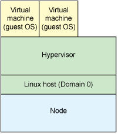
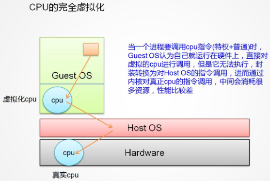
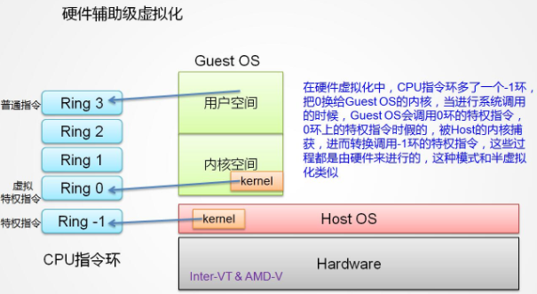
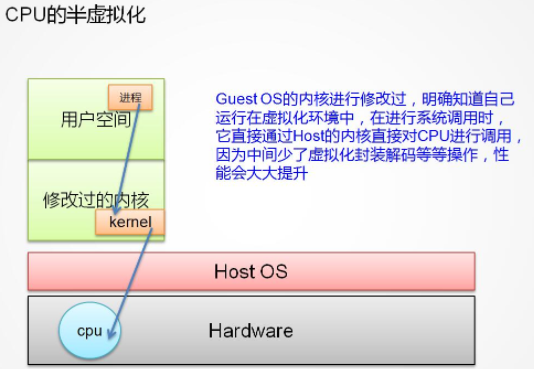
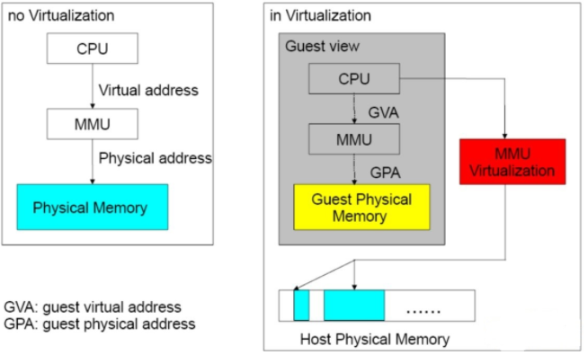
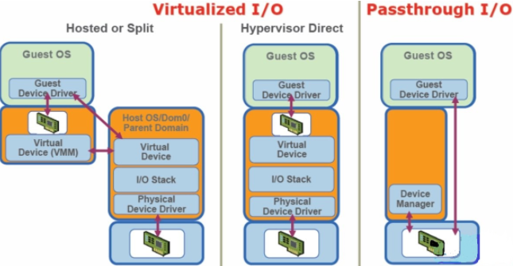

# openstack之nova

**什么是虚拟化？**

虚拟化说白了就是本来是一个完整的资源，切分或虚拟成多份，让这些资源都使用起来，物尽其用，减少了浪费，提高了利用率，省了钱

百科定义；虚拟化，是指通过虚拟化技术将一台计算机虚拟为多台逻辑计算机。在计算机上同时运行多个逻辑计算机，每个逻辑计算机可以运行不同的操作系统，并且应用程序都可以在相互独立的空间内运行而互补影响，从而显著提高计算机的工作效率。

　　虚拟化使用软件的方法从新定义划分IT资源，可以实现IT资源的动态分配，灵活调用，跨域共享，提高IT资源利用率，使IT资源能够真正的为社会基础服务，服务于各行各业中灵活多变的应用需求

　　虚拟化（Virtualization）技术最长出现在20世纪60年代的IBM大型机系统，在70年代的system730系列中逐渐流行起来。

　　在物理硬件之上安装软件：虚拟机监控器(Virtual Machine Monitor VMM),并且用VMM来控制产生多个的虚拟机（Virtual Machine）实例，每个vm都可以运行独立操作系统及应用软件。

　　虚拟化是一个广义的术语，对于不同的人来说都可能意味着不同的东西，这要取决于他们所处的环境。在计算机科学领域，虚拟化代表作计算资源的抽象，而不仅仅局限于虚拟机的概念。

　　比如对物理内存的抽象，产生了虚拟内存技术，使得应用程序认为其自身拥有连续可用的地址空间（Address Space），而实际上，应用程序的代码和数据可能被分割成多个碎片页或段，甚至被交换到磁盘、闪存等外部存储器上，即使物理内存不足，应用程序也能顺利执行。

 

**为什么要学习虚拟化**

随着近年来多核系统、集群、网络甚至云计算的广泛部署，虚拟化技术在商业应用上的优势日益体现，不仅降低了IT成本，而且还增强了系统安全性和可靠性，虚拟化的概念也逐渐深入到人们的日常生活中和工作中

 网格

 

虚拟化是云计算的基础，而我们学习虚拟化的目的之一是为云平台提供云主机，具体的：在一台真实物理机上产生多台虚拟机(每台vm安装不同的操作系统)，它们共享物理机的cpu、内存、IO硬件资源，但是逻辑上彼此隔离

 

**虚拟化技术的分类（简单了解下就可以）**

注意：本文讨论的虚拟化技术只针对x86平台，并假定虚拟机中运行的Guest OS也是为x86平台设计的。

**一、虚拟化计算主要分为以下几大类：**

　　1.平台虚拟化：针对计算机和操作系统的虚拟化，即创建虚拟机

　　2.资源虚拟化：针对特定的系统资源的虚拟化，比如内存，cpu等

　　3.应用程序虚拟化：包括仿真、模拟、接受计算（java虚拟机jvm）等。

　　**我们通常所说的虚拟化主要是指平台虚拟化技术，通过控制程序（VMM或者Hypervisor）来创建虚拟机**

Guest OS（客户机操作系统）：虚拟机中运行的操作系统

Host OS（主机操作系统）：运行虚拟机监控器（VMM、Hypervisor）需要注意的是，某些虚拟机监控器VMM可以脱离操作系统直接运行在硬件之上（如VMWARE的ESX产品）



**二、平台虚拟化技术又可以细分为如下几个子类**

　　了解这些分类的关键在于一定要记住：VM是由VMM产生并运行的

**1.全虚拟化（Full Virtualization）**

　　全虚拟化的核心就在"全" ,“全”指的是VMM为虚拟机模拟了完整的底层硬件，包括处理器，物理内存，时钟，外设等。

 　　这种‘全’的特性牛逼之处就在于：原本是为物理硬件设计的操作系统或者其他系统软件，完全不需做任何修改就可在虚拟机中运行。

然而再牛逼的软件也有不足：vm最后还是要和vmm打交道，对于全虚拟化来说，vmm必须完全并且完整地把自己模拟成硬件，为vm提供全部硬件接口

　　同时必须模拟特权指令的执行过程，如下例

[](javascript:void(0);)

```
让我们以x86 体系结构下对操作系统进程页表切换的操作(mov pgtable)为例，来介绍VMM把自己完全模拟成硬件是怎么样一种过程：
1.真实的硬件提供了一个特权 CR3 寄存器来实现该接口，操作系统只需执行 "mov pgtable,%%cr3"的 汇编指令即可。
2.VMM 必须按照1中所述，完全地模拟该接口执行的全部过程，但是如果硬件不提供虚拟化的特殊支持，那么这个模拟过程将会十分复杂：
    a:一般而言VMM 必须运行在最高优先级来完全控制物理主机的系统，而 Guest OS 需要降级运行，因而不能执行特权操作(如进程页表切换mov pgtable这种特权操作)。
    b:当 Guest OS 执行前面的特权汇编指令（mov pgtable...）时，物理主机系统产生异常（General Protection Exception），执行控制权重新从 Guest OS 转到 VMM 手中。--->飞的再高也得回到地面
    c:VMM 先分配一个变量作为影子 CR3 寄存器交给 Guest OS。将 pgtable （进程表）代表的客户机物理地址（Guest Physical Address）填入影子 CR3 寄存器--->让Guest OS以为自己在操作真实的内存。
    e:然后 VMM 将Guest Os需要操作的pgtable 翻译成物理主机的物理地址（Host Physical Address）并填入物理主机的 CR3 寄存器，最后返回到 Guest OS中。随后 VMM 还将处理复杂的 Guest OS 缺页异常（Page Fault）。
```

[](javascript:void(0);)



　　比较著名的全虚拟化VMM有Microsoft Virtual PC、VMware Workstation、Sun Virtual Box、Parallels Desktop for Mac，QEMU,KVM。

 

**2.硬件辅助虚拟化（Hardware—Assisted Virualization）**

 　　硬件辅虚拟化主要是为了解决全虚拟化在提供接口的同时必须模拟特权指令的执行过程，是指借助硬件（主要是主机处理器）的技术来实现高效的全虚拟化。例如有Inter-VT技术支持。Guest OS 和VMM的执行环节自动的隔离开来，Guest OS 有自己的“全套寄存器”，可以直接运行在最高级别。因此在上面的例子中，Guest OS 能够执行修改页表的汇编指令。Inter-VT和AMD-V是目前x86体系结构上可用的两种硬件辅助虚拟化技术。



 

**3.半虚拟化（Paravirtualization）**

　　半虚拟化，这是一种修改了Guest OS访问部分特权状态的代码，以便于直接与VMM交互的技术。在半虚拟化虚拟机中，部分硬件接口以软件的形式提供给客户机操作系统，这可以通过Hypercall(VMM提供给Guest OS 的直接调用，与系统调用类似)的方式来提供。例如Guest OS把切换页表的代码修改为调用Hypercall来直接完成修改影子CR3寄存器和翻译地址的工作。由于不需要产生额外的异常和模拟部分硬件执行流程，半虚拟化可以大幅度提高性能。，比较著名的VMM有Denali，Xen



**4.部分虚拟化(Partial Virtualization)**

　　VMM之模拟部分底层硬件，因此客户机操作系统不做修改是无法再虚拟机中运行的，其他程序也可能需要修改。在历史上，部分硬件虚拟化是通往全虚拟化道路上的里程牌，最早出现在第一代的分时系统CTSS和IBM M44/44X实验性的分页系统

 

**5.操作系统的虚拟化(Operating System Level Virualization)**

　　在操作系统中，所有用户的进程本质上是在同一个操作系统的实例中运行，因此内核或应用程序的缺陷可能影响到其它进程。操作系统级虚拟化是一种在服务器操作系统中使用的轻量级虚拟化技术，内核通过创建多个虚拟的操作系统（内核和库）来隔离不同的进程，不同的实例中进程完全不了解多方的存在。比较著名的有Solaris Container OpenVZ等

 

　　这种分类并不绝对的，一个优秀的虚拟软件往往融合了多项技术。例如VMware Workstation 是一个著名的全虚拟化的VMM，但它使用了一种被称为二进制翻译的技术把对特权状态的访问转回对影子状态的操作，从而避免了抵消的Trap-And-Emulate 的处理方式，这与半虚拟化相似，只不过半虚拟化是静态地修改程序代码。对于这种超虚拟化而言，如果能利用硬件特性，那么虚拟机的管理将会大大简化，同时还能保持较高的性能。

 

**内存虚拟化**



 

　　上图中左半部分是正常情况下内存的使用情况，线性地址到物理地址的一个转换，通常应用程序使用的内存地址就是线性地址，需要通过[MMU](http://baike.baidu.com/link?url=L_dBssp9dcyvY1CknspkzPoadZu0S_TDs2yxTZGUz3_PwF8W9vjbb8hoNZ1uLE6iibtMm3i9GQkKbYEvL5scFq)地址转换的一个硬件来实现线性地址到物理地址的一个转换。

　　上图右部分是虚拟化情况下内存如何实现线性地址到物理地址的转换，虚拟机中的OS获得是有Host OS分配的[线性地址](http://baike.baidu.com/item/线性地址/9013682?search=new)，Guest OS中的应用程序获取的是相对于Guest OS 来说的线性地址，那么多余这个线性地址来说最终只能转换成线性地址，无法转换成真正的物理地址，虚拟机中就提供了一个虚拟的MMU直接将Guest OS 中的线性地址直接转换成真正的物理地址，但是每个虚拟的MMU毕竟是虚拟出来的没有真实的硬件MMU性能好，而且虚拟MMU的开发也很负杂，每一个Guest 都要有一个MMU，这对内存消耗很大，对于这种技术我们称作是"影子页表技术"

 　　此后Inter开创了EPT（Extended Page Tables）技术，相当于影子页表技术来说EPT技术降低了内存虚拟化的难度，EPT技术是直接在硬件上实现了Guest OS中线性地址到Guest OS中的物理地址在到Host OS中的物理地址的两次转换

 

 **I/O虚拟化**

 

　　**最左边的IO虚拟化使用的是仿真技术：**

　　我们将要着重研究的Kvm虚拟化就引用了这种技术

　　仿真(Emulation)是一个完全通过软件程序来模拟硬件的技术。早期虚拟化都采用了这种方案来虚拟网络设备。常见的仿真软件有QEMU、Vmware Workstation、VirtualBox

　　**中间的IO虚拟化是Para-virtualization：**

 　　Para-virtualization又称为半虚拟化，最早由Citrix的Xen提出使用。在半虚拟化模型中，物理硬件资源统一由Hypervisor管理，由Hypervisor提供资源调用接口。虚拟子机通过特定的调用接口与Hypervisor通信，然后完整的对I/O资源进行控制操作

　　**最右边的是直接IO:**

　　Hypervisor将一个PCI设备（网卡，usb，光驱等）直接分配给指定虚拟子机单独访问。为了安全和稳定性考虑，pass-through使用通常结合Inter-VT-D（AMD也有类似技术）来使用，通过iommu保证虚拟子机之间内存访问不冲突。这种技术在WMware上交VMDirectPath I/O。