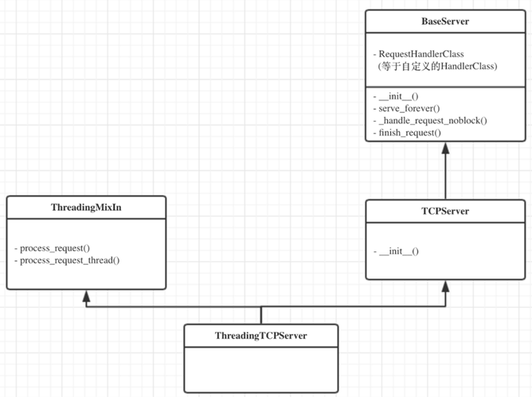

# socketserver编程

阅读: 6996   [评论](http://www.liujiangblog.com/course/python/77#comments)：2

上文中，我们自己使用socket和threading模块实现了一个简单的多线程服务器。在非正式环境，随便用用还是可以的，但是如果要在生产环境中使用，那是万万不够的。

Python考虑得很周到，为了满足我们对多线程网络服务器的需求，提供了`socketserver`模块。socketserver在内部使用IO多路复用以及多线程/进程机制，实现了并发处理多个客户端请求的socket服务端。每个客户端请求连接到服务器时，socketserver服务端都会创建一个“线程”或者“进程” 专门负责处理当前客户端的所有请求。

让我们来看看socketserver模块的Python源码（what！我连基本的都还没明白，你就让我看源代码......）：

```
import socket
import selectors
import os
import errno
import sys
try:
    import threading
except ImportError:
    import dummy_threading as threading
from io import BufferedIOBase
from time import monotonic as time

__all__ = ["BaseServer", "TCPServer", "UDPServer",
           "ThreadingUDPServer", "ThreadingTCPServer",
           "BaseRequestHandler", "StreamRequestHandler",
           "DatagramRequestHandler", "ThreadingMixIn"]
if hasattr(os, "fork"):
    __all__.extend(["ForkingUDPServer","ForkingTCPServer", "ForkingMixIn"])
if hasattr(socket, "AF_UNIX"):
    __all__.extend(["UnixStreamServer","UnixDatagramServer",
                    "ThreadingUnixStreamServer",
                    "ThreadingUnixDatagramServer"])

# poll/select have the advantage of not requiring any extra file descriptor,
# contrarily to epoll/kqueue (also, they require a single syscall).
if hasattr(selectors, 'PollSelector'):
    _ServerSelector = selectors.PollSelector
else:
    _ServerSelector = selectors.SelectSelector

class BaseServer:
    pass

class TCPServer(BaseServer):
    pass

class UDPServer(TCPServer):
    pass

if hasattr(os, "fork"):
    pass

class ThreadingMixIn:
    pass

if hasattr(os, "fork"):
    class ForkingUDPServer(ForkingMixIn, UDPServer): pass
    class ForkingTCPServer(ForkingMixIn, TCPServer): pass

class ThreadingUDPServer(ThreadingMixIn, UDPServer): pass
class ThreadingTCPServer(ThreadingMixIn, TCPServer): pass

if hasattr(socket, 'AF_UNIX'):
    pass

class StreamRequestHandler(BaseRequestHandler):
    pass

class _SocketWriter(BufferedIOBase):
    pass

class DatagramRequestHandler(BaseRequestHandler):
   pass
```

我把每个类的具体代码给省略后，就剩下这么些内容。

在socketserver模块的开头，导入了socket和threading等一些Python内置模块，和我们一样样的！然后，定义了一个`__all__`魔法变量，表示我们默认只能使用该模块里的这些类。

接下来，`if hasattr(os, "fork"):`判断语句，用于测试当前操作系统是否支持fork操作，如果支持，好吧，你可以你解锁更多功能。

`if hasattr(socket, "AF_UNIX"):`是针对UNIX系统的功能，同样基于操作系统的支持。

`if hasattr(selectors, 'PollSelector'):`就是最关键的IO复用机制的选择了，如果操作系统支持Poll，则启用`PollSelector`，否则使用默认的`SelectSelector`。

抛开那些复杂的类名及其作用，从逻辑流程来讲，其实socketserver也很简单。

阅读源代码有助于我们理解模块的运行机制，提高自己的代码水平。但具体使用模块，还要落到实处。对于socketserver模块，我们最常使用的是`ThreadingTCPServer`类。其定义如下：

```
class ThreadingTCPServer(ThreadingMixIn, TCPServer): pass
```

这里的pass不是我省略了，而是它真的就只有pass，^-^。它本身一句代码都没有，一切的功能都从两个父类里继承，`ThreadingMixIn`为它提供了多线程能力，`TCPServer`为它提供基本的socket通信能力。其继承关系，如下图所示：



ThreadingTCPServer实现的Soket服务器内部会为每个客户端创建一个线程，该线程用来和客户端进行交互。服务器相当于一个总管，在接收连接并创建新的线程后，就撒手不管了，后面的通信就是线程和客户端之间的连接了，一定要理解这一点！

**使用ThreadingTCPServer的要点:**

- 创建一个继承自`socketserver.BaseRequestHandler`的类；
- 这个类中必须定义一个名字为`handle`的方法，不能是别的名字！
- 将这个类，连同服务器的ip和端口，作为参数传递给`ThreadingTCPServer()`构造器
- 手动启动ThreadingTCPServer。

下面是一个ThreadingTCPServer使用的例子：

**服务器端：**

```
#!/usr/bin/env python
# -*- coding:utf-8 -*-

import socketserver

class MyServer(socketserver.BaseRequestHandler):
    """
    必须继承socketserver.BaseRequestHandler类
    """
    def handle(self):
        """
        必须实现这个方法！
        :return:
        """
        conn = self.request         # request里封装了所有请求的数据
        conn.sendall('欢迎访问socketserver服务器！'.encode())
        while True:
            data = conn.recv(1024).decode()
            if data == "exit":
                print("断开与%s的连接！" % (self.client_address,))
                break
            print("来自%s的客户端向你发来信息：%s" % (self.client_address, data))
            conn.sendall(('已收到你的消息<%s>' % data).encode())

if __name__ == '__main__':
    # 创建一个多线程TCP服务器
    server = socketserver.ThreadingTCPServer(('127.0.0.1', 9999), MyServer)
    print("启动socketserver服务器！")
    # 启动服务器，服务器将一直保持运行状态
    server.serve_forever()
```

**客户端：**

```
#!/usr/bin/env python
# -*- coding:utf-8 -*-
"""
客户端依然使用socket模块就可以了，不需要导入socketserver模块
"""

import socket

ip_port = ('127.0.0.1', 9999)
sk = socket.socket()
sk.connect(ip_port)
sk.settimeout(5)
data = sk.recv(1024).decode()
print('服务器:', data)
while True:
    inp = input('你:').strip()
    if not inp:
        continue

    sk.sendall(inp.encode())

    if inp == 'exit':
        print("谢谢使用，再见！")
        break
    data = sk.recv(1024).decode()
    print('服务器:', data)
sk.close()
```

客户端的代码很好理解，和前面一样样的，关键是服务器端。

分析一下服务器端的代码，核心要点有这些：

- 连接数据封装在`self.request`中！调用send()和recv()方法都是通过`self.request`对象。
- `handle()`方法是整个通信的处理核心，一旦它运行结束，当前连接也就断开了（但其他的线程和客户端还正常），因此一般在此设置一个无限循环。
- 注意`server = socketServer.ThreadingTCPServer((‘127.0.0.1’,8009),MyServer)`中参数传递的方法。
- `server.serve_forever()`表示该服务器在正常情况下将永远运行。

socketserver模块还提供了`ThreadingUDPServer`类，用于提供多线程的UDP服务。还有`ForkingTCPServer`类，当操作系统支持fork操作的时候，可以实现多进程服务器。他们的用法和`ThreadingTCPServer`基本类似，大家可以自行尝试。