# Redis 数据库


## 1.1 Redis简介


### 1.1.1 介绍

Redis是一个使用ANSI C编写的开源、支持网络、基于内存、可选持久性的键值对(key-value)存储数据库。从2015年6月开始，Redis的开发由Redis Labs赞助，而2013年5月至2015年6月期间，其开发由Pivotal赞助。在2013年5月之前，其开发由VMware赞助。根据月度排行网站DB-Engines.com的数据显示，Redis是最流行的键值对存储数据库。

 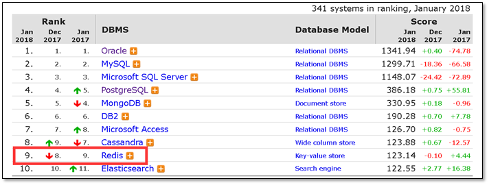

数据来源：<https://db-engines.com/en/ranking>

Redis采用内存(In-Memory)数据集(DataSet) 。

支持多种数据类型。

运行于大多数POSIX系统，如Linux、*BSD、OS X等。

Redis作者： Salvatore Sanfilippo

作者GitHUB: <https://github.com/antirez/redis>

### 1.1.2 软件获取和帮助

官方网站：[https://redis.io](https://redis.io/)

官方各版本下载地址：<http://download.redis.io/releases/>

Redis 中文命令参考：[http://redisdoc.com](http://redisdoc.com/)

中文网站1：[http://redis.cn](http://redis.cn/)

中文网站2：[http://www.redis.net.cn](http://www.redis.net.cn/)

### 1.1.3 Redis特性

>  高速读写，数据类型丰富
>
> 支持持久化，多种内存分配及回收策略
>
> 支持弱事务，消息队列、消息订阅
>
> 支持高可用，支持分布式分片集群

### 1.1.4 企业缓存数据库解决方案对比

**Memcached:**

优点：高性能读写、单一数据类型、支持客户端式分布式集群、一致性hash多核结构、多线程读写性能高。

缺点：无持久化、节点故障可能出现缓存穿透、分布式需要客户端实现、跨房数据同步困难、架构扩容复杂度高

**Redis:**

优点：高性能读写、多数据类型支持、数据持久化、高可用架构、支持自定义虚拟内存、支持分布式分片集群、单线程读写性能极高

缺点：多线程读写较Memcached慢

**Tair****：** 官方网站：[http://tair.taobao.org](http://tair.taobao.org/)

优点：高性能读写、支持三种存储引擎（ddb、rdb、ldb）、支持高可用、支持分布式分片集群、支撑了几乎所有淘宝业务的缓存。

缺点：单机情况下，读写性能较其他两种产品较慢。

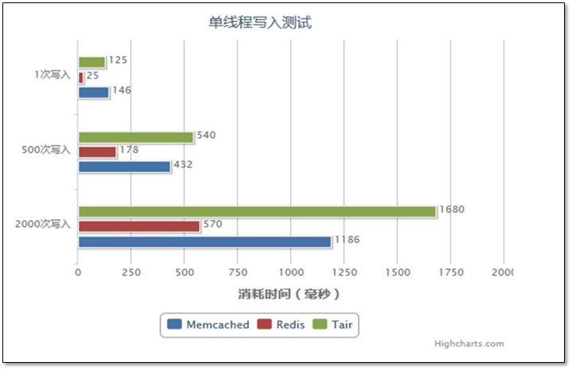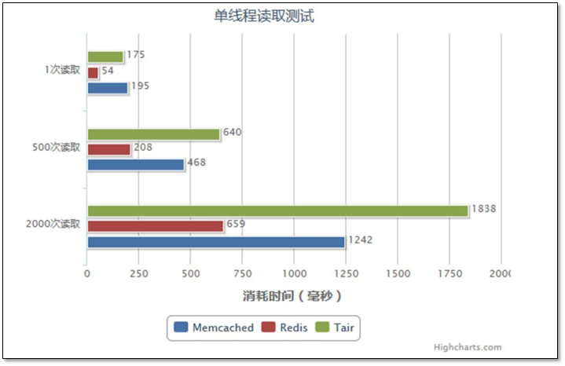

 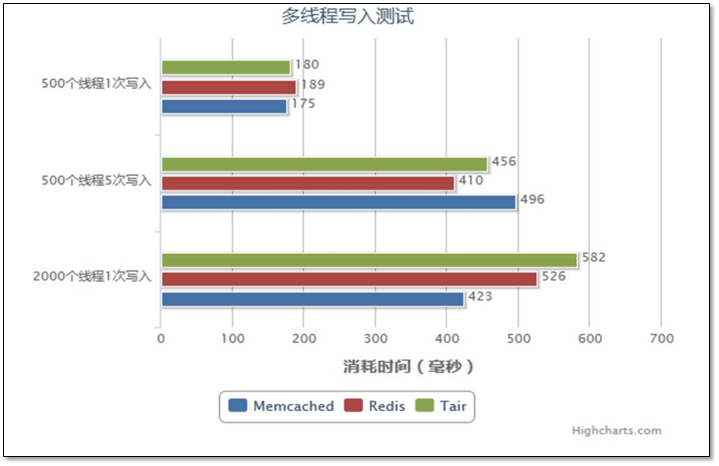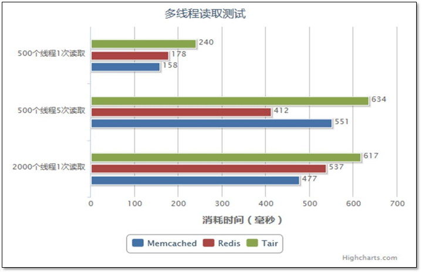

### 1.1.5 Redis应用场景

数据高速缓存,web会话缓存（Session Cache）

排行榜应用

消息队列,发布订阅

   附录 - Redis的企业应用

 

## 1.2 Redis简单部署

### 1.2.1 典型安装-单实例

系统环境说明

```
[root@Redis ~]# cat /etc/redhat-release 
CentOS release 6.9 (Final)
[root@Redis ~]# uname -r 
2.6.32-696.el6.x86_64
[root@Redis ~]# sestatus 
SELinux status:                 disabled
[root@Redis ~]# /etc/init.d/iptables status
iptables: Firewall is not running.
[root@Redis ~]# hostname -I 
10.0.0.186 172.16.1.186
```

安装redis

```
[root@Redis ~]# cd /usr/local/
[root@Redis local]# wget http://download.redis.io/releases/redis-3.2.10.tar.gz
[root@Redis local]# tar xzf redis-3.2.10.tar.gz
[root@Redis local]# \rm redis-3.2.10.tar.gz 
[root@Redis local]# mv redis-3.2.10 redis
[root@Redis local]# cd redis/
[root@Redis redis]# make
```

   至此redis就安装完成

### 1.2.2 启动第一个redis实例

创建客户端软连接

```
[root@Redis src]# ln -s /usr/local/redis/src/redis-cli /usr/bin/
```

简单启动方法，都使用默认配置

```
[root@Redis ~]# cd /usr/local/redis/src
[root@Redis src]# ./redis-server &
```

**编写配置文件**

1、精简化配置文件

```
[root@Redis redis]# cp redis.conf{,.bak}
[root@Redis redis]# grep -Ev '^$|#' redis.conf.bak > redis.conf
[root@Redis redis]# cp redis.conf /etc/
```

2、编辑配置文件

```
[root@Redis ~]# cat /etc/redis.conf 
bind 127.0.0.1 10.0.0.186
protected-mode yes
port 6379
tcp-backlog 511
timeout 0
tcp-keepalive 300
daemonize yes
supervised no
pidfile /var/run/redis_6379.pid
loglevel notice
logfile "/var/log/redis_6379.log"
dir /usr/local/redis/data/
# ···
```

   配置文件说明：https://www.cnblogs.com/zhang-ke/p/5981108.html

   3、编写启动脚本（适用于CentOS 6.X）

 View Code redis管理脚本

   **注意：自编写脚本注意执行权限。**

### 1.2.3 Redis多实例配置

注意：本次多实例配置基于单实例配置完成后

创建并进入程序目录

```
[root@Redis redis]# mkdir /application/redis  -p
[root@Redis redis]# cd /application/redis/
```

   修改配置文件

```
for i in 0 1 2
  do  
    # 创建多实例(端口命名)目录
    mkdir -p 638$i
    # 复制启动程序到各实例
    \cp /usr/local/redis/src/redis-server /application/redis/638$i/ 
    # 复制配置文件。注意：此处基于单实例配置完成
    \cp /etc/redis.conf  /application/redis/638$i/
    # 修改程序存储目录
    sed -i  "/dir/s#.*#dir /application/redis/638$i/#g" /application/redis/638$i/redis.conf 
    # 修改其他端口信息
    sed -i  "s#6379#638$i#g" /application/redis/638$i/redis.conf
    # 允许远程连接redis
    sed -i '/protected-mode/s#yes#no#g' /application/redis/638$i/redis.conf
done
```

\# 启动实例

```
for i in 0 1 2 
  do
  /application/redis/638$i/redis-server /application/redis/638$i/redis.conf 
done
```

   连接redis

```
[root@Redis redis]# redis-cli -h 10.0.0.186 -p 6379
10.0.0.186:6379>
```

### 1.2.4 redis.conf配置说明

是否后台运行：

```
daemonize no/yes
```

默认端口：

```
port 6379
```

AOF日志开关是否打开：

```
appendonly no/yes
```

日志文件位置

```
logfile /var/log/redis.log
```

RDB持久化数据文件:

```
dbfilename dump.rdb
```

指定IP进行监听

```
bind 10.0.0.51 ip2 ip3 ip4
```

禁止protected-mode

```
protected-mode yes/no （保护模式，是否只允许本地访问）
```

增加requirepass {password}

```
requirepass root
```

在redis-cli中使用

```
auth {password} 进行认证
```

### 1.2.5 在线变更配置

获取当前配置

```
CONFIG GET *
```

变更运行配置

```
CONFIG SET loglevel "notice"
```

修改密码为空

```
10.0.0.186:6379> config set requirepass ""
10.0.0.186:6379> exit
10.0.0.186:6379> config get dir
1) "dir"
2) "/usr/local/redis/data"
```

## 1.3 Redis数据持久化

### 1.3.1 持久化策略

redis 提供了多种不同级别的持久化方式:一种是RDB,另一种是AOF.

**RDB** **持久化**

可以在指定的时间间隔内生成数据集的时间点快照（point-in-time snapshot）。

**AOF** **持久化**

记录服务器执行的所有写操作命令，并在服务器启动时，通过重新执行这些命令来还原数据集。 AOF 文件中的命令全部以Redis 协议的格式来保存，新命令会被追加到文件的末尾。

Redis 还可以在后台对 AOF 文件进行重写（rewrite），使得 AOF 文件的体积不会超出保存数据集状态所需的实际大小。Redis 还可以同时使用 AOF 持久化和 RDB 持久化。 在这种情况下， 当 Redis 重启时， 它会优先使用 AOF 文件来还原数据集， 因为 AOF 文件保存的数据集通常比 RDB 文件所保存的数据集更完整。

你甚至可以关闭持久化功能，让数据只在服务器运行时存在。

### 1.3.2 RDB 持久化

**RDB****的优点**

⚔ RDB 是一个非常紧凑（compact）的文件，它保存了 Redis 在某个时间点上的数据集。 这种文件非常适合用于进行备份： 比如说，你可以在最近的 24 小时内，每小时备份一次 RDB 文件，并且在每个月的每一天，也备份一个 RDB 文件。 这样的话，即使遇上问题，也可以随时将数据集还原到不同的版本。

⚔ RDB 非常适用于灾难恢复（disaster recovery）：它只有一个文件，并且内容都非常紧凑，可以（在加密后）将它传送到别的数据中心，或者亚马逊 S3 中。

⚔ RDB 可以最大化 Redis 的性能：父进程在保存 RDB 文件时唯一要做的就是 fork 出一个子进程，然后这个子进程就会处理接下来的所有保存工作，父进程无须执行任何磁盘 I/O 操作。

⚔ RDB 在恢复大数据集时的速度比 AOF 的恢复速度要快。

**RDB****的缺点**

如果你需要尽量避免在服务器故障时丢失数据，那么 RDB 不适合你。

虽然 Redis 允许你设置不同的保存点（*save point*）来控制保存 RDB 文件的频率， 但是， 因为RDB 文件需要保存整个数据集的状态， 所以它并不是一个轻松的操作。 因此你可能会至少 5 分钟才保存一次 RDB 文件。 在这种情况下， 一旦发生故障停机， 你就*可能会丢失好几分钟的数据*。

每次保存 RDB 的时候，Redis 都要 fork() 出一个子进程，并由子进程来进行实际的持久化工作。 在数据集比较庞大时，fork() 可能会非常耗时，造成服务器在某某毫秒内停止处理客户端；如果数据集非常巨大，并且 CPU 时间非常紧张的话，那么这种停止时间甚至可能会长达整整一秒。 虽然 AOF 重写也需要进行 fork() ，但无论 AOF 重写的执行间隔有多长，数据的耐久性都不会有任何损失。

### 1.3.3 AOF 持久化

**AOF** **优点**

使用*AOF* *会让你的Redis**更加耐久*: 你可以使用不同的fsync策略：无fsync,每秒fsync,每次写的时候fsync.使用默认的每秒fsync策略,Redis的性能依然很好(fsync是由后台线程进行处理的,主线程会尽力处理客户端请求),一旦出现故障，你最多丢失1秒的数据.

Redis 可以在 AOF 文件体积变得过大时，*自动地在后台对* *AOF* *进行重写*： 重写后的新 AOF 文件包含了恢复当前数据集所需的最小命令集合。 整个重写操作是绝对安全的，因为 Redis 在创建新 AOF 文件的过程中，会继续将命令追加到现有的AOF 文件里面，即使重写过程中发生停机，现有的 AOF 文件也不会丢失。

一旦新 AOF 文件创建完毕，Redis 就会从旧 AOF 文件切换到新 AOF 文件，并开始对新 AOF 文件进行追加操作。

AOF 文件有序地保存了对数据库执行的所有写入操作， 这些写入操作以 Redis 协议的格式保存， 因此 *AOF* *文件的内容非常容易被人读懂*， 对文件进行分析（parse）也很轻松。 导出（export） AOF 文件也非常简单： 举个例子， 如果你不小心执行了 FLUSHALL 命令， 但只要 AOF 文件未被重写， 那么只要停止服务器， 移除 AOF 文件末尾的 FLUSHALL 命令， 并重启 Redis ， 就可以将数据集恢复到 FLUSHALL 执行之前的状态。

**AOF** **缺点**

对于相同的数据集来说，*AOF* *文件的体积通常要大于 RDB* *文件的体积*。根据所使用的 fsync 策略，AOF 的速度可能会慢于 RDB 。

在一般情况下， 每秒 fsync 的性能依然非常高， 而*关闭* *fsync* *可以让 AOF* *的速度和 RDB* *一样快*， 即使在高负荷之下也是如此。 不过在处理巨大的写入载入时，RDB 可以提供更有保证的最大延迟时间（latency）。

AOF 在过去曾经发生过这样的 bug ：因为个别命令的原因，导致 AOF 文件在重新载入时，无法将数据集恢复成保存时的原样。 （举个例子，阻塞命令 BRPOPLPUSH 就曾经引起过这样的 bug 。） 测试套件里为这种情况添加了测试： 它们会自动生成随机的、复杂的数据集， 并通过重新载入这些数据来确保一切正常。

虽然这种 bug 在 AOF 文件中并不常见， 但是对比来说， RDB 几乎是不可能出现这种 bug 的。

### 1.3.4 如何选择使用哪种持久化方式

一般来说， 如果想达到足以媲美 PostgreSQL 的数据安全性， 你应该同时使用两种持久化功能。

如果你非常关心你的数据， 但仍然可以承受数分钟以内的数据丢失， 那么你可以只使用 RDB 持久化。

有很多用户都只使用 AOF 持久化， 但我们并不推荐这种方式： 因为定时生成 RDB 快照（snapshot）非常便于进行数据库备份， 并且 RDB 恢复数据集的速度也要比 AOF 恢复的速度要快， 除此之外， 使用 RDB 还可以避免之前提到的 AOF 程序的 bug 。

Note: 因为以上提到的种种原因， 未来redis可能会将 AOF 和 RDB 整合成单个持久化模型（这是一个长期计划）。

### 1.3.5 快照实现持久化

在默认情况下， Redis 将数据库快照保存在名字为 dump.rdb的二进制文件中。你可以对 Redis 进行设置， 让它在“ N 秒内数据集至少有 M 个改动”这一条件被满足时， 自动保存一次数据集。

你也可以通过调用 SAVE或者 BGSAVE ， 手动让 Redis 进行数据集保存操作。

   比如说， 以下设置会让 Redis 在满足“ 60 秒内有至少有 1000 个键被改动”这一条件时， 自动保存一次数据集: save 60 1000 

   这种持久化方式被称为快照 snapshotting.

当 Redis 需要保存 dump.rdb 文件时， 服务器执行以下操作:

🎣 Redis 调用forks. 同时拥有父进程和子进程。

🎣 子进程将数据集写入到一个临时 RDB 文件中。

🎣 当子进程完成对新 RDB 文件的写入时，Redis 用新 RDB 文件替换原来的 RDB 文件，并删除旧的 RDB 文件。

这种工作方式使得 Redis 可以从写时复制（copy-on-write）机制中获益。

### 1.3.6 AOF持久化

只进行追加操作的文件（append-only file，AOF）

*快照功能并不是非常耐久*：如果 Redis 因为某些原因而造成故障停机，那么服务器将丢失最近写入、且仍未保存到快照中的那些数据。尽管对于某些程序来说，数据的耐久性并不是最重要的考虑因素，但是对于那些追求完全耐久能力的程序员来说，快照功能就不太适用了。

从 1.1 版本开始， Redis 增加了一种完全耐久的持久化方式： AOF 持久化。

你可以通过修改配置文件来打开 AOF 功能： appendonly yes 

从现在开始，每当 Redis 执行一个改变数据集的命令式（比如 SET），这个命令就会被追加到 AOF 文件的末尾。

这样的话，当redis重新启动时，程序就可以通过重新执行 AOF 文件中的命令来达到重建数据集的目的

### 1.3.7 AOF日志重写

因为 AOF 的运作方式是不断地将命令追加到文件的末尾， 所以随着写入命令的不断增加， AOF 文件的体积也会变得越来越大。

举个例子， 如果你对一个计数器调用了 100 次 INCR ， 那么仅仅是为了保存这个计数器的当前值， AOF 文件就需要使用 100 条记录（entry）。然而在实际上， 只使用一条 SET 命令已经足以保存计数器的当前值了， 其余 99 条记录实际上都是多余的。

为了处理这种情况， Redis 支持一种有趣的特性： 可以在不打断服务客户端的情况下， 对 AOF 文件进行重建（rebuild）。*执行* *BGREWRITEAOF* *命令， Redis* *将生成一个新的 AOF* *文件，* *这个文件包含重建当前数据集所需的最少命令*。Redis 2.2 需要自己手动执行 BGREWRITEAOF 命令.

### 1.3.8 AOF有多耐用?

你可以配置 Redis 多久才将数据 fsync 到磁盘一次。有三种方式：

👽 每次有新命令追加到 AOF 文件时就执行一次 fsync ：非常慢，也非常安全

👽 每秒 fsync 一次：足够快（和使用 RDB 持久化差不多），并且在故障时只会丢失 1 秒钟的数据。

👽 从不 fsync ：将数据交给操作系统来处理。更快，也更不安全的选择。

👽 推荐（并且也是默认）的措施为每秒 fsync 一次， 这种 fsync 策略可以兼顾速度和安全性。

### 1.3.9 如果AOF文件损坏了怎么办？

服务器可能在程序正在对 AOF 文件进行写入时停机， 如果停机造成了 AOF 文件出错（corrupt）， 那么 Redis 在重启时会拒绝载入这个 AOF 文件， 从而确保数据的一致性不会被破坏。当发生这种情况时， 可以用以下方法来修复出错的 AOF 文件：

🎑 为现有的 AOF 文件创建一个备份。

🎑 使用 Redis 附带的 redis-check-aof 程序，对原来的 AOF 文件进行修复: $ redis-check-aof –fix 

🎑 使用 diff -u 对比修复后的 AOF 文件和原始 AOF 文件的备份，查看两个文件之间的不同之处。（可选）

🎑 重启 Redis 服务器，等待服务器载入修复后的 AOF 文件，并进行数据恢复。

### 1.3.10 AOF和RDB之间的相互作用

在版本号大于等于 2.4 的 Redis 中，BGSAVE 执行的过程中， 不可以执行 BGREWRITEAOF 。

反过来说， 在 BGREWRITEAOF 执行的过程中， 也不可以执行 BGSAVE。这可以防止两个 Redis 后台进程同时对磁盘进行大量的 I/O 操作。

如果 BGSAVE 正在执行， 并且用户显示地调用 BGREWRITEAOF 命令， 那么服务器将向用户回复一个 OK 状态， 并告知用户， BGREWRITEAOF 已经被预定执行： 一旦 BGSAVE 执行完毕， BGREWRITEAOF 就会正式开始。

当 Redis 启动时， *如果 RDB* *持久化和 AOF* *持久化都被打开了，* *那么程序会优先使用 AOF* *文件来恢复数据集*， 因为AOF 文件所保存的数据通常是最完整的。

### 1.3.11 备份redis数据

Redis 对于数据备份是非常友好的， 因为你可以在服务器运行的时候对 RDB 文件进行复制：

RDB 文件一旦被创建， 就不会进行任何修改。 当服务器要创建一个新的 RDB 文件时， 它先将文件的内容保存在一个临时文件里面， 当临时文件写入完毕时， 程序才使用 rename(2) 原子地用临时文件替换原来的 RDB 文件。

   这也就是说， 无论何时， 复制 RDB 文件都是绝对安全的。

🎍 创建一个定期任务（cron job）， 每小时将一个 RDB 文件备份到一个文件夹， 并且每天将一个 RDB 文件备份到另一个文件夹。

🎍 确保快照的备份都带有相应的日期和时间信息， 每次执行定期任务脚本时， 使用 find 命令来删除过期的快照： 比如说， 你可以保留最近 48 小时内的每小时快照， 还可以保留最近一两个月的每日快照。

🎍 至少每天一次， 将 RDB 备份到你的数据中心之外， 或者至少是备份到你运行 Redis 服务器的物理机器之外。

### 1.3.12 RDB持久化配置

**RDB****持久化基本配置**

修改配置文件

```
save 900 1
save 300 10
save 60 10000
```

配置分别表示：

> • 900秒（15分钟）内有1个更改
>
> ```
> • 300秒（5分钟）内有10个更改
> • 60秒内有10000个更改    
> • 当达到以上定义的配置时间时，就将内存数据持久化到磁盘。
> ```

**RDB****持久化高级配置**

```
stop-writes-on-bgsave-error yes
rdbcompression yes 
rdbchecksum yes
dbfilename dump.rdb
dir ./clsn/redis/data/6379
```

以上配置分别表示：

> ```
> • 后台备份进程出错时,主进程停不停止写入? 主进程不停止容易造成数据不一致
> • 导出的rdb文件是否压缩 如果rdb的大小很大的话建议这么做
> • 导入rbd恢复时数据时,要不要检验rdb的完整性 验证版本是不是一致
> • 导出来的rdb文件名
> • rdb的放置路径
> ```

### 1.3.13 AOF持久化配置

**AOF****持久化基本配置**

```
appendonly yes/no
appendfsync always
appendfsync everysec
appendfsync no
```

配置分别表示：

>  
>
> • 是否打开aof日志功能
>
> • 每1个命令,都立即同步到aof
>
> • 每秒写1次
>
> • 写入工作交给操作系统,由操作系统判断缓冲区大小,统一写入到aof.
>
>  

**AOF****持久化高级配置**

```
no-appendfsync-on-rewrite yes/no
auto-aof-rewrite-percentage 100 
auto-aof-rewrite-min-size 64mb
```

配置分别表示：

> • 正在导出rdb快照的过程中,要不要停止同步aof
>
> • aof文件大小比起上次重写时的大小,增长率100%时重写,缺点:业务开始的时候，会重复重写多次。
>
> • aof文件,至少超过64M时,重写

### 1.3.14 RDB到AOF切换

在 Redis 2.2 或以上版本，可以在不重启的情况下，从 RDB 切换到 AOF ：

1、为最新的 dump.rdb 文件创建一个备份。

2、将备份放到一个安全的地方。

3、执行以下两条命令:

```
redis-cli config set appendonly yes
redis-cli config set save “”
```

4、确保写命令会被正确地追加到 AOF 文件的末尾。

执行说明

> 　　执行的第一条命令开启了 AOF 功能： Redis 会阻塞直到初始 AOF 文件创建完成为止， 之后 Redis 会继续处理命令请求， 并开始将写入命令追加到 AOF 文件末尾。
>
> 　　执行的第二条命令用于关闭 RDB 功能。 这一步是可选的， 如果你愿意的话， 也可以同时使用 RDB 和 AOF 这两种持久化功能。

**注意:**别忘了在 redis.conf 中打开 AOF 功能！ 否则的话， 服务器重启之后， 之前通过 CONFIG SET 设置的配置不会生效， 程序会按原来的配置来启动服务器。

## 1.4 Redis管理实战

### 1.4.1 基本数据类型

| **类型**                     | **说明**                                                     |
| ---------------------------- | ------------------------------------------------------------ |
| **String**  **字符串**       | Redis 字符串数据类型的相关命令用于管理 redis 字符串值        |
| **Hash**  **哈希**           | Redis hash 是一个string类型的field和value的映射表，hash特别适合用于存储对象。Redis 中每个 hash 可以存储 232 - 1 键值对（40多亿）。 |
| **List**  **列表**           | Redis列表是简单的字符串列表，按照插入顺序排序。你可以添加一个元素到列表的头部（左边）或者尾部（右边） 一个列表最多可以包含 232 - 1 个元素 (4294967295, 每个列表超过40亿个元素)。 |
| **Set**   **集合**           | Redis 的 Set 是 String 类型的无序集合。集合成员是唯一的，这就意味着集合中不能出现重复的数据。 |
| **Sorted set**  **有序集合** | Redis 有序集合和集合一样也是string类型元素的集合,且不允许重复的成员。 |

### 1.4.2 全局Key操作

| **命令**            | **含义**                    |
| ------------------- | --------------------------- |
| **KEYS \***         | 查看KEY支持通配符           |
| **DEL**             | 删除给定的一个或多个key     |
| **EXISTS**          | 检查是否存在                |
| **RENAME**          | 变更KEY名                   |
| **SORT**            | 键值排序，有非数字时报错    |
| **TYPE**            | 返回键所存储值的类型        |
| **DUMP RESTORE**    | 序例化与反序列化            |
| **EXPIRE\ PEXPIRE** | 以秒\毫秒设定生存时间       |
| **TTL\ PTTL**       | 以秒\毫秒为单位返回生存时间 |
| **PERSIST**         | 取消生存实现设置            |
| **RANDOMKEY**       | 返回数据库中的任意键        |

### 1.4.3 String（字符串）

string是redis最基本的类型，一个key对应一个value。一个键最大能存储512MB。

| **命令**                             | **描述**                                                     |
| ------------------------------------ | ------------------------------------------------------------ |
| **SET key value**                    | 设置指定 key 的值                                            |
| **GET key**                          | 获取指定 key 的值。                                          |
| **GETRANGE key start end**           | 返回 key 中字符串值的子字符                                  |
| **GETSET key value**                 | 将给定 key 的值设为 value ，并返回 key 的旧值(old value)。   |
| **GETBIT key offset****对 key**      | 所储存的字符串值，获取指定偏移量上的位(bit)。                |
| **MGET key1 [key2..]**               | 获取所有(一个或多个)给定 key 的值。                          |
| **SETBIT key offset value**          | 对 key 所储存的字符串值，设置或清除指定偏移量上的位(bit)。   |
| **SETEX key seconds value**          | 将值 value 关联到 key ，并将 key 的过期时间设为 seconds (以秒为单位)。 |
| **SETNX key value**                  | 只有在 key 不存在时设置 key 的值。                           |
| **SETRANGE key offset value**        | 用 value 参数覆写给定 key 所储存的字符串值，从偏移量 offset 开始。 |
| **STRLEN key**                       | 返回 key 所储存的字符串值的长度。                            |
| **MSET key value [key value ...]**   | 同时设置一个或多个 key-value 对。                            |
| **MSETNX key value [key value ...]** | 同时设置一个或多个 key-value 对，当且仅当所有给定 key 都不存在。 |
| **PSETEX key milliseconds value**    | 这个命令和 SETEX 命令相似，但它以毫秒为单位设置 key 的生存时间，而不是像 SETEX 命令那样，以秒为单位。 |
| **INCR key**                         | 将 key 中储存的数字值增一。                                  |
| **INCRBY key increment**             | 将 key 所储存的值加上给定的增量值（increment） 。            |
| **INCRBYFLOAT key increment**        | 将 key 所储存的值加上给定的浮点增量值（increment） 。        |
| **DECR key**                         | 将 key 中储存的数字值减一。                                  |
| **DECRBY key decrementkey**          | 所储存的值减去给定的减量值（decrement） 。                   |
| **APPEND key value**                 | 如果 key 已经存在并且是一个字符串， APPEND 命令将 指定value 追加到改 key 原来的值（value）的末尾。 |

**应用场景**

> 常规计数：微博数，粉丝数等。

### 1.4.4 Hash（字典）

我们可以将Redis中的Hashes类型看成具有String Key和String Value的map容器。

所以该类型非常适合于存储值对象的信息。如Username、Password和Age等。如果Hash中包含很少的字段，那么该类型的数据也将仅占用很少的磁盘空间。每一个Hash可以存储995701749 个键值对。

| **命令**                                           | **描述**                                                 |
| -------------------------------------------------- | -------------------------------------------------------- |
| **HDEL key field1 [field2]**                       | 删除一个或多个哈希表字段                                 |
| **HEXISTS key field**                              | 查看哈希表 key 中，指定的字段是否存在。                  |
| **HGET key field**                                 | 获取存储在哈希表中指定字段的值。                         |
| **HGETALL key**                                    | 获取在哈希表中指定 key 的所有字段和值                    |
| **HINCRBY key field increment**                    | 为哈希表 key 中的指定字段的整数值加上增量 increment 。   |
| **HINCRBYFLOAT key field increment**               | 为哈希表 key 中的指定字段的浮点数值加上增量 increment 。 |
| **HKEYS key**                                      | 获取所有哈希表中的字段                                   |
| **HLEN key**                                       | 获取哈希表中字段的数量                                   |
| **HMGET key field1 [field2]**                      | 获取所有给定字段的值                                     |
| **HMSET key field1 value1 [field2 value2 ]**       | 同时将多个 field-value (域-值)对设置到哈希表 key 中。    |
| **HSET key field value**                           | 将哈希表 key 中的字段 field 的值设为 value 。            |
| **HSETNX key field value**                         | 只有在字段 field 不存在时，设置哈希表字段的值。          |
| **HVALS key**                                      | 获取哈希表中所有值                                       |
| **HSCAN key cursor [MATCH pattern] [COUNT count]** | 迭代哈希表中的键值对。                                   |

**应用场景：**

> 存储部分变更的数据，如用户信息等。

### 1.4.5 LIST（列表）

List类型是按照插入顺序排序的字符串链表。和数据结构中的普通链表一样，我们可以在其头部(left)和尾部(right)添加新的元素。

在插入时，如果该键并不存在，Redis将为该键创建一个新的链表。与此相反，如果链表中所有的元素均被移除，那么该键也将会被从数据库中删除。

List中可以包含的最大元素数量是4294967295。

| **命令**                                  | **描述**                                                     |
| ----------------------------------------- | ------------------------------------------------------------ |
| **BLPOP key1 [key2 ] timeout**            | 移出并获取列表的第一个元素， 如果列表没有元素会阻塞列表直到等待超时或发现可弹出元素为止。 |
| **BRPOP key1 [key2 ] timeout**            | 移出并获取列表的最后一个元素， 如果列表没有元素会阻塞列表直到等待超时或发现可弹出元素为止。 |
|                                           |                                                              |
| **BRPOPLPUSH source destination timeout** | 从列表中弹出一个值，将弹出的元素插入到另外一个列表中并返回它； 如果列表没有元素会阻塞列表直到等待超时或发现可弹出元素为止。 |
| **LINDEX key index**                      | 通过索引获取列表中的元素                                     |
| **LINSERT key BEFORE\|AFTER pivot value** | 在列表的元素前或者后插入元素                                 |
| **LLEN key**                              | 获取列表长度                                                 |
| **LPOP key**                              | 移出并获取列表的第一个元素                                   |
| **LPUSH key value1 [value2]**             | 将一个或多个值插入到列表头部                                 |
| **LPUSHX key value**                      | 将一个值插入到已存在的列表头部                               |
| **LRANGE key start stop**                 | 获取列表指定范围内的元素                                     |
| **LREM key count value**                  | 移除列表元素                                                 |
| **LSET key index value**                  | 通过索引设置列表元素的值                                     |
| **LTRIM key start stop**                  | 对一个列表进行修剪(trim)，就是说，让列表只保留指定区间内的元素，不在指定区间之内的元素都将被删除。 |
| **RPOP key**                              | 移除并获取列表最后一个元素                                   |
| **RPOPLPUSH source destination**          | 移除列表的最后一个元素，并将该元素添加到另一个列表并返回     |
| **RPUSH key value1 [value2]**             | 在列表中添加一个或多个值                                     |
| **RPUSHX key value**                      | 为已存在的列表添加值                                         |

**应用场景**

> 消息队列系统，比如sina微博

在Redis中我们的最新微博ID使用了常驻缓存，这是一直更新的。但是做了限制不能超过5000个ID，因此获取ID的函数会一直询问Redis。只有在start/count参数超出了这个范围的时候，才需要去访问数据库。

系统不会像传统方式那样“刷新”缓存，Redis实例中的信息永远是一致的。SQL数据库（或是硬盘上的其他类型数据库）只是在用户需要获取“很远”的数据时才会被触发，而主页或第一个评论页是不会麻烦到硬盘上的数据库了。

### 1.4.6 SET(集合)

Set类型看作为没有排序的字符集合。Set可包含的最大元素数量是4294967295。如果多次添加相同元素，Set中将仅保留该元素的一份拷贝。

| **命令**                                           | **描述**                                            |
| -------------------------------------------------- | --------------------------------------------------- |
| **SADD key member1 [member2]**                     | 向集合添加一个或多个成员                            |
| **SCARD key**                                      | 获取集合的成员数                                    |
| **SDIFF key1 [key2]**                              | 返回给定所有集合的差集                              |
| **SDIFFSTORE destination key1 [key2]**             | 返回给定所有集合的差集并存储在 destination 中       |
| **SINTER key1 [key2]**                             | 返回给定所有集合的交集                              |
| **SINTERSTORE destination key1 [key2]**            | 返回给定所有集合的交集并存储在 destination 中       |
| **SISMEMBER key member**                           | 判断 member 元素是否是集合 key 的成员               |
| **SMEMBERS key**                                   | 返回集合中的所有成员                                |
| **SMOVE source destination member**                | 将 member 元素从 source 集合移动到 destination 集合 |
| **SPOP key**                                       | 移除并返回集合中的一个随机元素                      |
| **SRANDMEMBER key [count]**                        | 返回集合中一个或多个随机数                          |
| **SREM key member1 [member2]**                     | 移除集合中一个或多个成员                            |
| **SUNION key1 [key2]**                             | 返回所有给定集合的并集                              |
| **SUNIONSTORE destination key1 [key2]**            | 所有给定集合的并集存储在 destination 集合中         |
| **SSCAN key cursor [MATCH pattern] [COUNT count]** | 迭代集合中的元素                                    |

**应用场景：**

> 　　在微博应用中，可以将一个用户所有的关注人存在一个集合中，将其所有粉丝存在一个集合。
>
> 　　Redis还为集合提供了求交集、并集、差集等操作，可以非常方便的实现如共同关注、共同喜好、二度好友等功能，对上面的所有集合操作，你还可以使用不同的命令选择将结果返回给客户端还是存集到一个新的集合中。

### 1.4.7 SortedSet（有序集合）

Sorted-Sets中的每一个成员都会有一个分数(score)与之关联，Redis正是通过分数来为集合中的成员进行从小到大的排序。成员是唯一的，但是分数(score)却是可以重复的。

集合是通过哈希表实现的，所以添加，删除，查找的复杂度都是O(1)。 集合中最大的成员数为 232 - 1 (4294967295, 每个集合可存储40多亿个成员)。

| **命令**                                           | **描述**                                                     |
| -------------------------------------------------- | ------------------------------------------------------------ |
| **ZADD key score1 member1 [score2 member2]**       | 向有序集合添加一个或多个成员，或者更新已存在成员的分数       |
| **ZCARD key**                                      | 获取有序集合的成员数                                         |
| **ZCOUNT key min max**                             | 计算在有序集合中指定区间分数的成员数                         |
| **ZINCRBY key increment member**                   | 有序集合中对指定成员的分数加上增量 increment                 |
| **ZINTERSTORE destination numkeys key [key ...]**  | 计算给定的一个或多个有序集的交集并将结果集存储在新的有序集合 key 中 |
| **ZLEXCOUNT key min max**                          | 在有序集合中计算指定字典区间内成员数量                       |
| **ZRANGE key start stop [WITHSCORES]**             | 通过索引区间返回有序集合成指定区间内的成员                   |
| **ZRANGEBYLEX key min max [LIMIT offset count]**   | 通过字典区间返回有序集合的成员                               |
| **ZRANGEBYSCORE key min max [WITHSCORES] [LIMIT]** | 通过分数返回有序集合指定区间内的成员                         |
| **ZRANK key member**                               | 返回有序集合中指定成员的索引                                 |
| **ZREM key member [member ...]**                   | 移除有序集合中的一个或多个成员                               |
| **ZREMRANGEBYLEX key min max**                     | 移除有序集合中给定的字典区间的所有成员                       |
| **ZREMRANGEBYRANK key start stop**                 | 移除有序集合中给定的排名区间的所有成员                       |
| **ZREMRANGEBYSCORE key min max**                   | 移除有序集合中给定的分数区间的所有成员                       |
| **ZREVRANGE key start stop [WITHSCORES]**          | 返回有序集中指定区间内的成员，通过索引，分数从高到底         |
| **ZREVRANGEBYSCORE key max min [WITHSCORES]**      | 返回有序集中指定分数区间内的成员，分数从高到低排序           |
| **ZREVRANK key member**                            | 返回有序集合中指定成员的排名，有序集成员按分数值递减(从大到小)排序 |
| **ZSCORE key member**                              | 返回有序集中，成员的分数值                                   |
| **ZUNIONSTORE destination numkeys key [key ...]**  | 计算给定的一个或多个有序集的并集，并存储在新的 key 中        |
| **ZSCAN key cursor [MATCH pattern] [COUNT count]** | 迭代有序集合中的元素（包括元素成员和元素分值）               |

**应用场景：**

> 　　排行榜应用，取TOP N操作这个需求与上面需求的不同之处在于，前面操作以时间为权重，这个是以某个条件为权重，比如按顶的次数排序，这时候就需要我们的sorted set出马了，将你要排序的值设置成sorted set的score，将具体的数据设置成相应的value，每次只需要执行一条ZADD命令即可。

### 1.4.8 消息模式

Redis发布消息通常有两种模式：

> • 队列模式（queuing）
>
> • 发布-订阅模式(publish-subscribe)

任务队列：

顾名思义，就是“传递消息的队列”。与任务队列进行交互的实体有两类，一类是生产者（producer），另一类则是消费者（consumer）。生产者将需要处理的任务放入任务队列中，而消费者则不断地从任务独立中读入任务信息并执行。

任务队列的好处：

•**松耦合。**

生产者和消费者只需按照约定的任务描述格式，进行编写代码。

**•** **易于扩展。**

多消费者模式下，消费者可以分布在多个不同的服务器中，由此降低单台服务器的负载。

### 1.4.9 Redis 发布订阅

其实从Pub/Sub的机制来看，它更像是一个广播系统，多个Subscriber可以订阅多个Channel，多个Publisher可以往多个Channel中发布消息。可以这么简单的理解：

> • Subscriber：收音机，可以收到多个频道，并以队列方式显示
>
> • Publisher：电台，可以往不同的FM频道中发消息
>
> • Channel：不同频率的FM频道

#### **1.4.9.1** **发布订阅模型**

**一个Publisher****，多个Subscriber****模型**

   如下图所示，可以作为消息队列或者消息管道。

主要应用：*通知、公告。*

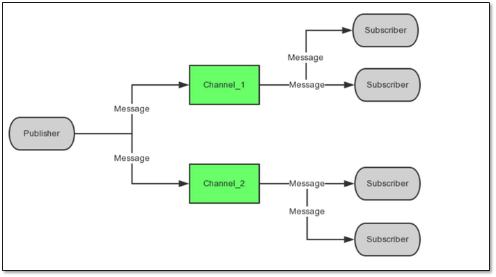 

**多个Publisher****，一个Subscriber****模型**

   可以将PubSub做成独立的HTTP接口，各应用程序作为Publisher向Channel中发送消息，Subscriber端收到消息后执行相应的业务逻辑，比如写数据库，显示等等。

主要应用：*排行榜、投票、计数。*

 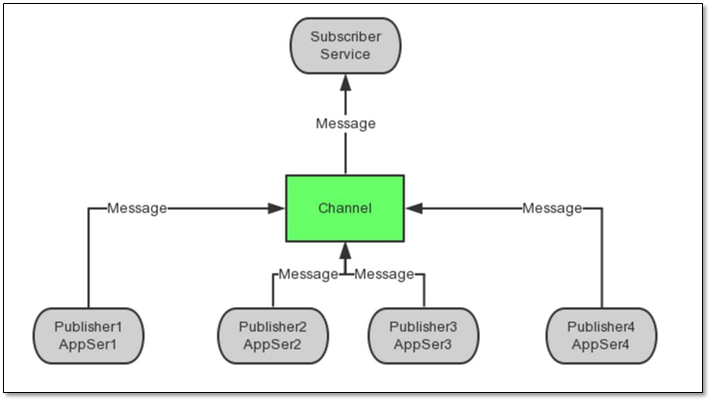

**多个Publisher****，多个Subscriber****模型**

故名思议，就是可以向不同的Channel中发送消息，由不同的Subscriber接收。

主要应用：群聊、聊天。

#### **1.4.9.2** **实践发布订阅**

**发布订阅实践命令**

| **命令**                                        | **描述**                                                     |
| ----------------------------------------------- | ------------------------------------------------------------ |
| **PUBLISH channel msg**                         | 将信息 message 发送到指定的频道 channel                      |
| **SUBSCRIBE channel [channel ...]**             | 订阅频道，可以同时订阅多个频道                               |
| **UNSUBSCRIBE [channel ...]**                   | 取消订阅指定的频道, 如果不指定频道，则会取消订阅所有频道     |
| **PSUBSCRIBE pattern [pattern ...]**            | 订阅一个或多个符合给定模式的频道，每个模式以 * 作为匹配符，比如 it* 匹配所有以 it 开头的频道( it.news 、 it.blog 、 it.tweets 等等)， news.* 匹配所有以 news. 开头的频道( news.it 、 news.global.today 等等)，诸如此类 |
| **PUNSUBSCRIBE [pattern [pattern ...]]**        | 退订指定的规则, 如果没有参数则会退订所有规则                 |
| **PUBSUB subcommand [argument [argument ...]]** | 查看订阅与发布系统状态                                       |

**注意：使用发布订阅模式实现的消息队列，当有客户端订阅channel****后只能收到后续发布到该频道的消息，之前发送的不会缓存，必须Provider****和Consumer****同时在线。**

#### **1.4.9.3** **消息队列系统对比**

客户端在执行订阅命令之后进入了订阅状态，只能接收 SUBSCRIBE 、PSUBSCRIBE、 UNSUBSCRIBE 、PUNSUBSCRIBE 四个命令。

 开启的订阅客户端，无法收到该频道之前的消息，因为 Redis 不会对发布的消息进行持久化。

和很多专业的消息队列系统（例如Kafka、RocketMQ）相比，Redis的发布订阅略显粗糙，例如无法实现消息堆积和回溯。但胜在足够简单，如果当前场景可以容忍的这些缺点，也不失为一个不错的选择。

### 1.4.10 Redis事务管理

redis中的事务跟关系型数据库中的事务是一个相似的概念，但是有不同之处。

关系型数据库事务执行失败后面的sql语句不在执行，而redis中的一条命令执行失败，其余的命令照常执行。

redis中开启一个事务是使用multi，相当于begin\start transaction，exec提交事务，discard取消队列命令（非回滚操作）。

   **redis****于mysql****对比**

|          | **MySQL**               | **Redis**                                                    |
| -------- | ----------------------- | ------------------------------------------------------------ |
| **开启** | start transaction/begin | multi                                                        |
| **语句** | 普通SQL                 | 普通命令                                                     |
| **失败** | rollback 回滚           | discard 取消(不叫回滚，是队列里面的命令不执行，队列里面的任务根本就没有执行。而不是执行了也可以撤回来) |
| **成功** | commit                  | exec                                                         |

#### **1.4.10.1**     **Redis** **事务命令**

| **命令**                | **描述**                                                     |
| ----------------------- | ------------------------------------------------------------ |
| **DISCARD**             | 取消事务，放弃执行事务块内的所有命令。                       |
| **EXEC**                | 执行所有事务块内的命令。                                     |
| **MULTI**               | 标记一个事务块的开始。                                       |
| **UNWATCH**             | 取消 WATCH 命令对所有 key 的监视。                           |
| **WATCH key [key ...]** | 监视一个(或多个) key ，如果在事务执行之前这个(或这些) key 被其他命令所改动，那么事务将被打断。 |

事务执行举例

 

```
ZADD salary 2000 user1
ZADD salary 3000 user2
ZRANGE salary 0 -1 WITHSCORES
MULTI
ZINCRBY salary 1000 user1
ZINCRBY salary -1000 user2
EXEC
```

#### **1.4.10.2**     **Redis****中事务中的锁机制**

举例：我正在买票 Ticket -1 , money -100 

而票只有1张, 如果在我multi之后,和exec之前, 票被别人买了，即ticket变成0了。

我该如何观察这种情景,并不再提交：

悲观的想法:

世界充满危险,肯定有人和我抢, 给 ticket上锁, 只有我能操作. **[****悲观锁]**

乐观的想法:

没有那么人和我抢,因此,我只需要注意,有没有人更改ticket的值就可以了 **[****乐观锁]**

Redis的事务中,**启用的是乐观锁**,只负责监测key没有被改动.

#### **1.4.10.3**     **Redis****服务管理命令**

| **命令**                                         | **描述**                                                     |
| ------------------------------------------------ | ------------------------------------------------------------ |
| **BGREWRITEAOF**                                 | 异步执行一个 AOF（AppendOnly File） 文件重写操作             |
| **BGSAVE**                                       | 在后台异步保存当前数据库的数据到磁盘                         |
| **CLIENT KILL [ip:port] [ID client-id]**         | 关闭客户端连接                                               |
| **CLIENT LIST**                                  | 获取连接到服务器的客户端连接列表                             |
| **CLIENT GETNAME**                               | 获取连接的名称                                               |
| **CLIENT PAUSE timeout**                         | 在指定时间内终止运行来自客户端的命令                         |
| **CLIENT SETNAME connection-name**               | 设置当前连接的名称                                           |
| **CLUSTER SLOTS**                                | 获取集群节点的映射数组                                       |
| **COMMAND**                                      | 获取 Redis 命令详情数组                                      |
| **COMMAND COUNT**                                | 获取 Redis 命令总数                                          |
| **COMMAND GETKEYS**                              | 获取给定命令的所有键                                         |
| **TIME**                                         | 返回当前服务器时间                                           |
| **COMMAND INFO command-name [command-name ...]** | 获取指定 Redis 命令描述的数组                                |
| **CONFIG GET parameter**                         | 获取指定配置参数的值                                         |
| **CONFIG REWRITE**                               | 对启动 Redis 服务器时所指定的 redis.conf 配置文件进行改写    |
| **CONFIG SET parameter value**                   | 修改 redis 配置参数，无需重启                                |
| **CONFIG RESETSTAT**                             | 重置 INFO 命令中的某些统计数据                               |
| **DBSIZE**                                       | 返回当前数据库的 key 的数量                                  |
| **DEBUG OBJECT key**                             | 获取 key 的调试信息                                          |
| **DEBUG SEGFAULT**                               | 让 Redis 服务崩溃                                            |
| **FLUSHALL**                                     | 删除所有数据库的所有key                                      |
| **FLUSHDB**                                      | 删除当前数据库的所有key                                      |
| **INFO [section]**                               | 获取 Redis 服务器的各种信息和统计数值                        |
| **LASTSAVE**                                     | 返回最近一次 Redis 成功将数据保存到磁盘上的时间，以 UNIX 时间戳格式表示 |
| **MONITOR**                                      | 实时打印出 Redis 服务器接收到的命令，调试用                  |
| **ROLE**                                         | 返回主从实例所属的角色                                       |
| **SAVE**                                         | 异步保存数据到硬盘                                           |
| **SHUTDOWN [NOSAVE] [SAVE]**                     | 异步保存数据到硬盘，并关闭服务器                             |
| **SLAVEOF host port**                            | 将当前服务器转变为指定服务器的从属服务器(slave server)       |
| **SLOWLOG subcommand [argument]**                | 管理 redis 的慢日志                                          |
| **SYNC**                                         | 用于复制功能(replication)的内部命令                          |

### 1.4.11 redis慢日志查询

Slow log 是 Redis 用来记录查询执行时间的日志系统。

slow log 保存在内存里面，读写速度非常快

可以通过改写 redis.conf 文件或者用 CONFIG GET 和 CONFIG SET 命令对它们动态地进行修改

```
slowlog-log-slower-than 10000 超过多少微秒
CONFIG SET slowlog-log-slower-than 100
CONFIG SET slowlog-max-len 1000 保存多少条慢日志
CONFIG GET slow*
SLOWLOG GET
SLOWLOG RESET
```

## 1.5 Redis主从复制

### 1.5.1 redis复制特性

⚗ 使用异步复制。

⚗ 一个主服务器可以有多个从服务器。

⚗ 从服务器也可以有自己的从服务器。

⚗ 复制功能不会阻塞主服务器。

⚗ 可以通过复制功能来让主服务器免于执行持久化操作，由从服务器去执行持久化操作即可。

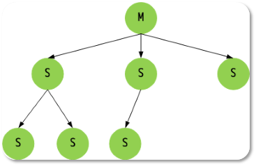

**关闭主服务器持久化时，复制功能的数据安全**

当配置Redis复制功能时，强烈建议打开主服务器的持久化功能。 否则的话，由于延迟等问题，部署的服务应该要避免自动拉起。

为了帮助理解主服务器关闭持久化时自动拉起的危险性，参考一下以下会导致主从服务器数据全部丢失的例子：

> \1. 假设节点A为主服务器，并且关闭了持久化。 并且节点B和节点C从节点A复制数据
>
> \2. 节点A崩溃，然后由自动拉起服务重启了节点A. 由于节点A的持久化被关闭了，所以重启之后没有任何数据
>
> \3. 节点B和节点C将从节点A复制数据，但是A的数据是空的， 于是就把自身保存的数据副本删除。

在关闭主服务器上的持久化，并同时开启自动拉起进程的情况下，即便使用Sentinel来实现Redis的高可用性，也是非常危险的。 因为主服务器可能拉起得非常快，以至于Sentinel在配置的心跳时间间隔内没有检测到主服务器已被重启，然后还是会执行上面的数据丢失的流程。

无论何时，数据安全都是极其重要的，所以应该禁止主服务器关闭持久化的同时自动拉起。

### 1.5.2 主从复制原理

**redis** **主从同步有两种方式（或者所两个阶段）：全同步和部分同步。**

主从刚刚连接的时候，进行全同步；全同步结束后，进行部分同步。当然，如果有需要，slave 在任何时候都可以发起全同步。

redis 策略是，无论如何，首先会尝试进行部分同步，如不成功，要求从机进行全同步，并启动 BGSAVE……BGSAVE 结束后，传输 RDB 文件；如果成功，允许从机进行部分同步，并传输积压空间中的数据。

下面这幅图，总结了主从同步的机制：

 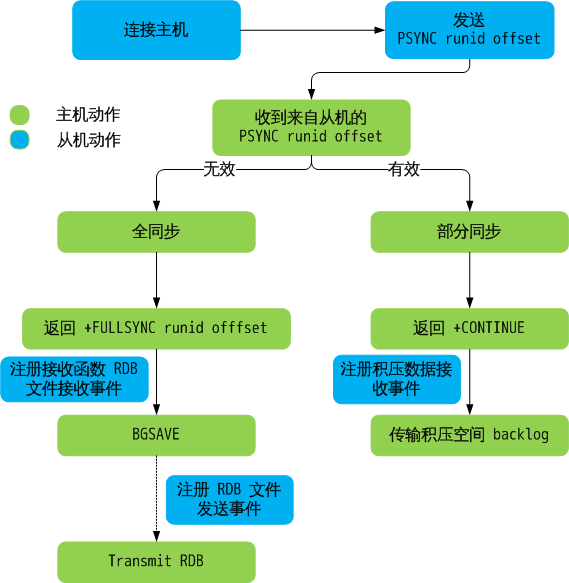

**主从复制原理：**

\1. 从服务器向主服务器发送 SYNC 命令。

\2. 接到 SYNC 命令的主服务器会调用BGSAVE 命令，创建一个 RDB 文件，并使用缓冲区记录接下来执行的所有写命令。

\3. 当主服务器执行完 BGSAVE 命令时，它会向从服务器发送 RDB 文件，而从服务器则会接收并载入这个文件。

\4. 主服务器将缓冲区储存的所有写命令发送给从服务器执行。

**命令的传播**

在主从服务器完成同步之后，主服务器每执行一个写命令，它都会将被执行的写命令发送给从服务器执行，这个操作被称为“命令传播”（command propagate）。

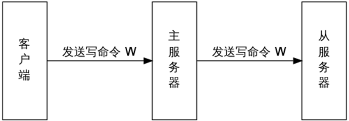 

命令传播是一个持续的过程：只要复制仍在继续，命令传播就会一直进行，使得主从服务器的状态可以一直保持一致。

### 1.5.3 复制中的SYNC与PSYNC

在 Redis 2.8 版本之前， 断线之后重连的从服务器总要执行一次完整重同步（full resynchronization）操作。

从 Redis 2.8 开始，Redis 使用 PSYNC命令代替 SYNC 命令。PSYNC 比起 SYNC 的最大改进在于 PSYNC 实现了部分重同步（partial resync）特性：在主从服务器断线并且重新连接的时候，只要条件允许，PSYNC 可以让主服务器只向从服务器同步断线期间缺失的数据，而不用重新向从服务器同步整个数据库。

### 1.5.4 复制的一致性问题

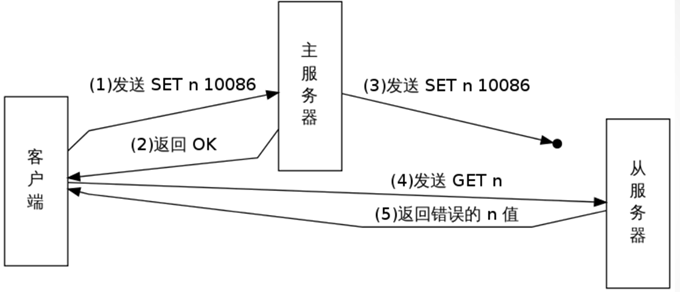 

在读写分离环境下，客户端向主服务器发送写命令 SET n 10086，主服务器在执行这个写命令之后，向客户端返回回复，并将这个写命令传播给从服务器。

接到回复的客户端继续向从服务器发送读命令 GET n ，并且因为网络状态的原因，客户端的 GET命令比主服务器传播的SET 命令更快到达了从服务器。

因为从服务器键 n 的值还未被更新，所以客户端在从服务器读取到的将是一个错误（过期）的 n值。

### 1.5.5 复制安全性提升

主服务器只在有至少 N 个从服务器的情况下，才执行写操作从 Redis 2.8 开始， 为了保证数据的安全性， 可以通过配置， 让主服务器只在有至少 N 个当前已连接从服务器的情况下， 才执行写命令。

不过， 因为 Redis 使用异步复制， 所以主服务器发送的写数据并不一定会被从服务器接收到， 因此， 数据丢失的可能性仍然是存在的。

通过以下两个参数保证数据的安全：

```
min-slaves-to-write <number of slaves>
min-slaves-max-lag <number of seconds>
```

### 1.5.6 Redis主从复制实践

在安装redis时就进行了多实例的配置

```
准备两个或两个以上redis实例
6380/redis-server
6380/redis.conf
6381/redis-server
6381/redis.conf
6382/redis-server
6382/redis.conf
```

配置文件示例：

```
bind 127.0.0.1 10.0.0.186
port 6380
daemonize yes
pidfile /var/run/redis_6380.pid
loglevel notice
logfile "/var/log/redis_6380.log"
dbfilename dump.rdb
dir /application/redis/6380/
appendonly no
appendfilename "appendonly.aof"
appendfsync everysec
slowlog-log-slower-than 10000
slowlog-max-len 128
protected-mode no
```

启动：

```
./6380/redis-server ./6380/redis.conf
./6381/redis-server ./6381/redis.conf
./6382/redis-server ./6382/redis.conf
```

复制环境说明

```
主节点：6380
从节点：6381、6382
```

开启主从（在6381 6382实例中执行）

```
redis-cli -p 6381/6382
SLAVEOF 127.0.0.1 6380
```

   **至此redis****主从复制完成**

### 1.5.7 Redis主从复制管理

主从复制状态监控：info replication

主从切换： slaveof no one

## 1.6 Redis HA 实践（Redis Sentinel）

官方文档：<https://redis.io/topics/sentinel>

Redis-Sentinel是Redis官方推荐的高可用性(HA)解决方案，当用Redis做Master-slave的高可用方案时，假如master宕机了，Redis本身(包括它的很多客户端)都没有实现自动进行主备切换，而Redis-sentinel本身也是一个独立运行的进程，它能监控多个master-slave集群，发现master宕机后能进行自动切换。

 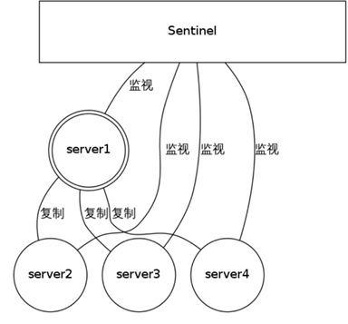

Sentinel 是一个监视器，它可以根据被监视实例的身份和状态来判断应该执行何种动作。

### 1.6.1 Redis Sentinel 功能

📣**监控****（Monitoring****）：**

Sentinel 会不断地检查你的主服务器和从服务器是否运作正常。

📣 **提醒****（Notification****）：**

当被监控的某个 Redis 服务器出现问题时， Sentinel 可以通过 API 向管理员或者其他应用程序发送通知。

📣 **自动故障迁移****（Automatic failover****）：**

当一个主服务器不能正常工作时， Sentinel 会开始一次自动故障迁移操作， 它会将失效主服务器的其中一个从服务器升级为新的主服务器， 并让失效主服务器的其他从服务器改为复制新的主服务器； 当客户端试图连接失效的主服务器时， 集群也会向客户端返回新主服务器的地址， 使得集群可以使用新主服务器代替失效服务器。

### 1.6.2 服务器连接

**发现并连接主服务器**

Sentinel 通过用户给定的配置文件来发现主服务器。

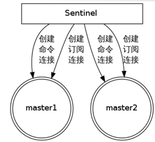

Sentinel 会与被监视的主服务器创建

两个网络连接：

🐱‍🏍 命令连接用于向主服务器发送命令。

🐱‍🏍 订阅连接用于订阅指定的频道，从而发现

监视同一主服务器的其他 Sentinel。

**发现并连接从服务器**

   Sentinel 通过向主服务器发送 INFO 命令来自动获得所有从服务器的地址。

   跟主服务器一样，Sentinel 会与每个被发现的从服务器创建命令连接和订阅连接。

 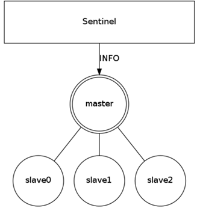

**发现其他 Sentinel**

   Sentinel 会通过命令连接向被监视的主从服务器发送 “HELLO” 信息，该消息包含Sentinel 的 IP、端口号、ID 等内容，以此来向其他 Sentinel 宣告自己的存在。与此同时Sentinel 会通过订阅连接接收其他 Sentinel 的“HELLO” 信息，以此来发现监视同一个主服务器的其他 Sentinel 。

 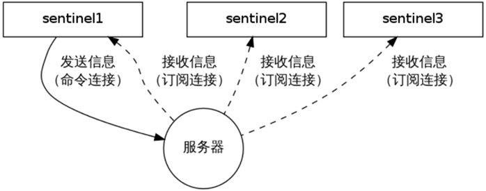

sentinel1 通过发送HELLO 信息来让sentinel2 和 sentinel3发现自己，其他两个sentinel 也会进行类似的操作。

**多个Sentienl****之间的链接**

   Sentinel 之间只会互相创建命令连接，用于进行通信。因为已经有主从服务器作为发送和接收 HELLO 信息的中介，所以Sentinel之间不会创建订阅连接。

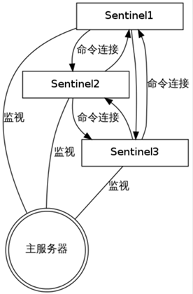 

### 1.6.3 检测实例的状态

Sentinel 使用 PING 命令来检测实例的状态：如果实例在指定的时间内没有返回回复，或者返回错误的回复，那么该实例会被 Sentinel 判断为下线。

 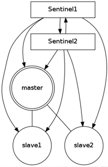

Redis 的 Sentinel 中关于下线（down）有两个不同的概念：

🥓 *主观下线（Subjectively Down**，* *简称 SDOWN**）*指的是单个Sentinel 实例对服务器做出的下线判断。

🥓*客观下线（Objectively Down**，* *简称 ODOWN**）*指的是多个Sentinel 实例在对同一个服务器做出 SDOWN 判断， 并且通过SENTINEL is-master-down-by-addr 命令互相交流之后， 得出的服务器下线判断。 （一个 Sentinel 可以通过向另一个Sentinel 发送 SENTINEL is-master-down-by-addr 命令来询问对方是否认为给定的服务器已下线。）

如果一个服务器没有在 master-down-after-milliseconds 选项所指定的时间内， 对向它发送 PING 命令的 Sentinel 返回一个有效回复（valid reply）， 那么 Sentinel 就会将这个服务器标记为主观下线。

### 1.6.4 故障转移FAILOVER

一次故障转移操作由以下步骤组成：

> \1.   发现主服务器已经进入客观下线状态。
>
> \2.   基于Raft leader election 协议 ， 进行投票选举
>
> \3.   如果当选失败，那么在设定的故障迁移超时时间的两倍之后，重新尝试当选。 如果当选成功， 那么执行以下步骤。
>
> \4.   选出一个从服务器，并将它升级为主服务器。
>
> \5.   向被选中的从服务器发送 SLAVEOF NO ONE 命令，让它转变为主服务器。
>
> \6.   通过发布与订阅功能， 将更新后的配置传播给所有其他 Sentinel ，其他 Sentinel 对它们自己的配置进行更新。
>
> \7.   向已下线主服务器的从服务器发送 SLAVEOF 命令，让它们去复制新的主服务器。
>
> \8.   当所有从服务器都已经开始复制新的主服务器时， leader Sentinel 终止这次故障迁移操作。

### 1.6.5 配置sentinel

创建程序目录

```
cd /application
mkdir 26380
cp /usr/local/redis/src/redis-sentinel ./26380/
cd  26380
```

   编辑配置文件

```
vim sentinel.conf
port 26380
dir "/tmp"
sentinel monitor mymaster 127.0.0.1 6380 2
sentinel down-after-milliseconds mymaster 60000
sentinel config-epoch mymaster 0
```

启动sentinel

```
./redis-sentinel ./sentinel.conf
```

配置文件说明

```
# 指定监控master
sentinel monitor mymaster 127.0.0.1 6370 2 
# {2表示多少个sentinel同意}
# 安全信息
sentinel auth-pass mymaster root
# 超过15000毫秒后认为主机宕机
sentinel down-after-milliseconds mymaster 15000 
# 当主从切换多久后认为主从切换失败
sentinel failover-timeout mymaster 900000
# 这两个配置后面的数量主从机需要一样，epoch为master的版本
sentinel leader-epoch mymaster 1
sentinel config-epoch mymaster 1
```

### 1.6.6 Sentinel命令操作

| **命令**                                           | **描述**                                                     |
| -------------------------------------------------- | ------------------------------------------------------------ |
| **PING**                                           | 返回 PONG                                                    |
| **SENTINEL masters**                               | 列出所有被监视的主服务器                                     |
| **SENTINEL slaves <master name>**                  |                                                              |
| **SENTINEL get-master-addr-by-name <master name>** | 返回给定名字的主服务器的 IP 地址和端口号。                   |
| **SENTINEL reset <pattern>**                       | 重置所有名字和给定模式 pattern 相匹配的主服务器              |
| **SENTINEL failover <master name>**                | 当主服务器失效时， 在不询问其他 Sentinel 意见的情况下，强制开始一次自动故障迁移。 |

### 1.6.7 Sentinel发布与订阅信息

客户端可以将 Sentinel 看作是一个只提供了订阅功能的 Redis 服务器： 你不可以使用 *PUBLISH* 命令向这个服务器发送信息， 但你可以用 *SUBSCRIBE* 命令或者 *PSUBSCRIBE* 命令， 通过订阅给定的频道来获取相应的事件提醒。

一个频道能够接收和这个频道的名字相同的事件。 比如说， 名为 *+sdown* 的频道就可以接收所有实例进入主观下线（*SDOWN*）状态的事件。

通过执行 PSUBSCRIBE * 命令可以接收所有事件信息。

以下列出的是客户端可以通过订阅来获得的频道和信息的格式：

>  第一个英文单词是频道/事件的名字，其余的是数据的格式。

**注意，** 当格式中包含 instance details 字样时， 表示频道所返回的信息中包

含了以下用于识别目标实例的内容：

```
<instance-type> <name> <ip> <port> @ <master-name> <master-ip> <master-port>
@ 字符之后的内容用于指定主服务器， 这些内容是可选的， 它们仅在 @ 字符之前的内容指定的实例不是主服务器时使用。
```

## 1.7 Redis cluster

### 1.7.1 Redis集群

Redis 集群是一个可以在多个 Redis 节点之间进行*数据共享*的设施（installation）。

Redis 集群不支持那些需要同时处理多个键的 Redis 命令， 因为执行这些命令需要在多个 Redis 节点之间移动数据， 并且在高负载的情况下，这些命令将降低 Redis 集群的性能， 并导致不可预测的行为。

Redis 集群通过分区（partition）来提供一定程度的可用性（availability）： 即使集群中有一部分节点失效或者无法进行通讯，集群也可以继续处理命令请求。将数据自动切分（split）到多个节点的能力。

当集群中的一部分节点失效或者无法进行通讯时， 仍然可以继续处理命令请求的能力。

### 1.7.2 Redis 集群数据共享

Redis 集群使用数据分片（sharding）而非一致性哈希（consistency hashing）来实现： 一个 Redis 集群包含 16384 个哈希槽（hash slot），数据库中的每个键都属于这 16384 个哈希槽的其中一个， 集群使用公式CRC16(key) % 16384 来计算键 key 属于哪个槽， 其中 CRC16(key) 语句用于计算键 key 的 CRC16 校验和 。

> 节点 A 负责处理 0 号至 5500 号哈希槽。
>
> 节点 B 负责处理 5501 号至 11000 号哈希槽。
>
>  
>
> 节点 C 负责处理 11001 号至 16384 号哈希槽。

**槽的计算公式**

集群使用公式 CRC16(key) & 16383 计算键 key属于哪个槽。

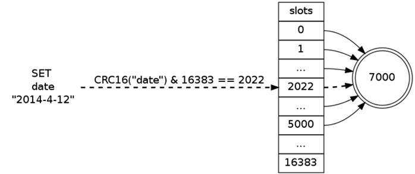 

### 1.7.3 集群运行机制

所有的redis节点彼此互联(PING-PONG机制),内部使用二进制协议优化传输速度和带宽.

节点的fail是通过集群中超过半数的master节点检测失效时才失效。

客户端与redis节点直连,不需要中间proxy层.客户端不需要连接集群所有节点,连接集群中任何一个可用节点即可

把所有的物理节点映射到[0-16383]slot上,cluster 负责维护node<->slot<->key

 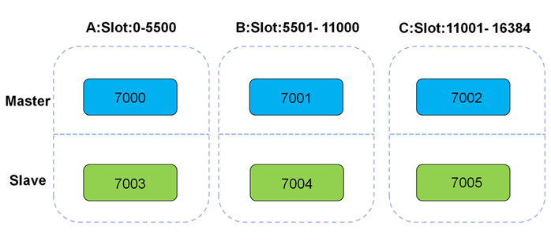

为了使得集群在一部分节点下线或者无法与集群的大多数（majority）节点进行通讯的情况下， 仍然可以正常运作，Redis 集群对节点使用了主从复制功能： 集群中的每个节点都有 1 个至 N 个复制品（replica）， 其中一个复制品为主节点（master）， 而其余的 N-1 个复制品为从节点（slave）。

> 在之前列举的节点 A 、B 、C 的例子中， 如果节点 B 下线了， 那么集群将无法正常运行， 因为集群找不到节点来处理 5501 号至 11000  号的哈希
>
> 槽。
>
> 假如在创建集群的时候（或者至少在节点 B 下线之前）， 我们为主节点  B添加了从节点 B1 ， 那么当主节点 B 下线的时候， 集群就会将 B1  设置为新的主节点， 并让它代替下线的主节点 B ， 继续处理 5501 号至  11000 号的哈希槽， 这样集群就不会因为主节点 B  的下线而无法正常运作了。
>
>  
>
> 不过如果节点 B 和 B1 都下线的话， Redis 集群还是会停止运作。

集群的复制特性重用了 SLAVEOF 命令的代码，所以集群节点的复制行为和SLAVEOF 命令的复制行为完全相同。

### 1.7.4 集群的故障转移

\1. 在集群里面，节点会对其他节点进行下线检测。

\2. 当一个主节点下线时，集群里面的其他主节点负责对下线主节点进行故障移。

\3. 换句话说，集群的节点集成了下线检测和故障转移等类似 Sentinel 的功能。

\4. 因为 Sentinel 是一个独立运行的监控程序，而集群的下线检测和故障转移等功能是集成在节点里面的，它们的运行模式非常地不同，所以尽管这两者的功能很相似，但集群的实现没有重用 Sentinel 的代码。

**在集群里面执行命令的两种情况**

*命令发送到了正确的节点：*

命令要处理的键所在的槽正好是由接收命令的节点负责，那么该节点执行命令，就像单机 Redis 服务器一样。

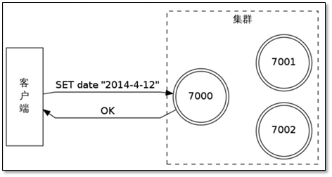 

> 槽位说明：
>
> 7000: 槽 0~5000
>
> 7001：槽 5001~10000
>
>  
>
> 7002：槽 10001~16383

```
键 date 位于 2022 槽，该槽由节点 7000 负责，命令会直接执行。
```

*命令发送到了错误的节点*：

接收到命令的节点并非处理键所在槽的节点，那么节点将向客户端返回一个转向（redirection）错误，告知客户端应该到哪个节点去执行这个命令，客户端会根据错误提示的信息，重新向正确的节点发送命令。

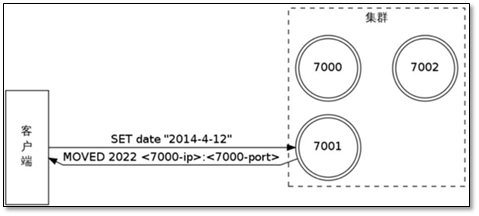

```
键 date 位于 2022 槽，该槽由节点 7000 负责，但错误发送到了7001节点，7001向客户返回转向错误。
```

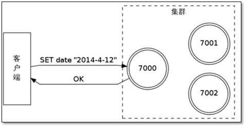

```
客户端根据转向错误的指引，转向到节点7000，并重新发送命令
```

### 1.7.5 关于转向错误

在集群中的节点会互相告知对方，自己负责处理哪些槽。


集群中的每个节点都会记录 16384 个槽分别由哪个节点负责，从而形成一个“槽表”（slot table）。

节点在接收到命令请求时，会通过槽表检查键所在的槽是否由本节点处理：

✍ 如果是的话，那么节点直接执行命令；

✍ 如果不是的话，那么节点就从槽表里面提取出正确节点的地址信息，然后返回转向错误。

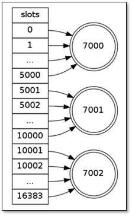 

### 1.7.6 配置集群

前期准备

\# EPEL源安装ruby支持

```
yum install ruby rubygems -y
```

使用国内源

```
gem source -a http://mirrors.aliyun.com/rubygems/  -remove https://rubygems.org/
# gem sources --add https://gems.ruby-china.org/ --remove https://rubygems.org/
# 安装redis支持
gem install redis -v 3.3.3
gem sources -l
```

配置文件

Redis 集群由多个运行在集群模式（cluster mode）下的 Redis 实例组成， 实例的集群模式需要通过配置来开启， 开启集群模式的实例将可以使用集群特有的功能和命令。

以下是一个包含了最少选项的集群配置文件示例：

 

```
port 7000
cluster-enabled yes
cluster-config-file nodes.conf
cluster-node-timeout 5000
appendonly yes
```

创建程序目录

```
cd /application/redis
mkdir 7000 7001 7002 7003 7004 7005
```

拷贝应用

```
for i in 0 1 2 3 4 5 
    do
    cp /usr/local/redis/src/redis-server  ./700$i
done
```

创建配置文件

```
for i in 7000 7001 7002 7003 7004 7005
do
echo "port $i
cluster-enabled yes
cluster-config-file nodes.conf
cluster-node-timeout 5000
appendonly yes" > $i/redis.conf
done
```

启动redis集群

```
for i in 7000 7001 7002 7003 7004 7005
do
    cd $i 
    ./redis-server ./redis.conf & 
    cd ../
done
```

创建集群

```
cd /usr/local/redis/src/
./redis-trib.rb --replicas 1 127.0.0.1:7000 127.0.0.1:7001 127.0.0.1:7002 127.0.0.1:7003 127.0.0.1:7004 127.0.0.1:7005
```

给定 redis-trib.rb 程序的命令是 create ， 这表示我们希望创建一个新的集群。

选项 --replicas 1 表示我们希望为集群中的每个主节点创建一个从节点。

### 1.7.7 集群管理

写数据，查看集群状态

```
redis-cli -c -p 7000
set foo bar
get foo
```

重新分片实践

```
cd /usr/local/redis/src/
./redis-trib.rb reshard 127.0.0.1:7000
```

集群状态

```
redis-cli -p 7000 cluster nodes | grep master
```

故障转移

```
redis-cli -p 7002 debug segfault
```

查看状态

```
redis-cli -p 7000 cluster nodes | grep master
```

增加新的节点

```
./redis-trib.rb add-node 127.0.0.1:7006 127.0.0.1:7000
```

删除一个节点

```
redis-trib del-node ip:port '<node-id>'
```

删除master节点之前首先要使用reshard移除master的全部slot,然后再删除当前节点

添加一个从节点

```
./redis-trib.rb add-node --slave --master-id $[nodeid] 127.0.0.1:7008 127.0.0.1:7000
```

### 1.7.8 状态说明

集群最近一次向节点发送 PING 命令之后， 过去了多长时间还没接到回复。

节点最近一次返回 PONG 回复的时间。

节点的配置节点（configuration epoch）：详细信息请参考Redis 集群规范 。

本节点的网络连接情况：例如 connected 。

节点目前包含的槽：例如 127.0.0.1:7001 目前包含号码为 5960 至 10921 的哈希槽。

## 1.8 Redis API

### 1.8.1 PHP使用redis

```
tar zxvf 2.2.7.tar.gz
cd phpredis-2.2.7
/application/php/bin/phpize
./configure --with-php-config=/application/php/bin/php-config
make && make install
echo 'extension="redis.so"' >> /application/php/lib/php.ini
service php-fpm restart
service nginx restart
```

连接测试代码

```
[root@clsn ~]# cat /application/nginx/html/check.php
<?php
//连接本地的 Redis 服务
$redis = new Redis();
$redis->connect('127.0.0.1', 6379);
echo "Connection to server sucessfully";
//查看服务是否运行
echo "Server is running: " . $redis->ping();
?>
```

字符串操作

```
<?php
//连接本地的 Redis 服务
$redis = new Redis();
$redis->connect('127.0.0.1', 6379);
echo "Connection to server sucessfully";
//设置 redis 字符串数据
$redis->set("tutorial-name", "Redis tutorial");
// 获取存储的数据并输出
echo "Stored string in redis:: " . $redis-
>get("tutorial-name");
?>
```

### 1.8.2 Python连接redis

安装软件包

```
[root@Redis ~]# yum install python-pip ipython -y  
[root@Redis ~]# pip install redis
```

测试

```
[root@Redis ~]# ipython
In [1]: import redis

In [2]: clsn = redis.StrictRedis(host='localhost', port=6379, db=0)

In [3]: clsn.set('blog','blog.nmtui.com')
Out[3]: True

In [4]: clsn.get('blog')
Out[4]: 'blog.nmtui.com'
```

## 1.9 参考文献

> [1] <http://blog.csdn.net/oanqoanq/article/details/50992535>
>
> [2] <http://www.redis.cn/topics/persistence.html>
>
> [3] <http://www.runoob.com/redis/redis-tutorial.html>
>
> [4] <http://blog.csdn.net/hechurui/article/details/49508813>
>
> [5] <https://www.cnblogs.com/lukexwang/p/4711977.html>
>
> [6] <https://www.cnblogs.com/daoluanxiaozi/p/3724299.html>