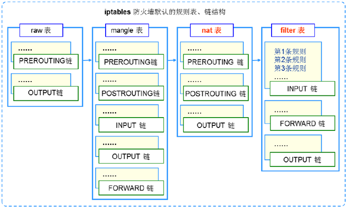
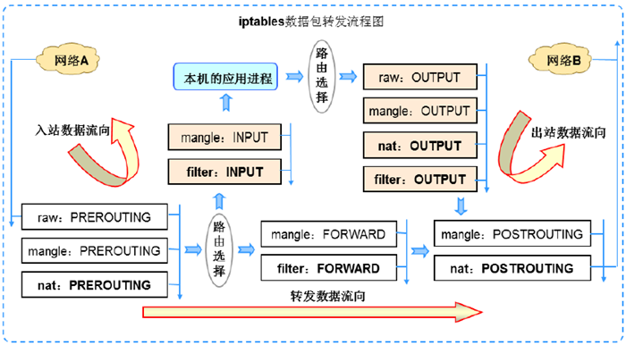
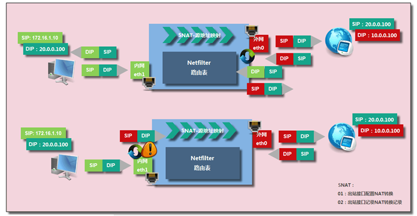
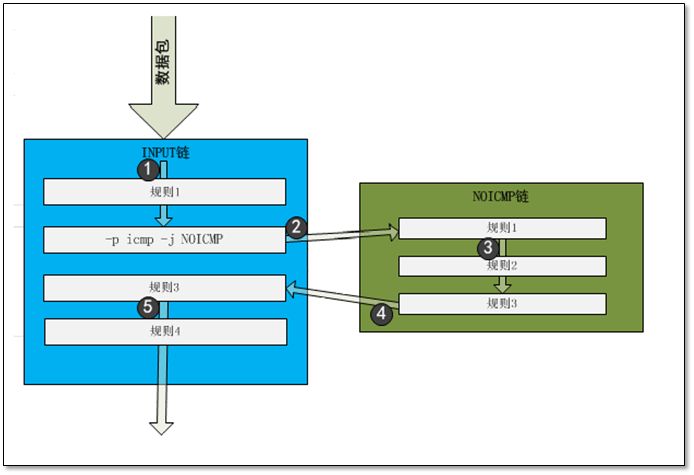

#  iptables

## 企业中安全优化配置原则

尽可能`不给服务器配置外网ip `,可以通过代理转发或者通过防火墙映射.并发不是特别大情况有外网ip,可以开启防火墙服务.

大并发的情况，不能开iptables,影响性能，利用硬件防火墙提升架构安全

### 生产中 iptables 的实际应用

主要应用方向

1、主机防火墙（filter表的INPUT链）。

2、局域网共享上网(nat 表的 POSTROUTING 链)。半个路由器，NAT功能。

3、端口及IP映射(nat 表的 PREROUTING 链)，硬防的NAT功能。

4、IP一对一映射。

**其他说明：**

>  ①iptables是基于内核的防火墙，功能非常强大，基于数据包的过滤！特别是可以在一台非常低的硬件配置下跑的非常好。
>
> **注：**iptables主要工作在OSI七层的2.3.4层。七层的控制可以使用squid代理+iptables。
>
> ②iptabes：生产中根据具体情况，一般，内网关闭，外网打开。大并发的情况不能开iptables，影响性能，iptables是要消耗CPU的，所以大并发的情况下，我们使用硬件防火墙的各方面做的很仔细。selinux：生产中也是关闭的。可以做ids的入侵检测。
>
> ③实际生产中尽可能不给服务器配置外网IP。可以通过代理转发。比如，nagios就不需要外网。
>
> ④并发不是很大的情况下，在外网的IP环境，开防火墙。
>
> ⑤第一次直接默认规则生成配置文件，以后就在配置文件中进行修改（编辑添加删除）。
>
> ⑥封掉IP：根据IP地址和网络连接数进行封杀。（定时任务，定时封掉，判断，存在就不再进行二次封杀）

###  企业常用案例功能小结：

1）linux主机防火墙，单机作为防火墙（表filter）。

2）局域网共享上网（表nat postrouting）。

3）外部地址映射为内部地址和端口（表nat prerouting）

## iptables 防火墙简介

Netfilter/Iptables(以下简称Iptables)是unix/linux自带的一款优秀且开放源代码的完全自由的基于包过滤的防火墙工具，它的功能十分强大，使用非常灵活，可以对流入和流出服务器的数据包进行很精细的控制.特别是它可以在一台非常低的硬件配置服务器上跑的非常好（赛扬500HZ cpu 64M 内存的惲况下部署网关防火墙），提供近400人的上网服务丝毫不逊色企业级专业路由器防火墙。 iptables + zebra + squid (企业常用网络开源产品）。

iptables是linux2.4及2.6内核中集成的服务，其功能与安全性比其老一蜚ipfwadm，ipchains 强大的多，iptables主要工作在0SI七层的二、三、四层，如果重新编译内核，iptables也可以支持 7 层控制（squid代理+iptables）。

###  iptables名词和术语

### 容器

用来描述这种包含或者说属于的关系。

### Netfilter/iptables 

Netfilter是表（tables）的容器，如果把Netfilter看成是某个小区的一栋楼。那么表（tables)就是楼里的其中的一套房子。这套房子"表（tables)"属于这栋“Netfilter”。

### 表（tables）

表（tables）是链的容器，即所有的链（chains）都属于其对应的表（tables）.如上，如果把Netfilter看成是某个小区的一栋楼.那么表（tables）就是楼里的其中的一套房子。

### 链（chains）

链（chains）是规则（Policys）的容器。接上，如果把表（tables）当作有一套房子，那么链（chains）就可以说是房子里的家具（柜子等）。

### 规则（Policy）

规则（Policy）就比较容易理解了，就是iptables系列过滤信息的规范和具体方法条款了.可以理解为柜子如何增加并摆放柜子东西等。

基本术语如下表格所示：

| **Netfilter** | **表（tables****）** | **链（chains****）** | **规则（Policy****）** |
| ------------- | -------------------- | -------------------- | ---------------------- |
| **一栋楼**    | 按里的房子           | 房子里的柜子         | 柜子里衣服，摆放规则   |

## iptables 表和链

描述完iptables术语后，相信大家对iptables的表和链有了初步的了解了，默认情况下，iptables根据功能和表的定义划分包含三个表，`filter,nat,mangle`,其每个表又包含不同的操作链（chains )。 实际iptables包含4张表和五个链,巧主要记住两张表即可filter和nat表即可。

下面表格展示了表和链的对应关系。

**四个表、五个链：**

| 表/链           | 介绍                                                         |
| --------------- | ------------------------------------------------------------ |
| `Filter`        | 这是`默认表`，实现防火墙数据过滤功能。                       |
| **INPUT**       | 对于指定到本地套接字的包，即`到达本地防火墙服务器的数据包`。 |
| **FORWARD**     | 路由穿过的数据包，即`经过本地防火墙服务器的数据包`。         |
| **OUTPUT**      | 本地创建的数据包                                             |
| `NAT`           | 当遇到新创建的数据包连接时将参考这个表                       |
| **FREROUTING**  | 一进来就对数据包进行改变                                     |
| **OUTPUT**      | 本地创建的数据包在路由前进行改变                             |
| **POSTROUTING** | 在数据包即将出去时改变数据包信息                             |
| `Mangle`        | 这个表专门用于改变数据包                                     |
| **INPUT**       | 进入到设备本身的包                                           |
| **FORWARD**     | 对路由后的数据包信息进行修改                                 |
| **FREROUTING**  | 在路由之前更改传入的包                                       |
| **OUTPUT**      | 本地创建的数据包在路由之前改变                               |
| **POSTROUTING** | 在数据包即将离开时更改数据包信息                             |
| `raw`           | **此表用处较少，可以忽略不计。**This  table is used mainly for configuring exemptions from connection tracking in combination with the  NOTRACK  target. |
| **PREROUTING**  | for packets arriving via any network interface               |
| **OUTPUT**      | for packets  generated by local processes                    |


| 表（tables）               | 链（chains） |        |            |             |      |
| -------------------------- | ------------ | ------ | ---------- | ----------- | ---- |
| INPUT                      | FORWARD      | OUTPUT | PREROUTING | POSTROUTING |      |
| **Filter**                 | √            | √      | √          | ×           | ×    |
| **NAT**                    | **×**        | ×      | √          | √           | √    |
| **Managle**                | √            | √      | √          | √           | √    |
| **raw**                    | ×            | ×      | √          | √           | ×    |
| 说明：√ 表示有，× 表示无。 |              |        |            |             |      |



图 - iptables中的表与链的结构关系

### filter表的详细介绍

| **filter表** | 主要和主机自身相关，真正负责主机防火墙功能的（过滤流入流出主机的数据包）filter表是iptables默认使用的表，这个表定义了三个链（chains）企业工作场景:主机防火墙 |
| ------------ | ------------------------------------------------------------ |
| **INPUT**    | 负责过滤所有目标是本机地址的数据包通俗来说：`过滤进入主机的数据包` |
| **FORWARD**  | `负责转发流经主机的数据包`。起到转发的作用，和NAT关系很大。LVS NAT 模式，net.ipv4.ip_forward=0 |
| **OUTPUT**   | 处理所有源地址是本机地址的数据包通俗的讲：`处理从主机发出的数据包` |

对于filter表的控制是我们实现本机防火墙功能的重要手段，特别是INPUT链的控制。

### NAT表信息详细介绍

| NAT表           | 负责网络地址转换的，即来源与目的的IP地址和port的转换。应用：和主机本身无关，一般用于局域网共享上网或者特殊的端口转换相关.**工作场景：**1、用于企业路由(zebra)或网关(iptables),共享上网(POSTROUTING)2、做内部外部IP地址一对一映射(dmz),硬件防火墙映射IP到内部服务器，FTP服务(PREROUTING)3、WEB,单个端口的映射，直接映射80端口(PREROUTING)这个表定义了3个链，nat功能相当于网络的acl控制。和网络交换机acl类似。 |
| --------------- | ------------------------------------------------------------ |
| **OUTPUT**      | 和主机放出去的数据包有关，改变主机发出数据包的目的地址。     |
| **PREROUTING**  | 在数据包到达防火墙时，进行路由判断之前执行的规则，作用是`改变数据包的目的地址、目的端口等`。就是收信时，根据规则重写收件人的地址例如：把公网IP： xxx.xxx.xxx.xxx 映射到局域网的 x.x.x.x 服务器如果是web服务，可以把80转换为局域网的服务器9000端口上。用来做DNAT。 |
| **POSTROUTING** | 在数据包离开防火墙时进行路由判断之后执行的规则，作用`改变数据包的源地址，源端口等`。写好收件人的地址，要让家人回信时能够有地址可回。例如。默认笔记本和虚拟机都是局域网地址，在出网的时候被路由器将源地址改为公网地址。**生产应用：**局域网共享上网。用来做SNAT。 |

### Mangle表信息详细介绍

| Mangle表 | 主要负责修改数据包中特殊的路由标记，做流量整形，如TTL,TOS,MARK等，这个表定义了5个链(chains). |
| -------- | ------------------------------------------------------------ |
|          |                                                              |

由于这个表与特殊标记相关，一般倩况下，我们用不到这个mangle表。这里就不做详细介绍了。

## iptables工作流程

### 工作流程说明

iptables是`采用数据包过滤机制`工作的，所以它会对请求的数据包的包头数据进行分析，并根据我们预先设定的规则进行匹配来决定是否可以进入主机。

数据包的流向是从左向右的。

 

图 - iptables包处理流程图

 

图 - iptables包处理流程图(简化)

上面的过程（Local Process）：主要是NAT功能（发送给防火墙本身的包）

>  企业案例：
>
>  1)局域网上网共享（路由和网关），使用NAT的POSTROUTING链。
>
>  2)外部IP和端口映射为内部IP和端口（DMZ功能），使用NAT的PREROUTING链

下面的过程：主要是FILTER功能，即防火墙功能FILTER INPUT FORWARD（需要经过防火墙的软件包）

> 企业案例：
>
> 主要应用就是主机服务器防火墙，使用FILTER的INPUT链

 

图 - iptables数据包转发流程图

###  iptables工作流程小结

> 1、防火墙是一层层过滤的。实际是按照配置规则的顺序从上到下，从前到后进行过滤的。
>
> 2、如果匹配上了规则，即明确表明是阻止还是通过，此时数据包就不在向下匹配新规则了。
>
> 3、如果所有规则中没有明确表明是阻止还是通过这个数据包，也就是没有匹配上规则，向下进行匹配，直到匹配默认规则得到明确的阻止还是通过。
>
> 4、防火墙的默认规则是对应链的所有的规则执行完以后才会执行的（最后执行的规则）。

## 处理过程

1. 表间优先顺序

    raw>mangle>nat>filter

2. 链间的匹配顺序

    入站数据： PREROUTING、INPUT

    出站数据： POSTROUTING、OUTPUT

    转发数据： PRETOUTING、FORWARD、POSTROUTING

3. 链内的匹配顺序：

    自上向下按顺序依次进行检查，找到相匹配的规则即停止

    若在链内找不到匹配规则，则按链的默认匹配规则处理

##  iptables操作

系统环境说明

```
[root@centos709 ~]# cat /etc/redhat-release 
CentOS Linux release 7.7.1908 (Core)
[root@centos709 ~]# hostname -I
192.168.122.108 172.17.0.1 10.244.1.0 10.244.1.1 
```

软件版本

```
[root@centos709 ~]# iptables -V
iptables v1.4.21
```

### iptables参数说明

| **参数**                       | **参数说明**                                                 |
| ------------------------------ | ------------------------------------------------------------ |
| **显示相关参数**               |                                                              |
| -n/--numeric                   | 以数字的方式显示地址或端口信息                               |
| -L/ --list                     | 列出一个链或所有链中的规则信息                               |
| --list-rules/-S                | 打印一个链或所有链中的规则信息                               |
| **--line-number**              | 当列出规则信息时，打印规则行号                               |
| **-v**                         | 显示详细信息，可以叠加                                       |
| **-h**                         | 显示帮助信息                                                 |
| **初始化相关参数**             |                                                              |
| iptables -F （FLUSH）          | 清除所有规则，不会处理默认的规则                             |
| **iptables -X**                | 删除用户自定义的链                                           |
| **iptables -Z**                | 链的计数器清零（数据包计数器与数据包字节计数器）             |
| **配置常用参数**               |                                                              |
| **-t** 表名称                  | 指定配置表名称。`默认filter`                                 |
| --append/-A  链名称            | `附加或追加上相应规则策略`，到指定链(链名称必须大写)，默认将配置的规则插入到`最后一条`。 |
| --check/-C                     | 检查规则是否存在                                             |
| --insert/-I 链名称             | `插入相应规则策略，到指定链上`，默认将配置的规则插入到`第一条`（可以根据规则序号插入到指定位置）--封IP地址使用。 |
| --delete/-D 链名称             | `删除指定的规则`(可以根据规则序号进行删除)                   |
| --replace/-R                   | `替换链中的规则`编号(1 = first)                              |
| -P(大写)链名称                 | `改变链上的最终默认规则策略`                                 |
| --new/-N                       | 创建新的用户定义链                                           |
| -p 协议名称[!] --proto         | 指定要匹配的数据包协议类型(`all tcp udp icmp`)               |
| --dport                        | 指定匹配的`目标端口信息`                                     |
| --sport                        | 指定匹配的`源端口信息`                                       |
| -j 动作                        | 匹配数据包后的动作                                           |
| ACCEPT                         | `允许`允许数据包通过本链而不拦截                             |
| DROP                           | `丢弃`(**不给请求者回应**)阻止数据包通过本链而丢弃           |
| REJECT                         | `拒绝`(**回应请求者明确的拒绝**)                             |
| MASQUERADE                     | `伪装上网`时使用                                             |
| SNAT                           | `源地址转换`                                                 |
| DNAT                           | `目的地址改写`                                               |
| **-i**[!] --in-interface       | 在INPUT链配置规则中，指定从`哪一个网卡接口进入的流量`（**只能配置在INPUT链上**） |
| **-o**[!] --out-interface      | 在OUTPUT链配置规则中，指定`从哪一个网接口出去的流量`（**只能配置在OUTPUT链上**） |
| -s/--source[!] address[/mask]  | 指定`源IP地址或源网段或源域名信息`                           |
| **-d**[!] --destination        | 指定`目标IP地址或目标网段或目标域名信息`                     |
| **扩展参数**                   |                                                              |
| -m 模块                        | 表示增加扩展，匹配功能扩展匹配（可以加载扩展参数）           |
| multiport                      | 实现不连续多端口扩展匹配                                     |
| icmp                           | 使用icmp的扩展                                               |
| state                          | 状态模块扩展                                                 |
| mac                            | 匹配某个mac地址                                              |
| --icmp-type                    | 只有类型8是真正会影响ping，或者也可以采用any；了解很多icmp类型*iptables -p icmp -h* |
| --limit n/{second/minute/hour} | 指定时间内的请求速率”n”为速率，后面为时间分别为：秒 分 时    |
| --limit-burst [n]              | 在同一时间内允许通过的请求”n”为数字，不指定默认为5           |
| --exact/-x                     | 扩展数字（显示精确数值）                                     |

!的使用实例

```
[root@centos709 ~]# iptables ! -V
Not 1.4.21 ;-)
[root@centos709 ~]# iptables -V
iptables v1.4.21
```

> 注意：在iptables中所有链名必须大写，表名必须小写，动作必须大写，匹配必须小写。
>

### 配置前准备

在配置防火墙首先要其中防火墙

```
[root@clsn ~]# /etc/init.d/iptables start 
iptables: Applying firewall rules:                         [  OK  ]
```

清除iptables所有规则

```
[root@clsn ~]# iptables -Z
[root@clsn ~]# iptables -X
[root@clsn ~]# iptables -F
```

查看iptables的规则

```
[root@centos728 ~]# iptables -nvL   # 注意：查看命令-[nvx]L 括号中的可选项要放在L前面
Chain INPUT (policy ACCEPT 80 packets, 6568 bytes)
 pkts bytes target     prot opt in     out     source               destination         

Chain FORWARD (policy ACCEPT 0 packets, 0 bytes)
 pkts bytes target     prot opt in     out     source               destination         

Chain OUTPUT (policy ACCEPT 47 packets, 5492 bytes)
 pkts bytes target     prot opt in     out     source               destination         
```

查看其他的表配置（-t 参数）

```
[root@clsn ~]# iptables -nL -t raw
Chain PREROUTING (policy ACCEPT)
target     prot opt source               destination         

Chain OUTPUT (policy ACCEPT)
target     prot opt source               destination
```

查看配置规则的顺序号

```
[root@clsn ~]# iptables -nvL --number-list
--line-number #  显示规则的序号
```

## iptables命令使用

```
iptables -P INPUT DROP  # 设置默认规则策略，默认拒绝
iptables -F INPUT # 清除INPUT链上的规则,但不会清空修改后的默认策略
iptables -t filter -F # 清除filter表中所有链上的规则
iptables -A INPUT -s 192.168.122.100 -j ACCEPT # 允许源数据包通过本机
iptables -A FORWAED -s 192.168.122.100 -j DROP # 阻止源数据包通过本机
```

> 注意: 在使用-P设置DROP，使用-F要小心，会导致远程链接不上,尤其对于云服务器
>
> 解决：配置一个crontab
>
> */15 * * * *    iptables -P INPUT ACCEPT

## iptables filter表配置实例

### 基础配置

**配置实例一：**配置22/ssh端口访问控制规则

```
iptables -A INPUT -p tcp --dprot 22 -j DROP     # 禁止所有人访问22端口
iptables -I INPUT -p tcp --dprot 22 -j ACCEPT   # 恢复连接方法
iptables -I INPUT 2 -p tcp --dprot 22 -j ACCEPT # 通过插入指定行号信息，指定将规则插入到第几行
iptables -D INPUT -p tcp --dport 22 -j ACCEPT   # 删除指定规则
iptables -D INPUT 2                             # 根据规则行号，删除相应的规则
```

只允许10.0.0.1的ip通过ssh连接这台服务器

```
iptables -I INPUT -s 10.0.0.1 -p tcp --dport 22 -j ACCEPT 
```

**配置实例二**：禁止网段连入（禁止172.16.1.0网段访问172.16.1.188）

```
iptables -A INPUT  -s 172.16.1.0/24 -d 172.16.1.188  -j DROP
```

**配置实例三**：禁止某个172.16.1.0网段访问服务器主机的22端口

```
iptables -A INPUT -s 172.16.1.0/24 -d 172.16.1.188  -p tcp --dport 22 -j DROP
```

方向说明：

```
# 在入方向控制
iptables -I INPUT -i eth0  -p tcp --dport 22 -j ACCEPT
# 在出方向控制
iptables -I OUTPUT -o eth0  -p tcp --sport 22 -j DROP
```

**配置实例四**：除10.0.0.0网段可以进行连接服务器主机意外，其余网段都禁止

  第一种方式：

```
iptables -A INPUT -s 10.0.0.0/24 -d 172.16.1.8  -j ACCEPT
```

   修改默认规则，将默认规则改为拒绝

第二种方式：

   ！  --- 表示对规则信息进行取反

```
iptables -A INPUT ! -s 10.0.0.0/24 -d 172.16.1.8  -j DROP   --- centos6用法
iptables -A INPUT -s ! 10.0.0.0/24 -d 172.16.1.8  -j DROP   --- centos5用法
```

说明：只有iptables帮助手册中指定的参数可以用取反符号（iptables --help）

**配置实例五**：测试匹配列举端口范围。

```
iptables -A INPUT -p tcp --dport 22:80 -j DROP                 # 设置连续多端口控制策略（22到80）
iptables -A INPUT -p tcp -m multiport  --dport 22,80 -j DROP   # 设置不连续多端口控制策略
```

   -m 参数表示增加扩展匹配功能，multiport 实现不连续多端口扩展匹配

> 扩展：
>
> --sport <匹配源端口>     --dport <匹配目标端口>
>
> 可以是个别端口也可以是端口范围
>
> --sport 1000 匹配源端口是1000的数据包
>
> --sport 1000:2000 匹配源端口是1000-2000的数据包(包含1000和2000)
>
> --sport 1000: 匹配源端口是1000以上的数据包（包含1000）
>
> --sport :1000 匹配源端口是1000以下的数据包（包含1000）
>
> --dport也是一样
>
> 注意：
>
> 1. --sport和--dport必须配合-p参数使用，不然没有意义。
> 2. 条件越多，匹配越细致，匹配范围越小

**配置实例六**：匹配ICMP类型

   禁止ping策略原则

   iptables服务器是ping命令发起者或是接受者

**发起者：**

input链： 禁止icmp-type 0 

```
iptables -A INPUT -i eth0 -p icmp --icmp-type 0 -j DROP
```

output链： 禁止icmp-type 8 

```
iptables -A OUTPUT -o eth0 -p icmp --icmp-type 8 -j DROP
```

   **接受者：**

input链： 禁止icmp-type 8 

```
iptables -A INPUT -i eth0 -p icmp --icmp-type 8 -j DROP
```

output链： 禁止icmp-type 0 

```
iptables -A OUTPUT -o eth0 -p icmp --icmp-type 0 -j DROP
```

简化配置：

```
iptables -A INPUT -i eth0 -p icmp -m icmp --icmp-type any -j DROP  #禁止所有类型的icmp
```

   指定类型禁止icmp

```
iptables -A INPUT -p icmp --icmp-type 8
iptables -A INPUT -p icmp --icmp-type 8 -j DROP
iptables -A INPUT -p icmp -m icmp --icmp-type any -j ACCEPT
iptables -A FORWARD -s 192.168.1.0/24 -p icmp -m icmp --icmp-type any -j ACCEPT
```

> 说明：只有类型8是真正会影响ping，或者也可以采用any；
>
> 了解很多icmp类型iptables -p icmp -h

**ICMP类型的说明**

| TYPE   | CODE | Description                                                  | Query | Error |
| ------ | ---- | ------------------------------------------------------------ | ----- | ----- |
| **0**  | 0    | Echo Reply——回显应答（Ping应答）                             | x     |       |
| **3**  | 0    | Network Unreachable——网络不可达                              |       | x     |
| **3**  | 1    | Host Unreachable——主机不可达                                 |       | x     |
| **3**  | 2    | Protocol Unreachable——协议不可达                             |       | x     |
| **3**  | 3    | Port Unreachable——端口不可达                                 |       | x     |
| **3**  | 4    | Fragmentation needed but no frag. bit set——需要进行分片但设置不分片比特 |       | x     |
| **3**  | 5    | Source routing failed——源站选路失败                          |       | x     |
| **3**  | 6    | Destination network unknown——目的网络未知                    |       | x     |
| **3**  | 7    | Destination host unknown——目的主机未知                       |       | x     |
| **3**  | 8    | Source host isolated (obsolete)——源主机被隔离（作废不用）    |       | x     |
| **3**  | 9    | Destination network administratively prohibited——目的网络被强制禁止 |       | x     |
| **3**  | 10   | Destination host administratively prohibited——目的主机被强制禁止 |       | x     |
| **3**  | 11   | Network unreachable for TOS——由于服务类型TOS，网络不可达     |       | x     |
| **3**  | 12   | Host unreachable for TOS——由于服务类型TOS，主机不可达        |       | x     |
| **3**  | 13   | Communication administratively prohibited by filtering——由于过滤，通信被强制禁止 |       | x     |
| **3**  | 14   | Host precedence violation——主机越权                          |       | x     |
| **3**  | 15   | Precedence cutoff in effect——优先中止生效                    |       | x     |
| **4**  | 0    | Source quench——源端被关闭（基本流控制）                      |       |       |
| **5**  | 0    | Redirect for network——对网络重定向                           |       |       |
| **5**  | 1    | Redirect for host——对主机重定向                              |       |       |
| **5**  | 2    | Redirect for TOS and network——对服务类型和网络重定向         |       |       |
| **5**  | 3    | Redirect for TOS and host——对服务类型和主机重定向            |       |       |
| **8**  | 0    | Echo request——回显请求（Ping请求）                           | x     |       |
| **9**  | 0    | Router advertisement——路由器通告                             |       |       |
| **10** | 0    | Route solicitation——路由器请求                               |       |       |
| **11** | 0    | TTL equals 0 during transit——传输期间生存时间为0             |       | x     |
| **11** | 1    | TTL equals 0 during reassembly——在数据报组装期间生存时间为0  |       | x     |
| **12** | 0    | IP header bad (catchall error)——坏的IP首部（包括各种差错）   |       | x     |
| **12** | 1    | Required options missing——缺少必需的选项                     |       | x     |
| **13** | 0    | Timestamp request (obsolete)——时间戳请求（作废不用）         | x     |       |
| **14** |      | Timestamp reply (obsolete)——时间戳应答（作废不用）           | x     |       |
| **15** | 0    | Information request (obsolete)——信息请求（作废不用）         | x     |       |
| **16** | 0    | Information reply (obsolete)——信息应答（作废不用）           | x     |       |
| **17** | 0    | Address mask request——地址掩码请求                           | x     |       |
| **18** | 0    | Address mask reply——地址掩码应答                             |       |       |

数据来源：http://www.cnitblog.com/yang55xiaoguang/articles/59581.html

### 防火墙状态机制配置

**状态集简单说明**

| **状态集**      | **说明**                                           |
| --------------- | -------------------------------------------------- |
| **NEW**         | 表示新建立连接的数据包状态                         |
| **ESTABLISHED** | 表示新建立连接数据包发送之后，回复响应的数据包状态 |
| **RELATED**     | 表示借助已经建立的链路，发送新的连接数据包         |
| **INVALID**     | 无效无法识别的数据包                               |

> 注意：允许关联的状态包通过（web服务不要使用FTP服务）
>

防火墙服务配置在FTP服务器上时，需要配置以下策略

```
iptables -A INPUT -m state --state ESTABLISHED,RELATED -j ACCEPT
iptables -A OUTPUT -m state --state ESTABLISHED,RELATED -j ACCEPT
```

实现发现sent_syn状态

```
iptables -A INPUT -m state --state NEW -j DROP    # 防火墙所连接客户端上配置
```

实现发现sent_rcvd状态

```
iptables -I INPUT -i eth0 -s 10.0.0.201 -m state --state ESTABLISHED -j DROP  # 防护墙上配置的
```

### 扩展模块MAC

```
iptables -A FORWARD -m mac --mac-source xx:xx:xx:xx:xx:xx -j DROP # 阻止来自某mac地址的数据包通过本机
```

> 注意：报文经过路由后，数据包中原有的mac地址会被替换，所以在路由后的iptables中使用mac模块没有意义。所以使用很少

###  使用iptables实现限速功能

limit是iptables的一个匹配模块，用它结合iptables的其它命令可以实现限速的功能。

不过首先必须明确，limit本身只是一个“匹配”模块。我们知道，iptables的基本原理是“匹配--处理”，limit在这个工作过程中只能起到匹配的作用，它本身是无法对网络数据包进行任何处理的。我看到网上有些limit的例子里面说只 用一条包含limit匹配规则的iptables语句就可以实现限速，那是错误的。

实际上，利用imit来限速需要包括两个步骤:

1.对符合limit匹配规则包放行

2.丢弃/拒绝未放行的包

示例：

```
iptables -I INPUT -s 10.0.0.7 -p icmp --icmp-type 8 -m limit --limit 6/min --limit-burst 5 -j ACCEPT 
iptables -I INPUT -s 10.0.0.7 -p icmp --icmp-type 8 -j DROP
```

语句含义：当来自10.0.0.7 的ping包超过5个时进行限速，限制为每10s一个。

参数说明：

| **参数**                           | **参数含义**                                              |
| ---------------------------------- | --------------------------------------------------------- |
| **--limit n/{second/minute/hour}** | 指定时间内的请求速率”n”为速率，后面为时间分别为：秒 分 时 |
| **--limit-burst [n]**              | 在同一时间内允许通过的请求”n”为数字，不指定默认为5        |

**limit模块具体是如何工作的**

limit的匹配是基于令牌桶 (Token bucket）模型的。

令牌桶是一种网络通讯中常见的缓冲区工作原理，它有两个重要的参数，令牌桶容量n和令牌产生速率s。

> 我们可以把令牌当成是门票，而令牌桶则是负责制作和发放门票的管理员，它手里最多有n张令牌。一开始，管理员开始手里有n张令牌。每当一个数据包到达后，管理员就看看手里是否还有可用的令牌。如果有，就把令牌发给这个数据包，limit就告诉iptables，这个数据包被匹配了。而当管理员把手上所有的令牌都发完了，再来的数据包就拿不到令牌了。这时，limit模块就告诉iptables，这个数据包不能被匹配。除了发放令牌之外，只要令牌桶中的令牌数量少于n，它就会以速率s来产生新的令牌，直到令牌数量到达n为止。

通过令牌桶机制，即可以有效的控制单位时间内通过（匹配）的数据包数量，又可以容许短时间内突发的大量数据包的通过（只要数据包数量不超过令牌桶n）。

limit模块提供了两个参数--limit和--limit-burst，分别对应于令牌产生速率和令牌桶容量。除了令牌桶模型外，limit匹配的另外一个重要概念是匹配项。在limit中，每个匹配项拥有一个单独的令牌桶，执行独立的匹配计算。

### 企业级防火墙配置

分析：

1. 网络接口lo的处理

2. 状态监测的处理

3. 协议+端口的处理

清除防火墙规则

```
[root@clsn ~]# iptables -F
[root@clsn ~]# iptables -X
[root@clsn ~]# iptables -Z
```

修改默认规则为拒绝（修改前先放行22端口，保证自己能够连上主机）

```
[root@clsn ~]# iptables -A INPUT -p tcp --dport  22 -j ACCEPT
[root@clsn ~]# iptables -P INPUT DROP 
[root@clsn ~]# iptables -P FORWARD DROP
```

放行指定的端口

```
[root@clsn ~]# iptables -A INPUT -i lo -j ACCEPT
[root@clsn ~]# iptables -A INPUT  -p tcp  -m multiport --dport  80,443 -j ACCEPT
[root@clsn ~]# iptables -A INPUT -s 172.16.1.0/24 -j ACCEPT
[root@clsn ~]# iptables -A INPUT -m state --state ESTABLISHED,RELATED -j ACCEPT
# 状态防火墙能识别TCP和UDP会话，非状态防火墙只能根据端口识别，不能识别会话。
```

保存iptables配置

1. 第一种方式

```
[root@clsn ~]# /etc/init.d/iptables save
iptables: Saving firewall rules to /etc/sysconfig/iptables:[  OK  ]
[root@clsn ~]# cat /etc/sysconfig/iptables
# Generated by iptables-save v1.4.7 on Tue Apr  4 12:24:43 2017
*filter
:INPUT DROP [0:0]
:FORWARD DROP [0:0]
:OUTPUT ACCEPT [159:10664]
-A INPUT -s 10.0.0.0/24 -j ACCEPT 
-A INPUT -p tcp -m tcp --dport 22 -j ACCEPT 
-A INPUT -p tcp -m multiport --dports 80,443 -j ACCEPT 
-A INPUT -s 172.16.1.0/24 -j ACCEPT 
-A INPUT -i lo -j ACCEPT 
-A INPUT -m state --state RELATED,ESTABLISHED -j ACCEPT 
COMMIT
# Completed on Tue Apr  4 12:24:43 2017
```

2. 第二种方式

```
iptables-save >/etc/sysconfig/iptables
```

> centos7问题解决：
>
> Centos7系统采用新的firewalld服务代替iptables，但并没有摒弃iptables。
>
> ```
> # 关闭firewalld服务
> sudo systemctl disable firewalld
> sudo systemctl stop firewalld
> 
> # 查看firewall状态
> sudo systemctl status firewalld
> 
> # 检查iptables是否安装
> sudo systemctl status iptables
> 
> # 安装iptables
> sudo yum install -y iptables
> 
> # 升级iptables
> sudo yum update iptables
> 
> # 安装iptables-services
> sudo yum install -y iptables-services
> ```
> iptables 也是一個類似的例子，ExecStart 的指令是執行 iptables.init start，執後完後就結束了，沒有 daemon 會持續持行，因此狀態也會是 active (exited）。
>
>  iptables 并不是守护进程，而是由内核控制，所以装载完规则后自动退出了。这里查看状态是active(exited)是没有问题的。


## iptables nat表配置实例

### iptables实现共享上网

 

图 - SNAT 配置原理图

第一个里程碑：配置内网服务器，设置网关地址

```
/etc/init.d/iptables stop      # 内网服务器停止防火墙服务
ifdown eth0                    # 模拟关闭内网服务器外网网卡
setup                          # 修改内网网卡网关和DNS地址信息
```

也可以使用命令添加默认网关

```
route add default gw 172.16.1.188
```

查看默认的路由信息

```
[root@test ~]# route -n
Kernel IP routing table
Destination     Gateway         Genmask         Flags Metric Ref    Use Iface
172.16.1.0      0.0.0.0         255.255.255.0   U     0      0        0 eth1
169.254.0.0     0.0.0.0         255.255.0.0     U     1003   0        0 eth1
0.0.0.0         172.16.1.188    0.0.0.0         UG    0      0        0 eth1
```

说明：内网服务器网关地址指定为共享上网服务器内网网卡地址

第二个里程碑：配置共享上网服务器，开启共享上网服务器路由转发功能

```
[root@clsn ~]# vim /etc/sysctl.conf 
net.ipv4.ip_forward = 1
[root@clsn ~]# sysctl -p
```

第三个里程碑：配置共享上网服务器，实现内网访问外网的NAT映射

```
iptables -t nat -A POSTROUTING -s 172.16.1.0/24 -o eth0 -j SNAT --to-source 10.0.0.188
```

参数详解：

| **参数**                | **参数说明**                                                 |
| ----------------------- | ------------------------------------------------------------ |
| **-s 172.16.1.0/24**    | 指定将哪些内网网段进行映射转换                               |
| **-o eth0**             | 指定在共享上网哪个网卡接口上做NAT地址转换                    |
| **-j SNAT**             | 将源地址进行转换变更。SNAT支持转换为单IP也支持转换到IP地址池。（nat表中的POSTROUTING链） |
| **-j DNAT**             | 将目标地址进行转换变更。DNAT支持转换为单IP也支持转换到IP地址池。（nat表中的PREROUTING链） |
| --to-source ip地址      | 将源地址映射为什么IP地址                                     |
| --to-destination ip地址 | 将目标地址映射为什么IP地址                                   |

当filter表中的forward默认为drop策略时，如何配置forward链？

 

图 - forward工作原理

   **配置示例**

```
iptables -A FORWARD -i eth1 -s 172.16.1.0/24 -j ACCEPT
# iptables -A FORWARD -o eth0 -s 172.16.1.0/24 -j ACCEPT  # 可以不进行配置
iptables -A FORWARD -i eth0 -d 172.16.1.0/24 -j ACCEPT
# iptables -A FORWARD -o eth1 -d 172.16.1.0/24 -j ACCEPT   # 可以不进行配置
```

当外网ip不固定时如何配置

```
iptables -t nat -A POSTROUTING -s 172.16.1.0/24 -o eth0 -j MASQUERADE   # 伪装共享上网
```

说明：在企业中如何没有固定外网IP地址，可以采取以上伪装映射的方式进行共享上网

**配置映射方法小结**

>  1. 指定哪些网段需要进行映射     -s 172.16.1.0/24
>
> 2. 指定在哪做映射               -o eth0
>
> 3. 用什么方法做映射             -j SNAT/DNAT/MASQUERADE
>
> 4. 映射成什么地址               --to-source  ip地址/--to-destination ip地址

### iptables实现外网IP的端口映射到内网IP的端口

**实际需求**：将网关的IP和9000端口映射到内网服务器的22端口

端口映射 10.0.0.188:9000 -->172.16.1.180:22

配置实例：

```
iptables -t nat -A PREROUTING -d 10.0.0.188 -p tcp --dport 9000 -i eth0 -j DNAT --to-destination 172.16.1.7:22
```

参数说明:

| **参数**          | **参数说明**   |
| ----------------- | -------------- |
| **-d 10.0.0.188** | 目标地址。     |
| **-j DNAT**       | 目的地址改写。 |

### IP一对一映射


图 - DNAT 映射原理

**实际需求**：将ip 地址172.16.1.180 映射到10.0.0.188

通过辅助IP配置：

```
ip addr add 10.0.0.81/24 dev eth0 label eth0:0   # 添加辅助IP
iptables  -t nat -I PREROUTING -d 10.0.0.81 -j DNAT --to-destination 172.16.1.51
iptables  -t nat -I POSTROUTING -s 172.16.1.51 -o eth0 -j SNAT --to-source 10.0.0.81
```

适合内网的机器访问NAT外网的IP

```
iptables  -t nat -I POSTROUTING -s 172.16.1.0/255.255.240.0 -d 10.0.0.81 -j SNAT --to-source 172.16.1.8
```

检查配置：

```
ping 10.0.0.81 -t
tcpdump|grep -i icmp（两台机器上分别监测）
telnet 10.0.0.81 22
```

### 映射多个外网IP上网

方法1：

```
iptables -t nat -A POSTROUTING -s 10.0.1.0/255.255.240.0 -o eth0 -j SNAT --to-source 124.42.60.11-124.42.60.16
```

在三层交换机或路由器，划分VLAN。

方法2：

```
iptables -t nat -A POSTROUTING -s 10.0.1.0/22 -o eth0 -j SNAT --to-source 124.42.60.11
iptables -t nat -A POSTROUTING -s 10.0.2.0/22 -o eth0 -j SNAT --to-source 124.42.60.12
```

 扩大子网，会增加广播风暴。

### 系统防火墙与网络内核优化标准参数

**有关iptables的内核优化**

调整内核参数文件/etc/sysctl.conf

以下是我的生产环境的某个服务器的配置：

**解决time-wait过多的办法**

```
net.ipv4.tcp_fin_timeout = 2
net.ipv4.tcp_tw_reuse = 1
net.ipv4.tcp_tw_recycle = 1
net.ipv4.tcp_syncookies = 1
net.ipv4.tcp_keepalive_time = 600
net.ipv4.tcp_max_tw_buckets = 36000
net.ipv4.ip_local_port_range = 4000  65000
net.ipv4.tcp_max_syn_backlog = 16384
net.ipv4.route.gc_timeout = 100
net.ipv4.tcp_syn_retries = 1
net.ipv4.tcp_synack_retries = 1
```

在dmesg中显示  ip_conntrack: table full, dropping packet. 的错误提示，什么原因？如何解决？

 iptables优化

```
net.nf_conntrack_max = 25000000
net.netfilter.nf_conntrack_max = 25000000
net.netfilter.nf_conntrack_tcp_timeout_established = 180
net.netfilter.nf_conntrack_tcp_timeout_time_wait = 120
net.netfilter.nf_conntrack_tcp_timeout_close_wait = 60
net.netfilter.nf_conntrack_tcp_timeout_fin_wait = 120
```

## 自定义链的配置

 

图 - 自定义链原理

创建自定义链

```
#示例：在filter表中创建NOICMP自定义链
iptables -t filter -N NOICMP
```

引用自定义链

```
#示例：在INPUT链中引用刚才创建的自定义链
iptables -t filter -I INPUT -p icmp  -j NOICMP
```

重命名自定义链

```
#示例：将IN_WEB自定义链重命名为WEB
iptables -E NOICMP ACCEPTICMP
```

删除自定义链

>  删除自定义链需要满足两个条件
>
> 1、自定义链没有被引用
>
> 2、自定义链中没有任何规则

```
# 示例： 删除引用数为0且不包含任何规则的ACCEPTICMP链
iptables -X ACCEPTICMP
```

## 防火墙状态机制

状态机制是iptables中较为特殊的一部分，这也是iptables和比较老的ipchains的一个比较大的区別之一，`运行状态机制（连接跟踪）的防火墙称作带有状态机制的防火墙`，以下简称为状态防火墙.状态防火墙比非状态防火墙要安全，因为它允许我们编写更严密的规则。

在iptables上一共有四种状态，分别被称为NEW、ESTABLISHED、INVALID、RELATED,这四种状态对于TCP、UDP、ICMP三种协议均有效。下面，我们来分别阐述四种状态的特性.

**🔔 `NEW`**

NEW说明这个包是我们看到的第一个包。意思就是，这是conntrack模块看到的某个连接的第一个包，它即刻被匹配了。比如，我们看到一个SYN包，是我们所留意的连接的第一个包，就要匹配它。

 

**🔔 `ESTABLISHED`**

ESTABLISHED已经注意到两个方向上的数据传输，而且会继续匹配这个连接的包.处于ESTABLISHED状态的连接是非常容易理解的.只要发送并接到应答，连接就是ESTABLISHED的了。一个连接要从NEW变为ESTABLISHED,只需要接到应答包即可，不管这个包是发往防火墙的，还是要由防火墙转发的.ICMP的错误和重定向等信息包也被看作是ESTABLISHED,只要它们是我们所发出的信息的应答。

 

**🔔` RELATED`**

RELATED是个比较麻烦的状态.当一个连接和某个已处于ESTABLISHED状态的连接有关系时，就被认为是RELATED的了，换句话说，一个连接要想是RELATED的，首先要有一个ESTABLISHED的连接。这个ESTABLISHED连接再产生一个主连接之外的连接，这个新的连接就是RELATED的了，当然前提是conntrack模块要能理解RELATED。ftp是个很好的例子，FTP-data连接就是和FTP-control有关联的，如果没有在iptables的策略中配RELATED状态，FTP-data的连接是无法正确建立的，还有其他的例子，比如，通过IRC的DCC连接#有了这个状态，ICMP应答、FTP传输、DCC等才能穿过防火墙正常工作.注意，大部分还有一些UDP协议都依赖这个机制。这些协议是很复杂的，它们把连接信息放在数据包里，并且要求这些信息能被正确理解。

 

**🔔` INVALID`**

INVALID说明数据包不能被识别属于哪个连接或没有任何状态.有几个原因可以产生这种情况，比如，内存溢出，收到不知厲于哪个连接的ICMP错误信息。一般地，我们DROP这个状态的任何东西，因为防火墙认为这是不安全的东西

 

### iptables配置哲学

**如何防止自己被关在门外**

>  1、去机房重启系统或者登陆服努器删除刚才的禁止规则。
>
> 2、让机房人员重启服芳器或者让机房人员拿用户密码登录进去。
>
> 3、通过服努器的远程管理卡管理（推荐）。
>
> 4、先写一个定时任务，每5分钟就停止防火墙。
>
> 5、测试环境测试好，写成脚本，批置执行

配置禁用22端口策略:

```
iptables -I INPUT -p tcp - dport 22 -j DROP
# 说明：利用-I参数，实现强行阻止访问22端口，将Jffc规则放在第一位
```

删除配置的禁止连接22端口的规则

```
iptables -t filter -D INPUT -p tcp --dport 22 -j DROP
iptables -F
/etc/init.d/iptables restart
```

