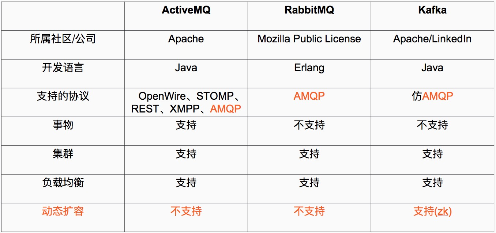
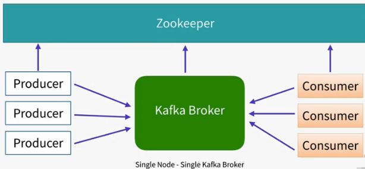
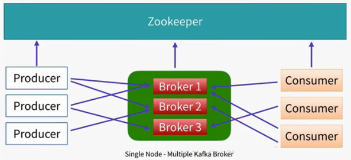
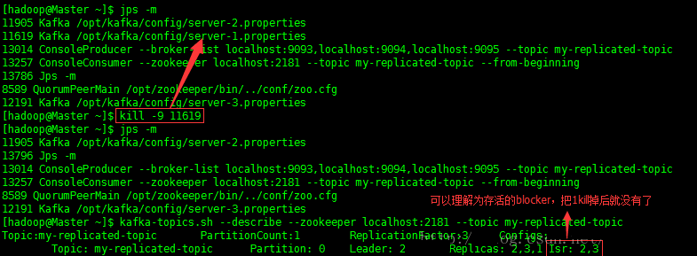
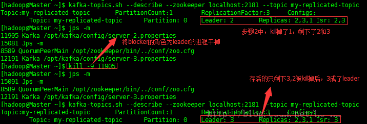
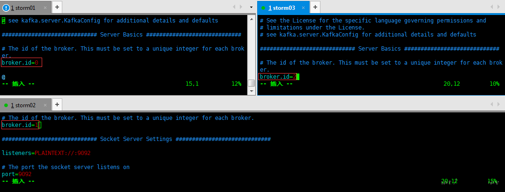
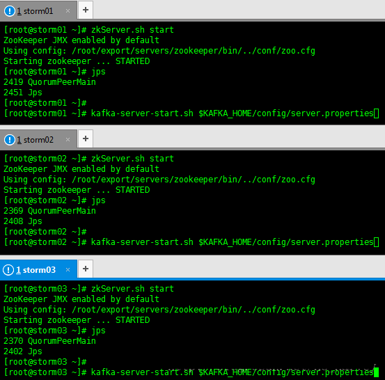

## Kafka初识

**1、Kafka使用背景**

在我们大量使用分布式数据库、分布式计算集群的时候，是否会遇到这样的一些问题：

1. 我们想分析下用户行为（pageviews），以便我们设计出更好的广告位
2. 我想对用户的搜索关键词进行统计，分析出当前的流行趋势
3. 有些数据，存储数据库浪费，直接存储硬盘效率又低 

这些场景都有一个共同点：

数据是由上游模块产生，上游模块，使用上游模块的数据计算、统计、分析，这个时候就可以使用消息系统，尤其是分布式消息系统！

**2、Kafka的定义**

What is Kafka：它是一个分布式消息系统，由linkedin使用scala编写，用作LinkedIn的活动流（`Activity Stream`）和运营数据处理管道（Pipeline）的基础。具有高水平扩展和高吞吐量。

**3、Kafka和其他主流分布式消息系统的对比** 



定义解释：

1、Java 和 scala都是运行在JVM上的语言。

2、erlang和最近比较火的和go语言一样是从代码级别就支持高并发的一种语言，所以RabbitMQ天生就有很高的并发性能，但是 有RabbitMQ严格按照AMQP进行实现，受到了很多限制。kafka的设计目标是高吞吐量，所以kafka自己设计了一套高性能但是不通用的协议，他也是仿照AMQP（ `Advanced Message Queuing Protocol   高级消息队列协议`）设计的。 

3、**事物的概念：**在数据库中，多个操作一起提交，要么操作全部成功，要么全部失败。举个例子， 在转账的时候付款和收款，就是一个事物的例子，你给一个人转账，你转成功，并且对方正常行收到款项后，这个操作才算成功，有一方失败，那么这个操作就是失败的。 

对应消在息队列中，就是多条消息一起发送，要么全部成功，要么全部失败。3个中只有ActiveMQ支持，这个是因为，RabbitMQ和Kafka为了更高的性能，而放弃了对事物的支持 。

4、**集群：**多台服务器组成的整体叫做集群，这个整体对生产者和消费者来说，是透明的。其实对消费系统组成的集群添加一台服务器减少一台服务器对生产者和消费者都是无感之的。

5、**负载均衡**：对消息系统来说负载均衡是大量的生产者和消费者向消息系统发出请求消息，系统必须均衡这些请求使得每一台服务器的请求达到平衡，而不是大量的请求，落到某一台或几台，使得这几台服务器高负荷或超负荷工作，严重情况下会停止服务或宕机。

6、**动态扩容**是很多公司要求的技术之一，不支持动态扩容就意味着停止服务，这对很多公司来说是不可以接受的。 

注：

阿里巴巴的Metal,RocketMQ都有Kafka的影子，他们要么改造了Kafka或者借鉴了Kafka，最后`Kafka的动态扩容是通过Zookeeper来实现的`。 


 Zookeeper是一种在分布式系统中被广泛用来作为：分布式状态管理、分布式协调管理、分布式配置管理、和分布式锁服务的集群。kafka增加和减少服务器都会在Zookeeper节点上触发相应的事件kafka系统会捕获这些事件，进行新一轮的负载均衡，客户端也会捕获这些事件来进行新一轮的处理。

## Kafka相关概念

**1、 AMQP协议**

Advanced Message Queuing Protocol （高级消息队列协议）

**The Advanced Message Queuing Protocol (AMQP)：**是一个标准开放的应用层的消息中间件（Message Oriented Middleware）协议。AMQP定义了通过网络发送的字节流的数据格式。因此兼容性非常好，任何实现AMQP协议的程序都可以和与AMQP协议兼容的其他程序交互，可以很容易做到跨语言，跨平台。

 

上面说的3种比较流行的消息队列协议，要么支持AMQP协议，要么借鉴了AMQP协议的思想进行了开发、实现、设计。

**2、 一些基本的概念**

1、消费者：（Consumer）：从消息队列中请求消息的客户端应用程序

2、生产者：（Producer）  ：向broker发布消息的应用程序

3、AMQP服务端（broker）：用来接收生产者发送的消息并将这些消息路由给服务器中的队列，便于fafka将生产者发送的消息，动态的添加到磁盘并给每一条消息一个偏移量，所以对于kafka一个broker就是一个应用程序的实例

**kafka支持的客户端语言**：Kafka客户端支持当前大部分主流语言，包括：C、C++、Erlang、Java、.net、perl、PHP、Python、Ruby、Go、Javascript

可以使用以上任何一种语言和kafka服务器进行通信（即辨析自己的consumer从kafka集群订阅消息也可以自己写producer程序） 


**3、Kafka架构**

生产者生产消息、kafka集群、消费者获取消息这样一种架构，如下图：


kafka集群中的消息，是通过Topic（主题）来进行组织的，如下图：


一些基本的概念：

1、主题（Topic）：一个主题类似新闻中的体育、娱乐、教育等分类概念，在实际工程中通常一个业务一个主题。

2、分区（Partition）：一个Topic中的消息数据按照多个分区组织，分区是kafka消息队列组织的最小单位，一个分区可以看作是一个FIFO（ First Input First Output的缩写，先入先出队列）的队列。

kafka分区是提高kafka性能的关键所在，当你发现你的集群性能不高时，常用手段就是增加Topic的分区，分区里面的消息是按照从新到老的顺序进行组织，消费者从队列头订阅消息，生产者从队列尾添加消息。

 

工作图：


 

备份（Replication）：为了保证分布式可靠性，kafka0.8开始对每个分区的数据进行备份（不同的Broker上），防止其中一个Broker宕机造成分区上的数据不可用。

kafka0.7是一个很大的改变：1、增加了备份2、增加了控制借点概念，增加了集群领导者选举 。


#  Kafka 安装部署及使用(单节点/集群)


导读： 
       以下介绍三种安装Kafka的方式，分别为：单节点单Broker部署、单节点多Broker部署、集群部署（多节点多Broker）。实际生产环境中使用的是第三种方式，以集群的方式来部署Kafka。 Kafka强依赖ZK，如果想要使用Kafka，就必须安装ZK，Kafka中的消费偏置信息、kafka集群、topic信息会被存储在ZK中。有人可能会说我在使用Kafka的时候就没有安装ZK，那是因为Kafka内置了一个ZK，一般我们不使用它。

# 一、Kafka 单节点部署

Kafka中单节点部署又分为两种，一种为单节点单Broker部署，一种为单节点多Broker部署。因为是单节点的Kafka，所以在安装ZK时也只需要单节点即可。

ZooKeeper官网：<http://zookeeper.apache.org/>

下载Zookeeper并解压到指定目录

```
$ wget http://www-eu.apache.org/dist/zookeeper/zookeeper-3.5.1-alpha/zookeeper-3.5.1-alpha.tar.gz
$ tar -zxvf zookeeper-3.5.1-alpha.tar.gz -c /opt/zookeeper
```

进入Zookeeper的conf目录下

```
$ cd /opt/zookeeper/conf
```

拷贝zoo_sample.cfg文件重命名为zoo.cfg，然后修改dataDir属性

```
# 数据的存放目录
dataDir=/home/hadoop/zkdata
# 端口，默认就是2181
clientPort=2181
```

配置环境变量

```
# Zookeeper Environment Variable
export ZOOKEEPER_HOME=/opt/zookeeper
export PATH=$PATH:$ZOOKEEPER_HOME/bin
```

Zookeeper 启动停止命令

```
$ zkServer.sh start
$ zkServer.sh stop
```

在安装完Zookeeper后，输入命令启动后，ps中并没有查看到QuorumPeerMain进程，说明没有启动成功，进入Zookeeper的log目录下查看日志，发现报了一个错误，如下

AdminServer$AdminServerException: Problem starting AdminServer on address 0.0.0.0, port 8080 and command URL /commands

原因：zookeeper的管理员端口被占用 
解决：使用的zookeeper的版本为3.5.1，该版本中有个内嵌的管理控制台是通过jetty启动，会占用8080 端口，需要修改配置里的“admin.serverPort=8080”，默认8080没有写出来，只要改为一个没使用的端口即可，例如：admin.serverPort=8181

## 1.Kafka 单节点单Broker部署及使用

**部署架构**



**配置Kafka**

参考官网：<http://kafka.apache.org/quickstart>

进入kafka的config目录下，有一个server.properties，添加如下配置

```
# broker的全局唯一编号，不能重复
broker.id=0
# 监听
listeners=PLAINTEXT://:9092
# 日志目录
log.dirs=/home/hadoop/kafka-logs
# 配置zookeeper的连接（如果不是本机，需要该为ip或主机名）
zookeeper.connect=localhost:2181
```

**启动Zookeeper**

```
[hadoop@Master ~]$ zkServer.sh start
ZooKeeper JMX enabled by default
Using config: /opt/zookeeper/bin/../conf/zoo.cfg
Starting zookeeper ... STARTED
```

**启动Kafka**

```
$ kafka-server-start.sh $KAFKA_HOME/config/server.properties
```

打印的日志信息没有报错，可以看到如下信息

```
[Kafka Server 0], started (kafka.server.KafkaServer)
```

但是并不能保证Kafka已经启动成功，输入jps查看进程，如果可以看到Kafka进程，表示启动成功

```
[hadoop@Master ~]$ jps
9173 Kafka
9462 Jps
8589 QuorumPeerMain
[hadoop@Master ~]$ jps -m
9472 Jps -m
9173 Kafka /opt/kafka/config/server.properties
8589 QuorumPeerMain /opt/zookeeper/bin/../conf/zoo.cfg
```

**创建topic**

```
[hadoop@Master ~]$ kafka-topics.sh --create --zookeeper localhost:2181 --replication-factor 1 --partitions 1 --topic test1
```

参数说明： 
–zookeeper：指定kafka连接zk的连接url，该值和server.properties文件中的配置项{zookeeper.connect}一样 
–replication-factor：指定副本数量 
–partitions：指定分区数量 
–topic：主题名称

**查看所有的topic信息**

```
[hadoop@Master ~]$ kafka-topics.sh --list --zookeeper localhost:2181
test12
```

**启动生产者**

```
[hadoop@Master ~]$ kafka-console-producer.sh --broker-list localhost:9092 --topic test1
```

**启动消费者**

```
[hadoop@Master ~]$ kafka-console-consumer.sh --zookeeper localhost:2181 --topic test --from-beginning1
```

**测试**

- 生产者生产数据


- 消费者消费数据


我们在启动一个消费者，去掉后面的参数–from-beginning，看有什么区别

- 生产者消费数据


- 消费者1消费数据（含有–from-beginning参数）


- 消费者2消费数据（没有–from-beginning参数）


总结：–from-beginning参数如果有表示从最开始消费数据，旧的和新的数据都会被消费，而没有该参数表示只会消费新产生的数据

## 2.Kafka 单节点多Broker部署及使用

**部署架构**



**配置Kafka**

参考官网：<http://kafka.apache.org/quickstart>

拷贝server.properties三份

```
[hadoop@Master ~]$ cd /opt/kafka/config
[hadoop@Master config]$ cp server.properties server-1.properties 
[hadoop@Master config]$ cp server.properties server-2.properties 
[hadoop@Master config]$ cp server.properties server-3.properties 1234
```

修改server-1.properties文件

```
# broker的全局唯一编号，不能重复
broker.id=1
# 监听
listeners=PLAINTEXT://:9093
# 日志目录
log.dirs=/home/hadoop/kafka-logs-1123456
```

修改server-2.properties文件

```
# broker的全局唯一编号，不能重复
broker.id=2
# 监听
listeners=PLAINTEXT://:9094
# 日志目录
log.dirs=/home/hadoop/kafka-logs-2123456
```

修改server-3.properties文件

```
# broker的全局唯一编号，不能重复
broker.id=3
# 监听
listeners=PLAINTEXT://:9094
# 日志目录
log.dirs=/home/hadoop/kafka-logs-3123456
```

**启动Zookeeper**

```
[hadoop@Master ~]$ zkServer.sh start
ZooKeeper JMX enabled by default
Using config: /opt/zookeeper/bin/../conf/zoo.cfg
Starting zookeeper ... STARTED1234
```

**启动Kafka（分别启动server1、2、3）**

```
$ kafka-server-start.sh $KAFKA_HOME/config/server-1.properties
$ kafka-server-start.sh $KAFKA_HOME/config/server-2.properties
$ kafka-server-start.sh $KAFKA_HOME/config/server-3.properties123
```

**查看进程**

```
[hadoop@Master ~]$ jps
11905 Kafka
11619 Kafka
8589 QuorumPeerMain
12478 Jps
12191 Kafka
[hadoop@Master ~]$ jps -m
11905 Kafka /opt/kafka/config/server-2.properties
11619 Kafka /opt/kafka/config/server-1.properties
12488 Jps -m
8589 QuorumPeerMain /opt/zookeeper/bin/../conf/zoo.cfg
12191 Kafka /opt/kafka/config/server-3.properties123456789101112
```

**创建topic（指定副本数量为3）**

```
[hadoop@Master ~]$ kafka-topics.sh --create --zookeeper localhost:2181 --replication-factor 3 --partitions 1 --topic my-replicated-topic
Created topic "my-replicated-topic".12
```

**查看所有的topic信息**

```
[hadoop@Master ~]$ kafka-topics.sh --list --zookeeper localhost:2181
my-replicated-topic
test123
```

**查看某个topic的详细信息**

```
[hadoop@Master ~]$ kafka-topics.sh --describe --zookeeper localhost:2181 --topic my-replicated-topic
Topic:my-replicated-topic   PartitionCount:1    ReplicationFactor:3 Configs:
    Topic: my-replicated-topic  Partition: 0    Leader: 2   Replicas: 2,3,1 Isr: 2,3,1123
```

**启动生产者**

```
$ kafka-console-producer.sh --broker-list localhost:9093,localhost:9094,localhost:9095 --topic my-replicated-topic1
```

**启动消费者**

```
$ kafka-console-consumer.sh --zookeeper localhost:2181 --topic my-replicated-topic --from-beginning1
```

**测试**

- 生产者生产数据


- 消费者消费数据


### 单节点多borker容错性测试

Kafka是支持容错的，上面我们已经完成了Kafka单节点多Blocker的部署，下面我们来对Kafka的容错性进行测试，测试步骤如下

(1).查看topic的详细信息，观察那个blocker的角色是leader，那些blocker的角色是follower

```
[hadoop@Master ~]$ kafka-topics.sh --describe --zookeeper localhost:2181 --topic my-replicated-topic
Topic:my-replicated-topic   PartitionCount:1    ReplicationFactor:3 Configs:
    Topic: my-replicated-topic  Partition: 0    Leader: 2   Replicas: 2,3,1 Isr: 2,3,1123
```

(2).手工kill掉任意一个状态是follower的borker，测试生成和消费信息是否正确

步骤1中可以看到 2 为leader,1 和 3为 follower，将follower为1的进程kill掉 


启动生产和消费者测试信息是否正确


**结论：kill掉任意一个状态是follower的broker，生成和消费信息正确，不受任何影响**

(3).手工kill掉状态是leader的borker，测试生产和消费的信息是否正确

borker2的角色为leader，将它kill掉，borker 3变成了leader 


启动生产和消费者测试信息是否正确


**结论：kill掉状态是leader的borker，生产和消费的信息正确**

总结：不管当前状态的borker是leader还是follower，当我们kill掉后，只要有一个borker能够正常使用，则消息仍然能够正常的生产和发送。即Kafka的容错性是有保证的！

## 2.Kafka 集群搭建(多节点多Broker)

Kafka 集群方式部署，需要先安装ZK集群，以下是三个节点组成的集群，具体安装配置请参考[Hadoop HA 高可用集群搭建](http://blog.csdn.net/hg_harvey/article/details/76269561) 中的ZK集群安装，在这笔者主要介绍Kafka的集群安装配置。

**安装zookeeper（node1、node2、node3）**

分别在node1、2、3中安装 zookeeper 
zookeeper 官网：<http://mirror.bit.edu.cn/apache/zookeeper/>

使用如下命令下载 zookeeper 安装包

```
# wget http://mirror.bit.edu.cn/apache/zookeeper/zookeeper-3.4.9/zookeeper-3.4.9.tar.gz
# tar -zvxf zookeeper-3.4.9.tar.gz 
```

jdk、zookeeper环境变量如下，配置在 ~/.bashrc 文件中（用户变量）

```
# Java Environment Variable
export JAVA_HOME=/usr/java/jdk1.8.0_131

# Zookeeper Environment Variable
export ZOOKEEPER_HOME=/home/hadoop/zookeeper-3.4.9

```

1.zookeeper 配置（node1、2、3）
在 node3、node4、node5 中的 zookeeper 安装目录下分别创建一个文件data，作为 zookeeper 的 数据文件，并在data目录下创建一个文件 myid 且在文件中写入一个数字，命令如下

node1、node2、node3中执行

```
# mkdir -p /home/hadoop/zookeeper-3.4.9/data   # 创建data目录，用于存放zookeeper数据
# cd /home/hadoop/zookeeper-3.4.9/data
# touch myid
# echo "1" > /home/hadoop/zookeeper-3.4.9/data/myid    # node1 中执行
# echo "2" > /home/hadoop/zookeeper-3.4.9/data/myid    # node2 中执行
# echo "3" > /home/hadoop/zookeeper-3.4.9/data/myid    # node3 中执行
# vim /home/hadoop/zookeeper-3.4.9/data/myid           # node1、node2、node3中执行，查看写入是否成功
```

在 zookeeper 安装目录下的 conf 目录下有一个名为 zoo_sample.cfg 的文件，拷贝该文件命名为zoo.cfg，我们需要配置该文件，zookeeper 在启动时会找这个文件作为默认配置文件。执行如下命令

```
# cp zoo_sample.cfg zoo.cfg
# vim /home/hadoop/zookeeper-3.4.9/conf/zoo.cfg        # 打开zookeeper配置文件
```

配置前：

```
# The number of milliseconds of each tick
tickTime=2000
# The number of ticks that the initial 
# synchronization phase can take
initLimit=10
# The number of ticks that can pass between 
# sending a request and getting an acknowledgement
syncLimit=5
# the directory where the snapshot is stored.
# do not use /tmp for storage, /tmp here is just 
# example sakes.
dataDir=/tmp/zookeeper
# the port at which the clients will connect
clientPort=2181
# the maximum number of client connections.
# increase this if you need to handle more clients
#maxClientCnxns=60
#
# Be sure to read the maintenance section of the 
# administrator guide before turning on autopurge.
#
# http://zookeeper.apache.org/doc/current/zookeeperAdmin.html#sc_maintenance
#
# The number of snapshots to retain in dataDir
#autopurge.snapRetainCount=3
# Purge task interval in hours
# Set to "0" to disable auto purge feature
#autopurge.purgeInterval=1
```

配置后：

```
# The number of milliseconds of each tick
tickTime=2000
# The number of ticks that the initial 
# synchronization phase can take
initLimit=10
# The number of ticks that can pass between 
# sending a request and getting an acknowledgement
syncLimit=5
# the directory where the snapshot is stored.
# do not use /tmp for storage, /tmp here is just 
# example sakes.
# dataDir=/tmp/zookeeper
# 配置Zookeeper数据存放配置
dataDir=/home/hadoop/zookeeper-3.4.9/data
# the port at which the clients will connect
clientPort=2181
# the maximum number of client connections.
# increase this if you need to handle more clients
#maxClientCnxns=60
#
# Be sure to read the maintenance section of the 
# administrator guide before turning on autopurge.
#
# http://zookeeper.apache.org/doc/current/zookeeperAdmin.html#sc_maintenance
#
# The number of snapshots to retain in dataDir
#autopurge.snapRetainCount=3
# Purge task interval in hours
# Set to "0" to disable auto purge feature
#autopurge.purgeInterval=1
# 配置zookeeper集群的主机和ip，1 2 3 表示zookeeper服务的编号
server.1=node3:2888:3888
server.2=node4:2888:3888
server.3=node5:2888:3888
```

1).启动zookeeper（node1、node2、node3）

```
# zkServer.sh start
```

2).停止zookeeper（node1、node2、node3）

```
# zkServer.sh stop
```

**下载安装包**

```
wget http://mirror.bit.edu.cn/apache/kafka/0.9.0.0/kafka_2.10-0.9.0.0.tgz1
```

**解压安装包**

```
tar -zxvf kafka_2.10-0.9.0.0.tgz -C ~/export/servers/1
```

**创建软连接**

```
ln -s kafka_2.10-0.9.0.0/ kafka1
```

**修改配置文件server.properties**

```
############################# Server Basics #############################
# broker 的全局唯一编号，不能重复
broker.id=0

############################# Socket Server Settings #############################
# 配置监听,，默认
listeners=PLAINTEXT://:9092

# 用来监听连接的端口，producer和consumer将在此端口建立连接,，默认
port=9092

# 处理网络请求的线程数量，默认
num.network.threads=3

# 用来处理磁盘IO的线程数量，默认
num.io.threads=8

# 发送套接字的缓冲区大小，默认
socket.send.buffer.bytes=102400

# 接收套接字的缓冲区大小，默认
socket.receive.buffer.bytes=102400

# 请求套接字的缓冲区大小，默认
socket.request.max.bytes=104857600

############################# Log Basics #############################
# kafka 运行日志存放路径
log.dirs=/root/export/servers/logs/kafka

# topic 在当前broker上的分片个数，默认为1
num.partitions=2

# 用来恢复和清理data下数据的线程数量，默认
num.recovery.threads.per.data.dir=1

############################# Log Retention Policy #############################
# segment文件保留的最长时间，超时将被删除，默认
log.retention.hours=168

# 滚动生成新的segment文件的最大时间，默认
log.roll.hours=168123456789101112131415161718192021222324252627282930313233343536373839404142
```

**配置环境变量**

```
# Kafka Environment Variable
export KAFKA_HOME=/root/export/servers/kafka
export PATH=$PATH:$KAFKA_HOME/bin123
```

**分发安装包** 
注意：分发安装包，也要创建软连接，配置环境变量

```
scp -r ~/export/servers/kafka_2.10-0.9.0.0/ storm02:~/export/servers
scp -r ~/export/servers/kafka_2.10-0.9.0.0/ storm03:~/export/servers12
```

**再次修改配置文件**

以下的ZK集群，使用的节点的主机名分别为storm01、storm02、storm03 
依次修改各服务器上配置文件server.properties 的 broker.id，分别是0，1，2不得重复 
修改host.name分别为storm01，storm02，storm03




**启动Kafka集群** 
注意：在启动Kafka集群前，确保ZK集群已经启动且能够正常运行



**测试**

- 创建topic

```
[root@storm01 ~]# kafka-topics.sh --create --zookeeper storm01:2181 --replication-factor 3 --partitions 2 --topic test
Created topic "test".
[root@storm01 ~]# kafka-topics.sh --describe --zookeeper storm01:2181 --topic test
Topic:test  PartitionCount:2    ReplicationFactor:3 Configs:
    Topic: test Partition: 0    Leader: 0   Replicas: 0,1,2 Isr: 0,1,2
    Topic: test Partition: 1    Leader: 1   Replicas: 1,2,0 Isr: 1,2,0123456
```

- 启动生产者

```
[root@storm01 ~]# kafka-console-producer.sh --broker-list storm01:9092,storm02:9092,storm03:9092 --topic test
hello
hello kafka cluster
test
hello storm12345
```

- 启动两个消费者，消费消息

```
[root@storm02 ~]# kafka-console-consumer.sh --zookeeper storm02:2181 --topic test --from-beginning
hello
hello kafka cluster
test
hello storm12345
[root@storm03 ~]# kafka-console-consumer.sh --zookeeper storm03:2181 --topic test --from-beginning
hello
hello kafka cluster
test
hello storm12345
```

**Kafka集群模式（多节点多Broker）下Broker容错性测试**

Kafka 单节点多Broker中笔者已经做了Broker的容错性测试，得出的结论是：不管当前状态的borker是leader还是follower，当我们kill掉后，只要有一个borker能够正常使用，则消息仍然能够正常的生产和发送。即Kafka的容错性是有保证的！

Kafka 集群中和单节点多Broker的测试相同，结果相同，请参考Kafka 单节点多Broker容错性测试