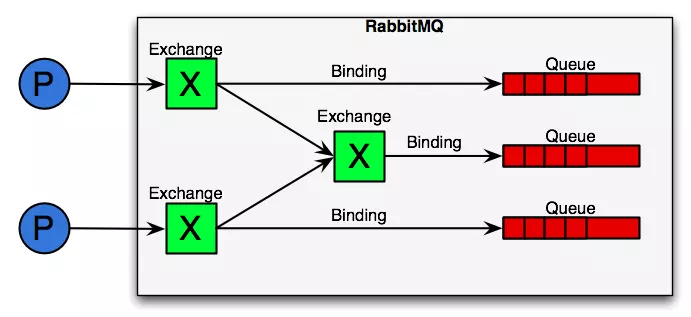
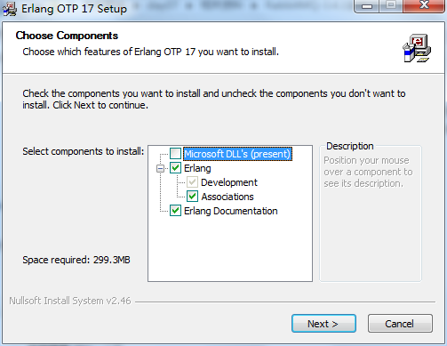
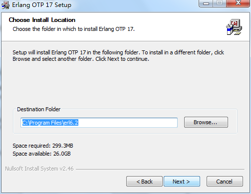
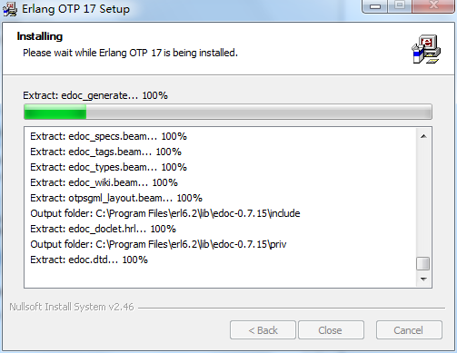
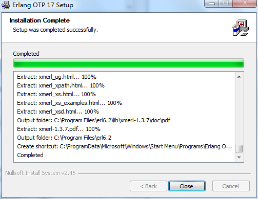
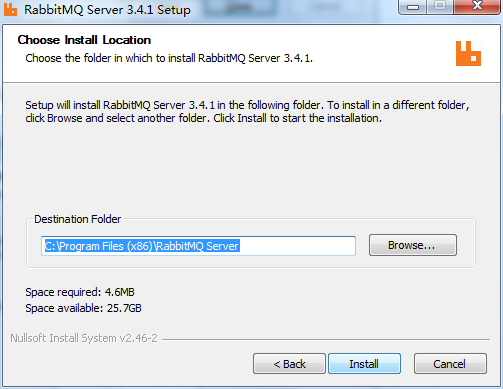
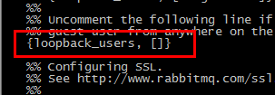
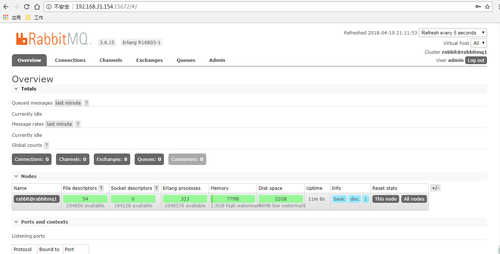
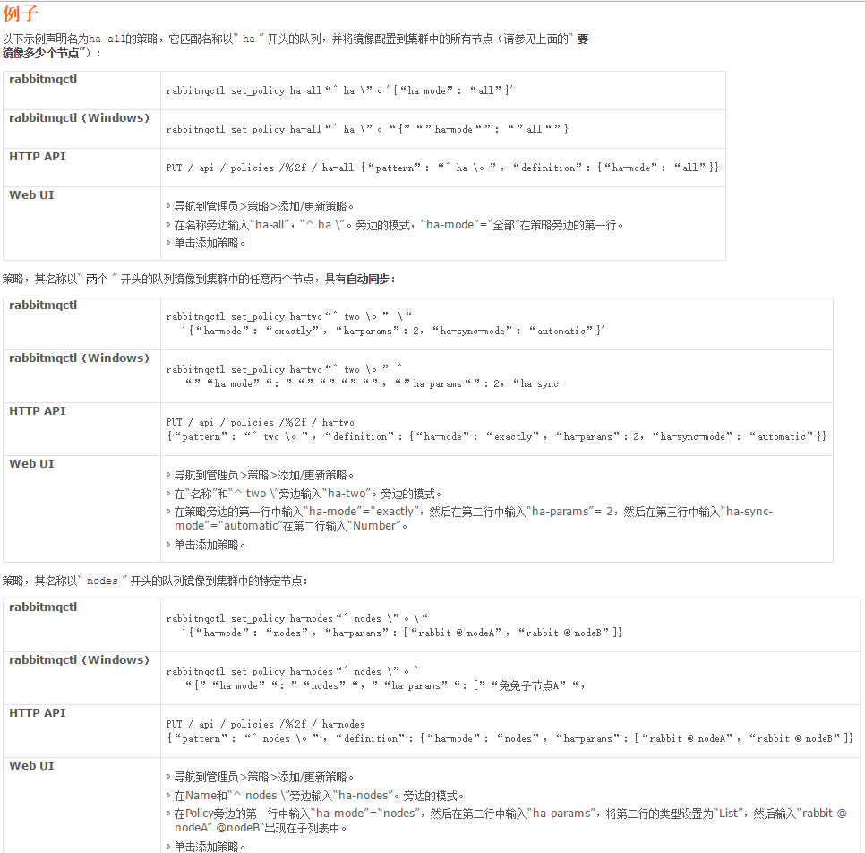
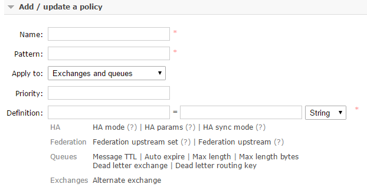

## RabbitMQ 消息中间件

### 1、消息中间件

#### 1、简介

消息中间件也可以称消息队列，是指用高效可靠的消息传递机制进行与平台无关的数据交流，并基于数据通信来进行分布式系统的集成。通过提供消息传递和消息队列模型，可以在分布式环境下扩展进程的通信。

当下主流的消息中间件有RabbitMQ、Kafka、ActiveMQ、RocketMQ等。其能在不同平台之间进行通信，常用来屏蔽各种平台协议之间的特性，实现应用程序之间的协同。优点在于能够在客户端和服务器之间进行同步和异步的连接，并且在任何时刻都可以将消息进行传送和转发，是分布式系统中非常重要的组件，主要用来解决应用耦合、异步通信、流量削峰等问题。 

#### 2、作用

##### 1、消息中间件主要作用

- 解耦
- 冗余(存储)
- 扩展性
- 削峰
- 可恢复性
- 顺序保证
- 缓冲
- 异步通信

##### 2、消息中间件的两种模式

###### 1、P2P模式

P2P模式包含三个角色：消息队列（Queue）、发送者(Sender)、接收者(Receiver)。每个消息都被发送到一个特定的队列，接收者从队列中获取消息。队列保留着消息，直到它们被消费或超时。

**P2P的特点：**

- 每个消息只有一个消费者（Consumer），即一旦被消费，消息就不再在消息队列中
- 发送者和接收者之间在时间上没有依赖性，也就是说当发送者发送了消息之后，不管接收者有没有正在运行它不会影响到消息被发送到队列
- 接收者在成功接收消息之后需向队列应答成功
- 如果希望发送的每个消息都会被成功处理的话，那么需要P2P模 

###### 2、Pub/Sub模式 

Pub/Sub模式包含三个角色：主题（Topic）、发布者（Publisher）、订阅者（Subscriber） 。多个发布者将消息发送到Topic，系统将这些消息传递给多个订阅者。

**Pub/Sub的特点：**

- 每个消息可以有多个消费者
- 发布者和订阅者之间有时间上的依赖性。针对某个主题（Topic）的订阅者，它必须创建一个订阅者之后，才能消费发布者的消息
- 为了消费消息，订阅者必须保持运行的状态
- 如果希望发送的消息可以不被做任何处理、或者只被一个消费者处理、或者可以被多个消费者处理的话，那么可以采用Pub/Sub模型

##### 3、常用中间件介绍与对比 

###### 1、Kafka

Kafka是LinkedIn开源的分布式发布-订阅消息系统，目前归属于Apache顶级项目。Kafka主要特点是基于Pull的模式来处理消息消费，追求高吞吐量，一开始的目的就是用于日志收集和传输。0.8版本开始支持复制，不支持事务，对消息的重复、丢失、错误没有严格要求，适合产生大量数据的互联网服务的数据收集业务。

###### 2、RabbitMQ

RabbitMQ是使用Erlang语言开发的开源消息队列系统，基于AMQP协议来实现。AMQP的主要特征是面向消息、队列、路由（包括点对点和发布/订阅）、可靠性、安全。AMQP协议更多用在企业系统内对数据一致性、稳定性和可靠性要求很高的场景，对性能和吞吐量的要求还在其次。

###### 3、RocketMQ

RocketMQ是阿里开源的消息中间件，它是纯Java开发，具有高吞吐量、高可用性、适合大规模分布式系统应用的特点。RocketMQ思路起源于Kafka，但并不是Kafka的一个Copy，它对消息的可靠传输及事务性做了优化，目前在阿里集团被广泛应用于交易、充值、流计算、消息推送、日志流式处理、binglog分发等场景。

RabbitMQ比Kafka可靠，Kafka更适合IO高吞吐的处理，一般应用在大数据日志处理或对实时性（少量延迟），可靠性（少量丢数据）要求稍低的场景使用，比如ELK日志收集。

### 2、RabbitMQ 详解

#### 1、RabbitMQ 介绍

RabbitMQ 是一个在 AMQP（Advanced Message Queuing Protocol ）基础上实现的，可复用的企业消息系统。它可以用于大型软件系统各个模块之间的高效通信，支持高并发，支持可扩展。它支持多种客户端如：Python、Ruby、.NET、Java、JMS、C、PHP、ActionScript、XMPP、STOMP等，支持AJAX，持久化，用于在分布式系统中存储转发消息，在易用性、扩展性、高可用性等方面表现不俗。

RabbitMQ是使用Erlang编写的一个开源的消息队列，本身支持很多的协议：AMQP，XMPP, SMTP, STOMP，也正是如此，使的它变的非常重量级，更适合于企业级的开发。它同时实现了一个Broker构架，这意味着消息在发送给客户端时先在中心队列排队，对路由(Routing)、负载均衡(Load balance)或者数据持久化都有很好的支持。

#### 2、RabbitMQ 特点

- 可靠性
- 灵活的路由
- 扩展性
- 高可用性
- 多种协议
- 多语言客户端
- 管理界面
- 插件机制

#### 3、AMQP 介绍

AMQP，即Advanced Message Queuing Protocol,一个提供统一消息服务的应用层标准**高级消息队列协议**,是应用层协议的一个开放标准,为面向消息的中间件设计。基于此协议的客户端与消息中间件可传递消息，并不受客户端/中间件不同产品，不同的开发语言等条件的限制。

#### 4、什么和是消息队列

MQ 全称为Message Queue, 消息队列。是一种应用程序对应用程序的通信方法。应用程序通过读写出入队列的消息（针对应用程序的数据）来通信，而无需专用连接来链接它们。

**消息传递**指的是程序之间通过在消息中发送数据进行通信，而不是通过直接调用彼此来通信。队列的使用除去了接收和发送应用程序同时执行的要求。

在项目中，将一些无需即时返回且耗时的操作提取出来，进行了异步处理，而这种异步处理的方式大大的节省了服务器的请求响应时间，从而提高了系统的吞吐量。

消息队列的使用场景是怎样的？

#### 5、RabbitMQ 应用场景

对于一个大型的软件系统来说，它会有很多的组件或者说模块或者说子系统或者（subsystem or Component or submodule）。那么这些模块的如何通信？这和传统的IPC有很大的区别。传统的IPC很多都是在单一系统上的，模块耦合性很大，不适合扩展（Scalability）；如果使用socket那么不同的模块的确可以部署到不同的机器上，但是还是有很多问题需要解决。比如：
1）信息的发送者和接收者如何维持这个连接，如果一方的连接中断，这期间的数据如何方式丢失？
2）如何降低发送者和接收者的耦合度？
3）如何让Priority高的接收者先接到数据？
4）如何做到load balance？有效均衡接收者的负载？
5）如何有效的将数据发送到相关的接收者？也就是说将接收者subscribe 不同的数据，如何做有效的filter。
6）如何做到可扩展，甚至将这个通信模块发到cluster上？
7）如何保证接收者接收到了完整，正确的数据？
**AMDQ**协议解决了以上的问题，而RabbitMQ实现了**AMQP**。

#### 6、RabbitMQ 概念介绍

- **Broker**：简单来说就是消息队列服务器实体。
- **Exchange**：消息交换机，它指定消息按什么规则，路由到哪个队列。
- **Queue**：消息队列载体，每个消息都会被投入到一个或多个队列。
- **Binding**：绑定，它的作用就是把exchange和queue按照路由规则绑定起来。
- **Routing Key**：路由关键字，exchange根据这个关键字进行消息投递。
- **vhost**：虚拟主机，一个broker里可以开设多个vhost，用作不同用户的权限分离。
- **producer**：消息生产者，就是投递消息的程序。
- **consumer**：消息消费者，就是接受消息的程序。
- **channel**：消息通道，在客户端的每个连接里，可建立多个channel，每个channel代表一个会话任务。

RabbitMQ从整体上来看是一个典型的生产者消费者模型，主要负责接收、存储和转发消息




#### 7、RabbitMQ 使用流程

AMQP模型中，消息在producer中产生，发送到MQ的exchange上，exchange根据配置的路由方式发到相应的Queue上，Queue又将消息发送给consumer，消息从queue到consumer有push和pull两种方式。 消息队列的使用过程大概如下：

1. 客户端连接到消息队列服务器，打开一个channel。
2. 客户端声明一个exchange，并设置相关属性。
3. 客户端声明一个queue，并设置相关属性。
4. 客户端使用routing key，在exchange和queue之间建立好绑定关系。
5. 客户端投递消息到exchange。

exchange接收到消息后，就根据消息的key和已经设置的binding，进行消息路由，将消息投递到一个或多个队列里。 exchange也有几个类型，完全根据key进行投递的叫做Direct交换机，例如，绑定时设置了routing key为”abc”，那么客户端提交的消息，只有设置了key为”abc”的才会投递到队列。

### 3、RabbitMQ 单机安装部署

#### 1、下载

下载地址：<http://www.rabbitmq.com/download.html>

#### 2、Windows上安装

###### 1、安装安装Erlang

下载erlang：<http://www.erlang.org/download/otp_win64_17.3.exe>

安装：



 








erlang安装完成。

###### 2、安装安装RabbitMQ




RabbitMQ安装完成。


启动、停止、重新安装等。

###### 3、启用管理工具

第一步：点击打开RabbitMQ的命令窗口。如图：


 

第二步：输入命令rabbitmq-plugins enable rabbitmq_management

这个命令的意思是安装RabbitMQ的插件。

第三步：测试是否安装成功。

方法：访问地址：<http://127.0.0.1:15672/>


 

默认账号：guest/guest

#### 3、Linux上安装

###### 1、安装 erlang

添加yum支持

```
cd /usr/local/src/
mkdir rabbitmq
cd rabbitmq
wget http://packages.erlang-solutions.com/erlang-solutions-1.0-1.noarch.rpm
rpm -Uvh erlang-solutions-1.0-1.noarch.rpm
rpm --import http://packages.erlang-solutions.com/rpm/erlang_solutions.asc
yum install erlang
```

###### 2、安装RabbitMQ

1、用 yum 安装 RabbitMQ

```bash
rpm --import https://github.com/rabbitmq/signing-keys/releases/download/2.0/rabbitmq-release-signing-key.asc
# this example assumes the CentOS 7 version of the package
yum install rabbitmq-server-3.7.13-1.el7.noarch.rpm
```

```bash
rpm --import https://www.rabbitmq.com/rabbitmq-release-signing-key.asc
# this example assumes the CentOS 7 version of the package
yum install rabbitmq-server-3.7.13-1.el7.noarch.rpm
```

2、用 rpm 手动安装

下载：

```
wget  https://github.com/rabbitmq/rabbitmq-server/releases/download/v3.7.13/rabbitmq-server-3.7.13-1.el7.noarch.rpm
```

上传rabbitmq-server-3.7.13-1.el7.noarch.rpm文件到/usr/local/src/rabbitmq/

安装：

```
rpm -ivh rabbitmq-server-3.7.13-1.el7.noarch.rpm
```

几个常用命令：

```
service rabbitmq-server start
service rabbitmq-server stop
service rabbitmq-server restart 
chkconfig rabbitmq-server on　　//设置开机自启
```

设置配置文件：

```
cd /etc/rabbitmq
cp /usr/share/doc/rabbitmq-server-3.7.13/rabbitmq.config.example /etc/rabbitmq/
mv rabbitmq.config.example rabbitmq.config
```

设置用户远程访问：

```
vim /etc/rabbitmq/rabbitmq.config
```



去掉后面的逗号

开启web界面管理工具

```
rabbitmq-plugins enable rabbitmq_management
service rabbitmq-server restart
```

防火墙开放15672端口(CentOS7 不用操作)

```
/sbin/iptables -I INPUT -p tcp --dport 15672 -j ACCEPT
/etc/rc.d/init.d/iptables save
```

###### 4、客户端的简单介绍

1、界面的介绍


 

注意设置虚拟主机与添加用户这块。


关于虚拟主机，Virtual Host，其实是一个虚拟概念，类似于权限控制组，一个Virtual Host里面可以有若干个Exchange和Queue，但是权限控制的最小粒度是Virtual Host

用户角色有下面几种：

1. 超级管理员(administrator)

可登陆管理控制台，可查看所有的信息，并且可以对用户，策略(policy)进行操作。

1. 监控者(monitoring)

可登陆管理控制台，同时可以查看rabbitmq节点的相关信息(进程数，内存使用情况，磁盘使用情况等)

1. 策略制定者(policymaker)

可登陆管理控制台, 同时可以对policy进行管理。但无法查看节点的相关信息(上图红框标识的部分)。

1. 普通管理者(management)

仅可登陆管理控制台，无法看到节点信息，也无法对策略进行管理。

1. 其他

无法登陆管理控制台，通常就是普通的生产者和消费者。

#### 4、Mac 安装教程

###### 1、安装

在Mac下安装RabbitMQ是非常简单的，一般默认RabbitMQ服务器依赖的Erlang已经安装，只需要用下面两个命令就可以完成RabbitMQ的安装（前提是homebrew已经被安装）：

```
brew update
brew install rabbitmq
```

耐心等待，安装完成后需要将/usr/local/sbin添加到$PATH，可以将下面这两行加到~/.bash_profile：

```
# RabbitMQ Config
export PATH=$PATH:/usr/local/sbin
```

编辑完后:wq保存退出，使环境变量立即生效。

```
source ~/.bash_profile
```

###### 2、启动RabbitMQ服务

上面配置完成后，需要关闭终端窗口，重新打开，然后输入下面命令即可启动RabbitMQ服务：

```
rabbitmq-server
```

###### 3、登录Web管理界面

浏览器输入`localhost：15672`,账号密码全输入guest即可登录。

#### 5、RabbitMQ常用的命令

##### 1、基本命令

启动监控管理器：rabbitmq-plugins enable rabbitmq_management
关闭监控管理器：rabbitmq-plugins disable rabbitmq_management
启动rabbitmq：rabbitmq-service start
关闭rabbitmq：rabbitmq-service stop
查看所有的队列：rabbitmqctl list_queues
清除所有的队列：rabbitmqctl reset
关闭应用：rabbitmqctl stop_app
启动应用：rabbitmqctl start_app

##### 2、用户和权限设置

添加用户：rabbitmqctl add_user username password
分配角色：rabbitmqctl set_user_tags username administrator
新增虚拟主机：rabbitmqctl add_vhost vhost_name
将新虚拟主机授权给新用户：`rabbitmqctl set_permissions -p vhost_name username “.*” “.*” “.*”`(后面三个”*”代表用户拥有配置、写、读全部权限)

##### 3、角色说明

- 超级管理员(administrator)
  可登陆管理控制台，可查看所有的信息，并且可以对用户，策略(policy)进行操作。
- 监控者(monitoring)
  可登陆管理控制台，同时可以查看rabbitmq节点的相关信息(进程数，内存使用情况，磁盘使用情况等)
- 策略制定者(policymaker)
  可登陆管理控制台, 同时可以对policy进行管理。但无法查看节点的相关信息(上图红框标识的部分)。
- 普通管理者(management)
  仅可登陆管理控制台，无法看到节点信息，也无法对策略进行管理。
- 其他
  无法登陆管理控制台，通常就是普通的生产者和消费者。

### 4、RabbitMQ 集群部署及配置

消息中间件RabbitMQ，一般以集群方式部署，主要提供消息的接受和发送，实现各微服务之间的消息异步。以下将介绍RabbitMQ+HA方式进行部署。

#### 1、原理介绍

RabbitMQ是依据erlang的分布式特性（RabbitMQ底层是通过Erlang架构来实现的，所以rabbitmqctl会启动Erlang节点，并基于Erlang节点来使用Erlang系统连接RabbitMQ节点，在连接过程中需要正确的Erlang Cookie和节点名称，Erlang节点通过交换Erlang Cookie以获得认证）来实现的，所以部署Rabbitmq分布式集群时要先安装Erlang，并把其中一个服务的cookie复制到另外的节点。

RabbitMQ集群中，各个RabbitMQ为对等节点，即每个节点均提供给客户端连接，进行消息的接收和发送。节点分为内存节点和磁盘节点，一般的，均应建立为磁盘节点，为了防止机器重启后的消息消失；

RabbitMQ的Cluster集群模式一般分为两种，普通模式和镜像模式。消息队列通过RabbitMQ HA镜像队列进行消息队列实体复制。

普通模式下，以两个节点（rabbit01、rabbit02）为例来进行说明。对于Queue来说，消息实体只存在于其中一个节点rabbit01（或者rabbit02），rabbit01和rabbit02两个节点仅有相同的元数据，即队列的结构。当消息进入rabbit01节点的Queue后，consumer从rabbit02节点消费时，RabbitMQ会临时在rabbit01、rabbit02间进行消息传输，把A中的消息实体取出并经过B发送给consumer。所以consumer应尽量连接每一个节点，从中取消息。即对于同一个逻辑队列，要在多个节点建立物理Queue。否则无论consumer连rabbit01或rabbit02，出口总在rabbit01，会产生瓶颈。

镜像模式下，将需要消费的队列变为镜像队列，存在于多个节点，这样就可以实现RabbitMQ的HA高可用性。作用就是消息实体会主动在镜像节点之间实现同步，而不是像普通模式那样，在consumer消费数据时临时读取。缺点就是，集群内部的同步通讯会占用大量的网络带宽。

#### 2、部署 RabbitMQ Cluster

##### 1、rabbitmq 有 3 种模式，但集群模式是 2 种

详细如下：

- 单一模式：即单机情况不做集群，就单独运行一个 rabbitmq 而已。
- 普通模式：默认模式，以两个节点（rabbit01、rabbit02）为例来进行说明。对于 Queue 来说，消息实体只存在于其中一个节点 rabbit01（或者 rabbit02），rabbit01 和 rabbit02 两个节点仅有相同的元数据，即队列的结构。当消息进入 rabbit01 节点的 Queue 后，consumer 从 rabbit02 节点消费时，RabbitMQ 会临时在 rabbit01、rabbit02 间进行消息传输，把 A 中的消息实体取出并经过 B 发送给 consumer。所以 consumer 应尽量连接每一个节点，从中取消息。即对于同一个逻辑队列，要在多个节点建立物理 Queue。否则无论 consumer 连 rabbit01 或 rabbit02，出口总在 rabbit01，会产生瓶颈。当 rabbit01 节点故障后，rabbit02 节点无法取到 rabbit01 节点中还未消费的消息实体。如果做了消息持久化，那么得等 rabbit01 节点恢复，然后才可被消费；如果没有持久化的话，就会产生消息丢失的现象。
- 镜像模式: 把需要的队列做成镜像队列，存在与多个节点属于 RabbitMQ 的 HA 方案。该模式解决了普通模式中的问题，其实质和普通模式不同之处在于，消息实体会主动在镜像节点间同步，而不是在客户端取数据时临时拉取。该模式带来的副作用也很明显，除了降低系统性能外，如果镜像队列数量过多，加之大量的消息进入，集群内部的网络带宽将会被这种同步通讯大大消耗掉。所以在对可靠性要求较高的场合中适用。

##### 2、环境准备

```
3台centos7操作系统，ip分别为：

192.168.120.138
192.168.120.139
192.168.120.140
```

##### 3、修改 hosts 文件 (3 台)

```
vim /etc/hosts
192.168.120.138 rabbitmq1
192.168.120.139 rabbitmq2
192.168.120.140 rabbitmq3
```

##### 4、保证 3 台能 ping 通

```
[root@rabbitmq1 ~]# ping  rabbitmq2
PING 192.168.31.154 (192.168.31.154) 56(84) bytes of data.
64 bytes from 192.168.31.154: icmp_seq=1 ttl=64 time=0.025 ms
64 bytes from 192.168.31.154: icmp_seq=2 ttl=64 time=0.043 ms
64 bytes from 192.168.31.154: icmp_seq=3 ttl=64 time=0.042 ms
^C
--- 192.168.31.154 ping statistics ---
3 packets transmitted, 3 received, 0% packet loss, time 1999ms
rtt min/avg/max/mdev = 0.025/0.036/0.043/0.010 ms
[root@rabbitmq1 ~]# ping  rabbitmq2
PING 192.168.31.155 (192.168.31.155) 56(84) bytes of data.
64 bytes from 192.168.31.155: icmp_seq=1 ttl=64 time=0.742 ms
64 bytes from 192.168.31.155: icmp_seq=2 ttl=64 time=0.343 ms
^C
--- 192.168.31.155 ping statistics ---
2 packets transmitted, 2 received, 0% packet loss, time 1000ms
rtt min/avg/max/mdev = 0.343/0.542/0.742/0.200 ms
[root@rabbitmq1 ~]# ping 192.168.31.156
PING 192.168.31.156 (192.168.31.156) 56(84) bytes of data.
64 bytes from 192.168.31.156: icmp_seq=1 ttl=64 time=1.15 ms
64 bytes from 192.168.31.156: icmp_seq=2 ttl=64 time=0.380 ms
^C
--- 192.168.31.156 ping statistics ---
2 packets transmitted, 2 received, 0% packet loss, time 1001ms
rtt min/avg/max/mdev = 0.380/0.768/1.157/0.389 ms
[root@rabbitmq1 ~]# 
```

##### 5、安装 rabbitmq 依赖 erlang 环境

```
yum install erlang
```

##### 6、安装 socat

```
yum install -y socat　
```

##### 8、安装 rabbitmq

```
yum -y install rabbitmq-server
```

##### 9、rabbitmq 常用命令

```
systemctl start rabbitmq-server.service 
systemctl stop rabbitmq-server.service 
systemctl enable rabbitmq-server.service 
systemctl restart rabbitmq-server.service 
```

##### 10、账号配置

安装启动后其实还不能在其它机器访问，rabbitmq 默认的 guest 账号只能在本地机器访问， 如果想在其它机器访问必须配置其它账号

配置管理员账号：

```
可以创建管理员用户，负责整个 MQ 的运维
rabbitmqctl add_user admin admin
赋予其 administrator 角色
rabbitmqctl set_user_tags admin administrator
创建 RabbitMQ 监控用户，负责整个 MQ 的监控
rabbitmqctl add_user  user_monitoring  passwd_monitor  
rabbitmqctl set_user_tags user_monitoring monitoring
创建某个项目的专用用户，只能访问项目自己的 virtual hosts
rabbitmqctl set_user_tags user_monitoring management
创建和赋角色完成后查看并确认
rabbitmqctl list_users  
```

##### 11、启动 rabbitmq 内置 web 插件， 管理 rabbitmq 账号等信息

```
rabbitmq-plugins enable rabbitmq_management
```

访问 http:// 你的地址:15672
页面如下： 

##### 12、rabbitmq 用户权限 VirtualHost

像 mysql 有数据库的概念并且可以指定用户对库和表等操作的权限。那 RabbitMQ 呢？RabbitMQ 也有类似的权限管理。在 RabbitMQ 中可以虚拟消息服务器 VirtualHost，每个 VirtualHost 相当月一个相对独立的 RabbitMQ 服务器，每个 VirtualHost 之间是相互隔离的。exchange、queue、message 不能互通。 在 RabbitMQ 中无法通过 AMQP 创建 VirtualHost，可以通过以下命令来创建

```
rabbitmqctl add_vhost [vhostname]
```

通常在权限管理中主要包含三步：

###### 1、新建用户

```
rabbitmqctl add_user superrd superrd
```

###### 2、配置权限

```
set_permissions [-p <vhostpath>] <user> <conf> <write> <read>
rabbitmqctl  set_permissions -p /  admin '.*' '.*' '.*'  
```

其中，.* 的位置分别用正则表达式来匹配特定的资源，如:

```
'^(amq.gen.*|amq.default)$'
```

可以匹配 server 生成的和默认的 exchange，’^$’不匹配任何资源

- exchange 和 queue 的 declare 与 delete 分别需要 exchange 和 queue 上的配置权限
- exchange 的 bind 与 unbind 需要 exchange 的读写权限
- queue 的 bind 与 unbind 需要 queue 写权限 exchange 的读权限 发消息 (publish) 需 exchange 的写权限
- 获取或清除 (get、consume、purge) 消息需 queue 的读权限

示例：我们赋予 superrd 在“/”下面的全部资源的配置和读写权限。

```
rabbitmqctl set_permissions -p / superrd ".*" ".*" ".*"
```

注意”/”代表 virtual host 为“/”这个“/”和 linux 里的根目录是有区别的并不是 virtual host 为“/”可以访问所以的 virtual host，把这个“/”理解成字符串就行。

需要注意的是 RabbitMQ 会缓存每个 connection 或 channel 的权限验证结果、因此权限发生变化后需要重连才能生效。

###### 3、查看权限

```
rabbitmqctl list_user_permissions admin
rabbitmqctl list_permissions -p /
```

###### 4、配置角色

```
rabbitmqctl set_user_tags [user] [role]
```

RabbitMQ 中的角色分为如下五类：none、management、policymaker、monitoring、administrator

官方解释如下：

```
management 
User can access the management plugin 
policymaker 
User can access the management plugin and manage policies and parameters for the vhosts they have access to. 
monitoring 
User can access the management plugin and see all connections and channels as well as node-related information. 
administrator 
User can do everything monitoring can do, manage users, vhosts and permissions, close other user’s connections, and manage policies and parameters for all vhosts.
```

- none 不能访问 management plugin
- management 用户可以通过 AMQP 做的任何事外加： 列出自己可以通过 AMQP 登入的 virtual hosts 查看自己的 virtual hosts 中的 queues, exchanges 和 bindings 查看和关闭自己的 channels 和 connections 查看有关自己的 virtual hosts 的“全局”的统计信息，包含其他用户在这些 virtual hosts 中的活动。
- policymaker management 可以做的任何事外加： 查看、创建和删除自己的 virtual hosts 所属的 policies 和 parameters
- monitoring management 可以做的任何事外加： 列出所有 virtual hosts，包括他们不能登录的 virtual hosts 查看其他用户的 connections 和 channels 查看节点级别的数据如 clustering 和 memory 使用情况 查看真正的关于所有 virtual hosts 的全局的统计信息
- administrator policymaker 和 monitoring 可以做的任何事外加: 创建和删除 virtual hosts 查看、创建和删除 users 查看创建和删除 permissions 关闭其他用户的 connections

如下示例将 superrd 设置成 administrator 角色。

```
rabbitmqctl set_user_tags superrd administrator
```

#### 3、搭建 rabbitmq 的一般模式集群

在上述的 3 台机器上安装 rabbitmq 完成之后，你可以看到你的机器中有如下 1 个文件。路径在 $HOME 中或者在 /var/lib/rabbitmq 中，文件名称为.erlang.cookie, 他是一个隐藏文件。那么这文件存储的内容是什么，是做什么用的呢？

RabbitMQ 的集群是依赖 erlang 集群，而 erlang 集群是通过这个 cookie 进行通信认证的，因此我们做集群的第一步就是干 cookie。

1、必须使集群中也就是rabbitmq2，rabbitmq3这两台机器的.erlang.cookie 文件中 cookie 值一致，且权限为 owner 只读。

```
chmod 600 /var/lib/rabbitmq/.erlang.cookie
```

2、查看集群状态，我的是已经做好的。

```
[root@rabbitmq1 rabbitmq]#  rabbitmqctl status
Status of node rabbit@rabbitmq1
[{pid,17572},
 {running_applications,
     [{rabbitmq_management,"RabbitMQ Management Console","3.6.15"},
      {rabbitmq_web_dispatch,"RabbitMQ Web Dispatcher","3.6.15"},
      {rabbitmq_management_agent,"RabbitMQ Management Agent","3.6.15"},
      {rabbit,"RabbitMQ","3.6.15"},
      {amqp_client,"RabbitMQ AMQP Client","3.6.15"},
      {rabbit_common,
          "Modules shared by rabbitmq-server and rabbitmq-erlang-client",
          "3.6.15"},
      {recon,"Diagnostic tools for production use","2.3.2"},
      {os_mon,"CPO  CXC 138 46","2.2.14"},
      {cowboy,"Small, fast, modular HTTP server.","1.0.4"},
      {ranch,"Socket acceptor pool for TCP protocols.","1.3.2"},
      {ssl,"Erlang/OTP SSL application","5.3.3"},
      {public_key,"Public key infrastructure","0.21"},
      {cowlib,"Support library for manipulating Web protocols.","1.0.2"},
      {crypto,"CRYPTO version 2","3.2"},
      {inets,"INETS  CXC 138 49","5.9.8"},
      {mnesia,"MNESIA  CXC 138 12","4.11"},
      {compiler,"ERTS  CXC 138 10","4.9.4"},
      {xmerl,"XML parser","1.3.6"},
      {syntax_tools,"Syntax tools","1.6.13"},
      {asn1,"The Erlang ASN1 compiler version 2.0.4","2.0.4"},
      {sasl,"SASL  CXC 138 11","2.3.4"},
      {stdlib,"ERTS  CXC 138 10","1.19.4"},
      {kernel,"ERTS  CXC 138 10","2.16.4"}]},
 {os,{unix,linux}},
 {erlang_version,
     "Erlang R16B03-1 (erts-5.10.4) [source] [64-bit] [smp:2:2] [async-threads:64] [hipe] [kernel-poll:true]\n"},
 {memory,
     [{connection_readers,0},
      {connection_writers,0},
      {connection_channels,0},
      {connection_other,2800},
      {queue_procs,2800},
      {queue_slave_procs,0},
      {plugins,1471200},
      {other_proc,23282232},
      {metrics,142320},
      {mgmt_db,526352},
      {mnesia,84160},
      {other_ets,2372704},
      {binary,890656},
      {msg_index,40536},
      {code,27114499},
      {atom,992409},
      {other_system,22458876},
      {allocated_unused,9790936},
      {reserved_unallocated,2389504},
      {total,91561984}]},
 {alarms,[]},
 {listeners,[{clustering,25672,"::"},{amqp,5672,"::"},{http,15672,"::"}]},
 {vm_memory_calculation_strategy,rss},
 {vm_memory_high_watermark,0.4},
 {vm_memory_limit,1589890252},
 {disk_free_limit,50000000},
 {disk_free,33908043776},
 {file_descriptors,
     [{total_limit,204700},
      {total_used,2},
      {sockets_limit,184228},
      {sockets_used,0}]},
 {processes,[{limit,1048576},{used,330}]},
 {run_queue,0},
 {uptime,2934},
 {kernel,{net_ticktime,60}}]
[root@rabbitmq1 rabbitmq]# rabbitmqctl cluster_status
Cluster status of node rabbit@rabbitmq1
[{nodes,[{disc,[rabbit@rabbitmq1]},{ram,[rabbit@rabbitmq3,rabbit@rabbitmq2]}]},
 {running_nodes,[rabbit@rabbitmq3,rabbit@rabbitmq2,rabbit@rabbitmq1]},
 {cluster_name,<<"rabbit_cluster">>},
 {partitions,[]},
 {alarms,[{rabbit@rabbitmq3,[]},{rabbit@rabbitmq2,[]},{rabbit@rabbitmq1,[]}]}]
[root@rabbitmq1 rabbitmq]# 
```

3、重启 rabbitmq1机器中 rabbitmq 的服务 在 rabbitmq2，rabbitmq3 分别执行

```
rabbitmqctl stop_app
rabbitmqctl join_cluster --ram rabbit@rabbitmq1
rabbitmqctl start_app
rabbitmq-plugins enable rabbitmq_management
systemctl restart rabbitmq-server.service 
```

4、打开网页管理页面查看 nodes 

如此便可以啦，你可以做下测试，验证下我们序言中说的普通模式的说明，那必须是杠杠对的。

#### 4、搭建rabbitmq的镜像高可用模式集群

这一节要参考的文档是：<http://www.rabbitmq.com/ha.html>

首先镜像模式要依赖policy模块，这个模块是做什么用的呢？

policy中文来说是政策，策略的意思，那么他就是要设置，那些Exchanges或者queue的数据需要复制，同步，如何复制同步？对就是做这些的。

这里有点内容的，我先上例子慢慢说：

```
[root@rabbitmq1 ~]# rabbitmqctl set_policy ha-all "^" '{"ha-mode":"all"}'
```

参数意思为：

ha-all：为策略名称。

^：为匹配符，只有一个^代表匹配所有，^zlh为匹配名称为zlh的exchanges或者queue。

ha-mode：为匹配类型，他分为3种模式：

- all-所有（所有的 queue），
- exctly-部分（需配置ha-params参数，此参数为int类型比如3，众多集群中的随机3台机器），
- nodes-指定（需配置ha-params参数，此参数为数组类型比如["3rabbit@F","rabbit@G"]这样指定为F与G这2台机器。）。

参考示例如下



当然在web管理界面也能配置：



配置完看队列如下，其中表示ha-haall的说明用我的ha-haall策略啦，属于镜像模式，没有表示的就是普通模式：

 

###  5、rabbitmq （附录）

RabbitMQ 常用的三种自定义服务器的通用方法：

- 配置文件 rabbitmq.conf
- 环境变量文件 rabbitmq-env.conf
- 补充配置文件 advanced.config

rabbitmq.conf和rabbitmq-env.conf的位置

- 在二进制安装中路径是在 ：安装目录下的/etc/rabbitmq/
- rpm 安装： /etc/rabbitmq/

如果rabbitmq.conf和rabbitmq-env.conf 的两个文件不存在，那么我们可以创建该文件，然后我们可以通过环境变量
指定该文件的位置。

补充 ：

- rabbitmqctl rabbitmqctl 是管理虚拟主机和用户权限的工具
- rabbitmq-plugins 是管理插件的工具

#### 1、 rabbitmq.conf

在rabbitmq 3.7.0 之前，rabbitmq.conf 使用了Erlang语法配置格式，新的版本使用了sysctl 格式.

sysctl 语法：

- 单个信息都在一行里面
- 配置信息以key value 的形式保存。
- ‘#’开头表示注释。

配置示例文件：[rabbitmq.conf.example](https://github.com/rabbitmq/rabbitmq-server/blob/v3.7.x/docs/rabbitmq.conf.example)

配置属性和描述（[官网链接](http://www.rabbitmq.com/configure.html#config-items)）

| 属性                                                        | 描述                                                         | 默认值                                                       |
| ----------------------------------------------------------- | ------------------------------------------------------------ | ------------------------------------------------------------ |
| listeners                                                   | 要监听 AMQP 0-9-1 and AMQP 1.0 的端口                        | listeners.tcp.default = 5672                                 |
| num_acceptors.tcp                                           | 接受tcp连接的erlang 进程数                                   | num_acceptors.tcp = 10                                       |
| handshake_timeout                                           | AMQP 0-9-1 超时时间，也就是最大的连接时间，单位毫秒          | handshake_timeout = 10000                                    |
| listeners.ssl                                               | 启用TLS的协议                                                | 默认值为none                                                 |
| num_acceptors.ssl                                           | 接受基于TLS协议的连接的erlang 进程数                         | num_acceptors.ssl = 10                                       |
| ssl_options                                                 | TLS 配置                                                     | ssl_options =none                                            |
| ssl_handshake_timeout                                       | TLS 连接超时时间 单位为毫秒                                  | ssl_handshake_timeout = 5000                                 |
| vm_memory_high_watermark                                    | 触发流量控制的内存阈值，可以为相对值(0.5),或者绝对值 vm_memory_high_watermark.relative = 0.6 ,vm_memory_high_watermark.absolute = 2GB | 默认vm_memory_high_watermark.relative = 0.4                  |
| vm_memory_calculation_strategy                              | 内存使用报告策略，assigned：使用Erlang内存分配器统计信息 rss：使用操作系统RSS内存报告。这使用特定于操作系统的方法，并可能启动短期子进程。legacy：使用遗留内存报告（运行时认为将使用多少内存）。这种策略相当不准确。erlang 与legacy一样 是为了向后兼容 | vm_memory_calculation_strategy = allocated                   |
| vm_memory_high_watermark_paging_ratio                       | 当内存的使用达到了50%后,队列开始将消息分页到磁盘             | vm_memory_high_watermark_paging_ratio = 0.5                  |
| total_memory_available_override_value                       | 该参数用于指定系统的可用内存总量，一般不使用，适用于在容器等一些获取内存实际值不精确的环境 | 默认未设置                                                   |
| disk_free_limit                                             | Rabbitmq存储数据的可用空间限制，当低于该值的时候，将触发流量限制，设置可参考vm_memory_high_watermark参数 | disk_free_limit.absolute = 50MB                              |
| log.file.level                                              | 控制记录日志的等级，有info,error,warning,debug               | log.file.level = info                                        |
| channel_max                                                 | 最大通道数，但不包含协议中使用的特殊通道号0，设置为0表示无限制，不建议使用该值，容易出现channel泄漏 | channel_max = 2047                                           |
| channel_operation_timeout                                   | 通道操作超时，单位为毫秒                                     | channel_operation_timeout = 15000                            |
| heartbeat                                                   | 表示连接参数协商期间服务器建议的心跳超时的值。如果两端都设置为0，则禁用心跳,不建议禁用 | heartbeat = 60                                               |
| default_vhost                                               | rabbitmq安装后启动创建的虚拟主机                             | default_vhost = /                                            |
| default_user                                                | 默认创建的用户名                                             | default_user = guest                                         |
| default_pass                                                | 默认用户的密码                                               | default_pass = guest                                         |
| default_user_tags                                           | 默认用户的标签                                               | default_user_tags.administrator = true                       |
| default_permissions                                         | 在创建默认用户是分配给默认用户的权限                         | default_permissions.configure = .* default_permissions.read = .* default_permissions.write = .* |
| loopback_users                                              | 允许通过回环地址连接到rabbitmq的用户列表,如果要允许guest用户远程连接(不安全)请将该值设置为none,如果要将一个用户设置为仅localhost连接的话，配置loopback_users.username =true(username要替换成用户名) | loopback_users.guest = true(默认为只能本地连接)              |
| cluster_formation.classic_config.nodes                      | 设置集群节点cluster_formation.classic_config.nodes.1 = rabbit@hostname1 |                                                              |
| cluster_formation.classic_config.nodes.2 = rabbit@hostname2 | 默认为空，未设置                                             |                                                              |
| collect_statistics                                          | 统计收集模式，none 不发出统计信息事件，coarse每个队列连接都发送统计一次,fine每发一条消息的统计数据 | collect_statistics = none                                    |
| collect_statistics_interval                                 | 统计信息收集间隔，以毫秒为单位                               | collect_statistics_interval = 5000                           |
| delegate_count                                              | 用于集群内通信的委托进程数。在多核的服务器上我们可以增加此值 | delegate_count = 16                                          |
| tcp_listen_options                                          | 默认的套接字选项                                             | tcp_listen_options.backlog = 128 .....                       |
| hipe_compile                                                | 设置为true以使用HiPE预编译RabbitMQ的部分，HiPE是Erlang的即时编译器,启用HiPE可以提高吞吐量两位数，但启动时会延迟几分钟。Erlang运行时必须包含HiPE支持。如果不是，启用此选项将不起作用。HiPE在某些平台上根本不可用，尤其是Windows。 | hipe_compile = false                                         |
| cluster_keepalive_interval                                  | 节点应该多长时间向其他节点发送keepalive消息(以毫秒为单位),keepalive的消息丢失不会被视为关闭 | cluster_keepalive_interval = 10000                           |
| queue_index_embed_msgs_below                                | 消息的字节大小,低于该大小，消息将直接嵌入队列索引中 bytes    | queue_index_embed_msgs_below = 4096                          |
| mnesia_table_loading_retry_timeout                          | 等待集群中Mnesia表可用的超时时间，单位毫秒                   | mnesia_table_loading_retry_timeout = 30000                   |
| mnesia_table_loading_retry_limit                            | 集群启动时等待Mnesia表的重试次数，不适用于Mnesia升级或节点删除。 | mnesia_table_loading_retry_limit = 10                        |
| mirroring_sync_batch_size                                   | 要在队列镜像之间同步的消息的批处理大小                       | mirroring_sync_batch_size = 4096                             |
| queue_master_locator                                        | 队列主节点的策略，有三大策略 min-masters，client-local，random | queue_master_locator = client-local                          |
| proxy_protocol                                              | 如果设置为true ,则连接需要通过反向代理连接，不能直连接       | proxy_protocol = false                                       |
| management.listener.port                                    | rabbitmq web管理界面使用的端口                               | management.listener.port = 15672                             |

查看rabbitmq的有效配置

```
rabbitmqctl environment
```

#### 2、advanced.config

[示例文件](https://github.com/rabbitmq/rabbitmq-server/blob/master/docs/advanced.config.example)
某些配置设置不可用或难以使用sysctl格式进行配置。因此，可以使用Erlang术语格式的其他配置文件advanced.config
它将与rabbitmq.conf 文件中提供的配置合并。

配置属性和描述（[官网链接](http://www.rabbitmq.com/configure.html#config-items)）

| 属性                                           | 描述                                                         | 默认值                                                       |
| ---------------------------------------------- | ------------------------------------------------------------ | ------------------------------------------------------------ |
| msg_store_index_module                         | 设置队列索引使用的模块                                       | {rabbit，[ {msg_store_index_module，rabbit_msg_store_ets_index} ]} |
| backing_queue_module                           | 队列内容的实现模块。                                         | {rabbit，[ {backing_queue_module，rabbit_variable_queue} ]}  |
| msg_store_file_size_limit                      | 消息储存的文件大小,现有的节点更改是危险的，可能导致数据丢失  | 默认值16777216                                               |
| trace_vhosts                                   | 内部的tracer使用，不建议更改                                 | {rabbit，[ {trace_vhosts，[]} ]}                             |
| msg_store_credit_disc_bound                    | 设置消息储存库给队列进程的积分,默认一个队列进程被赋予4000个消息积分 | {rabbit, [{msg_store_credit_disc_bound, {4000, 800}}]}       |
| queue_index_max_journal_entries                | 队列的索引日志超过该阈值将刷新到磁盘                         | {rabbit, [{queue_index_max_journal_entries, 32768}]}         |
| lazy_queue_explicit_gc_run_operation_threshold | 在内存压力下为延迟队列设置的值，该值可以触发垃圾回收和减少内存使用，降低该值，会降低性能，提高该值，会导致更高的内存消耗 | {rabbit,[{lazy_queue_explicit_gc_run_operation_threshold, 1000}]} |
| queue_explicit_gc_run_operation_threshold      | 在内存压力下，正常队列设置的值，该值可以触发垃圾回收和减少内存使用，降低该值，会降低性能，提高该值，会导致更高的内存消耗 | {rabbit, [{queue_explicit_gc_run_operation_threshold, 1000}]} |

#### 3、rabbitmq-env.conf

[官网链接](http://www.rabbitmq.com/man/rabbitmq-env.conf.5.html)
通过rabbitmq-env.conf 来定义环境变量
RABBITMQ_NODENAME 指定节点名称

| 属性                              | 描述                                                 | 默认值                                                       |
| --------------------------------- | ---------------------------------------------------- | ------------------------------------------------------------ |
| RABBITMQ_NODE_IP_ADDRESS          | 绑定的网络接口                                       | 默认为空字符串表示绑定本机所有的网络接口                     |
| RABBITMQ_NODE_PORT                | 端口                                                 | 默认为5672                                                   |
| RABBITMQ_DISTRIBUTION_BUFFER_SIZE | 节点之间通信连接的数据缓冲区大小                     | 默认为128000,该值建议不要使用低于64MB                        |
| RABBITMQ_IO_THREAD_POOL_SIZE      | 运行时用于io的线程数                                 | 建议不要低于32，linux默认为128 ，windows默认为64             |
| RABBITMQ_NODENAME                 | rabbitmq节点名称，集群中要注意节点名称唯一           | linux 默认节点名为 rabbit@$hostname                          |
| RABBITMQ_CONFIG_FILE              | rabbitmq 的配置文件路径，注意不要加文件的后缀(.conf) | 默认 $RABBITMQ_HOME/etc/rabbitmq/rabbitmq(二进制安装) /etc/rabbitmq/rabbitmq(rpm 安装) |
| RABBITMQ_ADVANCED_CONFIG_FILE     | advanced.config文件路径                              | 默认 $RABBITMQ_HOME/etc/rabbitmq/advanced(二进制安装) /etc/rabbitmq/advanced(rpm 安装) |
| RABBITMQ_CONF_ENV_FILE            | 环境变量配置文件路径                                 | 默认 $RABBITMQ_HOME/etc/rabbitmq/rabbitmq-env.conf(二进制安装) /etc/rabbitmq/rabbitmq-env.conf(rpm 安装) |
| RABBITMQ_SERVER_CODE_PATH         | 在使用HiPE 模块时需要使用                            | 默认为空                                                     |
| RABBITMQ_LOGS                     | 指定日志文件位置                                     | 默认为 $RABBITMQ_HOME/etc/var/log/rabbitmq/                  |

网络设置 http://www.rabbitmq.com/networking.html
RABBITMQ_DISTRIBUTION_BUFFER_SIZE 节点间通信缓冲区大小,默认值 128Mb,节点流量比较多的集群中，可以提升该值，建议该值不要低于64MB。

tcp 缓存区大小
下示例将AMQP 0-9-1连接的TCP缓冲区设置为192 KiB：

```
tcp_listen_options.backlog = 128
tcp_listen_options.nodelay = true
tcp_listen_options.linger.on = true
tcp_listen_options.linger.timeout = 0
tcp_listen_options.sndbuf = 196608
tcp_listen_options.recbuf = 196608
```

#### 4、在生产环境中不适用的策略

[官网链接](http://www.rabbitmq.com/production-checklist.html)

##### **1、 vhost**

在生产中，如果rabbitmq只为单个系统提供服务的时候，我们使用默认的(/)是可以的。在为多个系统提供的服务时，我们建议使用单独的vhost.

##### **2、 user**

对于生产环境，请删除默认用户(guest),默认用户只能从localhost 连接。
我们可以创建指定权限的单独用户为每个应用提供服务。对于开启权限用户来说，我们可以使用证书，和源ip地址过滤，和身份验证。来加强安全性。

##### **3、最大打开文件限制**

在生产环境我们可能需要调整一些系统的默认限制，以便处理大量的并发连接和队列。
需要调整的值有打开的最大文件数。在生产环境为rabbitmq 运行的用户设定为65536，但是对于大多数开发环境来说，4096就已经足够了。

查看默认的打开文件的最大数量。

```
ulimit -n
```

###### **1、更改方式：**

- 1 临时修改

```
ulimit -n 65536
```

- 2 永久修改

  - 2.1如果是systemed 来进行管理的话我们可以编辑systemed配置文件来进行控制

  ```
  [service]
  LimitNOFILE=300000
  ```

  - 2.2 如果不是systemed 来进行管理的话，我们可以更改rabbitmq的启动加载的环境配置文件 rabbitmq-env.conf。在里面开头添加ulimit -S -n 4096，但该值不能超过系统的默认值的最大值。

    ```
    ulimit -S -n 4096
    ```

  - 2.3 系统级别更改
    更改配置文件：/etc/security/limits.conf
    在文件末尾前面加入
    `rabbitmq(启动的用户名) - nofile 65536`
    如果更改前用户已经登录的话，需要重新登录下才能生效。

  **4、内存**
  当rabbitmq 检测到它使用的内存超过系统的40%，它将不会接受任何新的消息，这个值是由参数 vm_memory_high_watermark来控制的，默认值是一个安全的值，修改该值需要注意。 rabbitmq 的至少需要128MB,建议vm_memory_high_watermark 值为 0.4~0..66 ，不要使用大于0.7的值。

  **5、磁盘**
  磁盘默认的储存数据阈值是50MB,当低于该值的时候，将触发流量限制。50MB 只适用于开发环境，生产环境需要调高该值，不然容易由磁盘空间不足导致节点故障，也可能导致数据丢失。

  在生产环境中我们设置的值

  - 建议的最小值 {disk_free_limit, {mem_relative, 1.0}}

  它是基于mem_relative的值，例如在具有4GB内存的rabbitmq主机上，那么该磁盘的阈值就是4G,如果磁盘可用空间低于4G，所有生产者和消息都将拒绝。在允许恢复发布之前，通常需要消费者将队列消息消费完。

  - 建议的更安全值 {disk_free_limit, {mem_relative, 1.5}}

  在具有4GB内存的RabbitMQ节点上，如果可用磁盘空间低于6GB，则所有新消息都将被阻止，但是如果我们在停止的时候rabbitmq需要储存4GB的数据到磁盘，再下一次启动的时候，就只有2G空间了。

  - 建议的最大值 {disk_free_limit, {mem_relative, 2.0}}
    这个是最安全的值，如果你的磁盘有足够多的空间话，建议设置该值。但该值容易触发警告，因为在具有4GB内存的rabbitmq主机上，需要最低空间大于8G,如果你的磁盘空间比较少的话，不建议设置该值。

  **6、连接**
  少使用短连接，使用连接池或者长连接。

  **7、TLS**
  建议尽可能使用TLS连接，使用TLS会对传输的数据加密，但是对系统的吞吐量产生很大的影响

  **8、更改默认端口**
  我们常用的web界面的端口 15672 和AMQP 0-9-1 协议端口 5672 ，建议更改，web界面更改，配置参数 management.listener.port ，AMQP 0-9-1 协议端口配置参数 listeners.tcp.default。