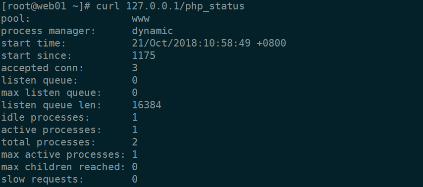
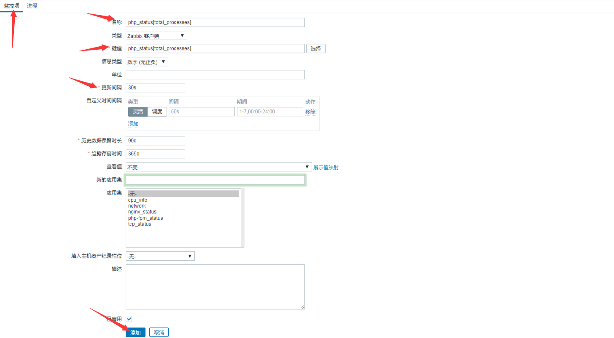
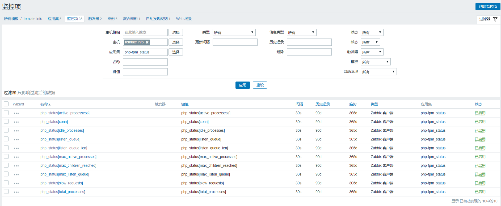

# zabbix 监控 php-fpm

zabbix监控php-fpm主要是通过nginx配置php-fpm的状态输出页面，在正则取值.要nginx能输出php-fpm的状态首先要先修改php-fpm的配置，没有开启nginx是没有法输出php-fpm status。

第一个里程：修改文件php-fpm

vim /application/php-5.5.32/etc/php-fpm.conf文件


第二个里程：修改nginx配置文件

vim vim /application/nginx/conf/extra/www.conf，在server 区块下添加一行内容


重启nginx

第三个里程：curl 127.0.0.1/php_status 我们可以看到php-fpm 的状态信息



| **字段**                 | **含义**                                                     |
| ------------------------ | ------------------------------------------------------------ |
| **pool**                 | **php-fpm pool的名称，大多数情况下为www**                    |
| **process manager**      | **进程管理方式，现今大多都为dynamic，不要使用static**        |
| **start time**           | **php-fpm上次启动的时间**                                    |
| **start since**          | **php-fpm已运行了多少秒**                                    |
| **accepted conn**        | **pool接收到的请求数**                                       |
| **listen queue**         | **处于等待状态中的连接数，如果不为0，需要增加php-fpm进程数** |
| **max listen queue**     | **php-fpm启动到现在处于等待连接的最大数量**                  |
| **listen queue len**     | **处于等待连接队列的套接字大小**                             |
| **idle processes**       | **处于空闲状态的进程数**                                     |
| **active processes**     | **处于活动状态的进程数**                                     |
| **total processess**     | **进程总数**                                                 |
| **max active process**   | **从php-fpm启动到现在最多有几个进程处于活动状态**            |
| **max children reached** | **当pm试图启动更多的children进程时，却达到了进程数的限制，达到一次记录一次，如果不为0，需要增加****php-fpm pool进程的最大数** |
| **slow requests**        | **当启用了php-fpm slow-log功能时，如果出现php-fpm慢请求这个计数器会增加，一般不当的Mysql查询会触发这个值** |

 第四个里程：编写监控脚本和监控文件

```shell
vim /server/scripts/php_fpm-status.sh

#!/bin/sh
#php-fpm status
case $1 in
ping) #检测php-fpm进程是否存在
/sbin/pidof php-fpm | wc -l
;;
start_since) #提取status中的start since数值
/usr/bin/curl 127.0.0.1/php_status 2>/dev/null | awk 'NR==4{print $3}'
;;
conn) #提取status中的accepted conn数值
/usr/bin/curl 127.0.0.1/php_status 2>/dev/null | awk 'NR==5{print $3}'
;;
listen_queue) #提取status中的listen queue数值
/usr/bin/curl 127.0.0.1/php_status 2>/dev/null | awk 'NR==6{print $3}'
;;
max_listen_queue) #提取status中的max listen queue数值
/usr/bin/curl 127.0.0.1/php_status 2>/dev/null | awk 'NR==7{print $4}'
;;
listen_queue_len) #提取status中的listen queue len
/usr/bin/curl 127.0.0.1/php_status 2>/dev/null | awk 'NR==8{print $4}'
;;
idle_processes) #提取status中的idle processes数值
/usr/bin/curl 127.0.0.1/php_status 2>/dev/null | awk 'NR==9{print $3}'
;;
active_processes) #提取status中的active processes数值
/usr/bin/curl 127.0.0.1/php_status 2>/dev/null | awk 'NR==10{print $3}'
;;
total_processes) #提取status中的total processess数值
/usr/bin/curl 127.0.0.1/php_status 2>/dev/null | awk 'NR==11{print $3}'
;;
max_active_processes) #提取status中的max active processes数值
/usr/bin/curl 127.0.0.1/php_status 2>/dev/null | awk 'NR==12{print $4}'
;;
max_children_reached) #提取status中的max children reached数值
/usr/bin/curl 127.0.0.1/php_status 2>/dev/null | awk 'NR==13{print $4}'
;;
slow_requests) #提取status中的slow requests数值
/usr/bin/curl 127.0.0.1/php_status 2>/dev/null | awk 'NR==14{print $3}'
;;
*)
echo "Usage: $0 {conn|listen_queue|max_listen_queue|listen_queue_len|idle_processes|active_processess|total_processes|max_active_processes|max_children_reached|slow_requests}"
exit 1
;;
esac

vim /etc/zabbix/zabbix_agentd.d/test.conf

UserParameter=php_status[*],/bin/sh /server/scripts/php_fpm-status.sh $1
```

第六个里程：重启服务


 在服务端测试


第七个里程：在web端进行配置




 

这时候我们再来看最新监控数据，就可以看到我们监控的内容了

 

配置到这，我们PHP状态监控基本完成，根据需求配置相应的触发器，即可。

你要的模板

链接：https://pan.baidu.com/s/1bnoYn1gD7xdQTEUzFj44eA 
提取码：47sv