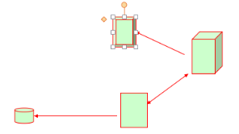
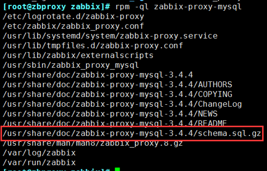
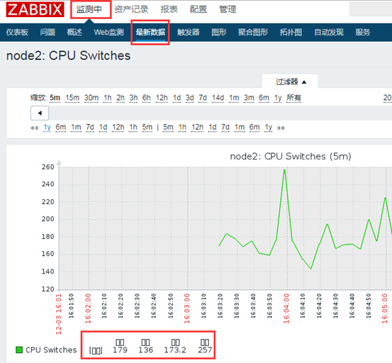

# Zabbix 分布式监控


## 1、介绍

（1）介绍

分布式监控概述

　　proxy and node

Zabbix 的三种架构

　　Server-agent

　　Server-Node-agent

　　Server-Proxy-agent

监控Zabbix

 

（2）配置介绍

Zabbix Proxy的配置：

　　server-node-agent

　　server-proxy-agent

a) 配置proxy主机：

(1) 安装程序包

​    zabbix-proxy-mysql zabbix-get

​    zabbix-agent zabbix-sender

(2) 准备数据库

　　创建、授权用户、导入schema.sql；

(3) 修改配置文件

　　Server=

　　　　zabbix server主机地址；

　　Hostname=

　　　　当前代理服务器的名称；在server添加proxy时，必须使用此处指定的名称；

　　　　=需要事先确保server能解析此名称；

　　DBHost=

　　DBName=

　　DBUser=

　　DBPassword=

 

　　ConfigFrequency=10

　　DataSenderFrequency=1

 

b) 在server端添加此Porxy

​    Administration --> Proxies

 

c) 在Server端配置通过此Proxy监控的主机；

注意：zabbix agent端要允许zabbix proxy主机执行数据采集操作：

 

## 2、实现分布式zabbix proxy监控

实验前准备：

① ntpdate 172.168.30.1 同步时间

② 关闭防火墙，selinux

③ 设置主机名 hostnamectl set-hostname zbproxy.along.com

④ vim /etc/hosts 每个机器都设置hosts，以解析主机名；DNS也行

192.168.30.107 server.along.com

192.168.30.7 node1.along.com

192.168.30.2 node2.along.com

192.168.30.3 node3.along.com zbproxy.along.com



（1）环境配置（4台主机）

| 机器名称      | IP配置         | 服务角色  |
| ------------- | -------------- | --------- |
| zabbix-server | 192.168.30.107 | 监控      |
| agent-node1   | 192.168.30.7   | 被监控端  |
| agent-node2   | 192.168.30.2   | 被监控端  |
| node3         | 192.168.30.3   | 代理proxy |

zabbix-server 直接监控一台主机node1

zabbix-server 通过代理node3 监控node2

（2）在node3 上配置mysql

① 创建配置mysql

vim /etc/my.cnf.d/server.cnf

```
[server]
skip_name_resolve = on
innodb_file_per_table = on
innodb_buffer_pool_size = 256M
max_connections = 2000
log-bin = master-log
```

② systemctl start mariadb 开启服务

③ 创建数据库 和 授权用户

```
MariaDB [(none)]> create database zbxproxydb character set 'utf8';
MariaDB [(none)]> grant all on zbxproxydb.* to 'zbxproxyuser'@'192.168.30.%' identified by 'zbxproxypass';
MariaDB [(none)]> flush privileges;
```

（3）在node3 上下载zabbix 相关的包，主要是代理proxy的包

yum -y install **zabbix-proxy-mysql** zabbix-get zabbix-agent zabbix-sender

 

a) **初始化数据库**

zabbix-proxy-mysql 包里带有，导入数据的文件



cp /usr/share/doc/zabbix-proxy-mysql-3.4.4/schema.sql.gz ./ 复制

gzip -d schema.sql.gz 解包

mysql -root -p zbxproxydb < schema.sql 导入数据

 

b) 查看数据已经生成


 

（4）配置proxy端

① vim /etc/zabbix/zabbix_proxy.conf


```
Server=192.168.30.107   #server 的IP
ServerPort=10051   #server 的端口

Hostname=zbxproxy.along.com   #主机名
ListenPort=10051    #proxy自己的监听端口
EnableRemoteCommands=1    #允许远程命令
LogRemoteCommands=1    #记录远程命令的日志

数据的配置
DBHost=192.168.30.3
DBName=zbxproxydb  
DBUser=zbxproxyuser
DBPassword=zbxproxypass

ConfigFrequency=30    #多长时间，去服务端拖一次有自己监控的操作配置；为了实验更快的生效，这里设置30秒，默认3600s
DataSenderFrequency=1   #每一秒向server 端发一次数据，发送频度
```

② systemctl start zabbix-proxy 开启服务

（5）配置node2端，允许proxy代理监控

vim /etc/zabbix/zabbix_agentd.conf

```
Server=192.168.30.107,192.168.30.3
ServerActive=192.168.30.107,192.168.30.3
```

systemctl restart zabbix-agent 启动服务

（6）把代理加入监控server，创建配置agent 代理

① 创建agent 代理


② 配置


 

（7）创建node2 主机，并采用代理监控


设置代理成功


 

（8）创建item监控项

① 为了实验，随便创一个监控项 CPU Switches


② 进程里设置每秒更改


③ 成功，graph 图形生成



 

