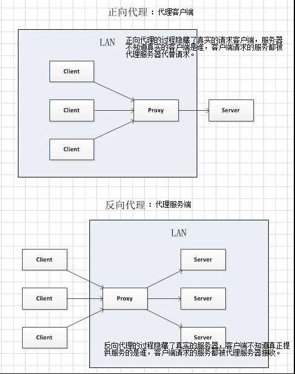
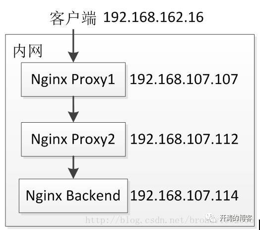
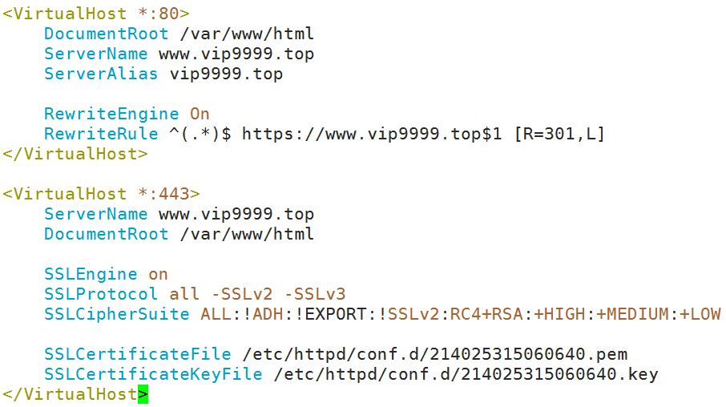

## 一、nginx 服务

### 1、nginx 介绍


 *Nginx* (engine x) 是一个高性能的 HTTP 和 反向代理 服务，也是一个IMAP/POP3/SMTP服务。Nginx是由伊戈尔·赛索耶夫为俄罗斯访问量第二的Rambler.ru站点（俄文：Рамблер）开发的，第一个公开版本0.1.0发布于2004年10月4日。其将源代码以类BSD许可证的形式发布，因它的稳定性、丰富的功能集、示例配置文件和低系统资源的消耗而闻名。2011年6月1日，nginx 1.0.4发布。

Nginx是一款轻量级的Web 服务器/反向代理服务器及电子邮件（IMAP/POP3）代理服务器，并在一个BSD-like 协议下发行。其特点是占有内存少，并发能力强，事实上nginx的并发能力确实在同类型的网页服务器中表现较好，中国大陆使用nginx网站用户有：百度、[京东](https://baike.baidu.com/item/%E4%BA%AC%E4%B8%9C/210931)、[新浪](https://baike.baidu.com/item/%E6%96%B0%E6%B5%AA/125692)、[网易](https://baike.baidu.com/item/%E7%BD%91%E6%98%93/185754)、[腾讯](https://baike.baidu.com/item/%E8%85%BE%E8%AE%AF/112204)、[淘宝](https://baike.baidu.com/item/%E6%B7%98%E5%AE%9D/145661)等。

`在高连接并发的情况下，Nginx是Apache服务器不错的替代品`。

**创始人伊戈尔·赛索耶夫**


### 2、为什么选择 nginx 

Nginx 是一个高性能的 Web 和反向代理服务器, 它具有有很多非常优越的特性:

**作为 Web 服务器**：相比 Apache，Nginx 使用更少的资源，支持更多的并发连接，体现更高的效率，这点使 Nginx 尤其受到虚拟主机提供商的欢迎。能够支持高达 50,000 个并发连接数的响应，感谢 Nginx 为我们选择了 epoll and kqueue 作为开发模型.

**作为负载均衡服务器**：Nginx 既可以在内部直接支持 Rails 和 PHP，也可以支持作为 HTTP代理服务器 对外进行服务。Nginx 用 C 编写, 不论是系统资源开销还是 CPU 使用效率都比 Perlbal 要好的多。

**作为邮件代理服务器**: Nginx 同时也是一个非常优秀的邮件代理服务器（最早开发这个产品的目的之一也是作为邮件代理服务器），Last.fm 描述了成功并且美妙的使用经验。

**Nginx 安装非常的简单，配置文件 非常简洁（还能够支持perl语法），Bugs非常少的服务器**: Nginx 启动特别容易，并且几乎可以做到7*24不间断运行，即使运行数个月也不需要重新启动。你还能够在 不间断服务的情况下进行软件版本的升级。

### 3、IO多路复用

#### 1、I/O multiplexing【多并发】

第一种方法就是最传统的多进程并发模型 (每进来一个新的I/O流会分配一个新的进程管理。)

第二种方法就是I/O多路复用 (单个线程，通过记录跟踪每个I/O流(sock)的状态，来同时管理多个I/O流 。)


I/O multiplexing 这里面的 multiplexing 指的其实是在单个线程通过记录跟踪每一个Sock(I/O流)的状态来同时管理多个I/O流。发明它的原因，是尽量多的提高服务器的吞吐能力。在同一个线程里面， 通过拨开关的方式，来同时传输多个I/O流


#### 2、一个请求到来了，nginx使用epoll接收请求的过程是怎样的?

ngnix会有很多连接进来， epoll会把他们都监视起来，然后像拨开关一样，谁有数据就拨向谁，然后调用相

应的代码处理。

- **select, poll, epoll** 都是I/O多路复用的具体的实现，其实是他们出现是有先后顺序的。 

I/O多路复用这个概念被提出来以后， 相继出现了多个方案

- **select**是第一个实现 (1983 左右在BSD里面实现的)。 

select 被实现以后，很快就暴露出了很多问题。

• select 会修改传入的参数数组，这个对于一个需要调用很多次的函数，是非常不友好的。

• select 如果任何一个sock(I/O stream)出现了数据，select 仅仅会返回，但是并不会告诉你是那个sock上有数

据，于是你只能自己一个一个的找，10几个sock可能还好，要是几万的sock每次都找一遍...

• select 只能监视1024个链接。

• select 不是线程安全的，如果你把一个sock加入到select, 然后突然另外一个线程发现，这个sock不用，要收

回，这个select 不支持的，如果你丧心病狂的竟然关掉这个sock, select的标准行为是不可预测的

- 于是14年以后(1997年）一帮人又实现了**poll,**  poll 修复了select的很多问题，比如

• poll 去掉了1024个链接的限制，于是要多少链接呢， 主人你开心就好。

• poll 从设计上来说，不再修改传入数组，不过这个要看你的平台了，所以行走江湖，还是小心为妙。

其实拖14年那么久也不是效率问题， 而是那个时代的硬件实在太弱，一台服务器处理1千多个链接简直就是神

一样的存在了，select很长段时间已经满足需求。 

但是poll仍然不是线程安全的， 这就意味着，不管服务器有多强悍，你也只能在一个线程里面处理一组I/O流。

你当然可以那多进程来配合了，不过然后你就有了多进程的各种问题。

- 于是5年以后, 在2002, 大神 Davide Libenzi 实现了**epoll**. 

epoll 可以说是I/O 多路复用最新的一个实现，epoll 修复了poll 和select绝大部分问题, 比如：

• epoll 现在是线程安全的。 

• epoll 现在不仅告诉你sock组里面数据，还会告诉你具体哪个sock有数据，你不用自己去找了。

#### 3、异步，非阻塞

$ pstree |grep nginx
 |-+= 81666 root nginx: master process nginx
 | |--- 82500 nobody nginx: worker process
 | \--- 82501 nobody nginx: worker process

 1个master进程，2个work进程

​     每进来一个request，会有一个worker进程去处理。但不是全程的处理，处理到什么程度呢？处理

到可能发生阻塞的地方，比如向上游（后端）服务器转发request，并等待请求返回。那么，这个处理

的worker不会这么一直等着，他会在发送完请求后，注册一个事件：“如果upstream返回了，告诉我一声，

我再接着干”。于是他就休息去了。这就是异步。此时，如果再有request 进来，他就可以很快再按这种

方式处理。这就是非阻塞和IO多路复用。而一旦上游服务器返回了，就会触发这个事件，worker才会来

接手，这个request才会接着往下走。这就是异步回调。

### 4、nginx 的内部技术架构 

Nginx服务器，以其处理网络请求的高并发、高性能及高效率，获得了行业界的广泛认可，近年已稳居web服务器部署排名第二的位置，并被广泛用于反向代理和负载均衡。

Nginx是如何实现这些目标的呢？答案就是其独特的内部技术架构设计。看懂下面这张图，就明白了Nginx的内部技术架构。


简要说明几点：

1）nginx启动时，会生成两种类型的进程，一个是主进程（Master），一个（windows版本的目前只有一个）或多个工作进程（Worker）。主进程并不处理网络请求，主要负责调度工作进程，也就是图示的三项：加载配置、启动工作进程及非停升级。所以，nginx启动以后，查看操作系统的进程列表，我们就能看到至少有两个nginx进程。

2）服务器实际处理网络请求及响应的是工作进程（worker），在类unix系统上，nginx可以配置多个worker，而每个worker进程都可以同时处理数以千计的网络请求。

3）模块化设计。nginx的worker，包括核心和功能性模块，核心模块负责维持一个运行循环（run-loop），执行网络请求处理的不同阶段的模块功能，如网络读写、存储读写、内容传输、外出过滤，以及将请求发往上游服务器等。而其代码的模块化设计，也使得我们可以根据需要对功能模块进行适当的选择和修改，编译成具有特定功能的服务器。

4）事件驱动、异步及非阻塞，可以说是nginx得以获得高并发、高性能的关键因素，同时也得益于对Linux、Solaris及类BSD等操作系统内核中事件通知及I/O性能增强功能的采用，如kqueue、epoll及event ports。

5）代理（proxy）设计，可以说是nginx深入骨髓的设计，无论是对于HTTP，还是对于FastCGI、memcache、Redis等的网络请求或响应，本质上都采用了代理机制。所以，nginx天生就是高性能的代理服务器   

### 5、nginx 安装部署和配置管理

#### 1、nginx 部署-Yum

访问 nginx官方网站：http://www.nginx.org

Nginx版本类型

Mainline version：   主线版，即开发版

Stable version：       最新稳定版，生产环境上建议使用的版本

Legacy versions：    遗留的老版本的稳定版


**Yum安装Nginx**

##### a、**官方安装指导**

Installation instructions

Before you install nginx for the first time on a new machine, you need to set up the nginx packages repository. Afterward, you can install and update nginx from the repository.

**RHEL/CentOS**

Install the prerequisites:

> ```
> sudo yum install yum-utils
> ```

To set up the yum repository, create the file named `/etc/yum.repos.d/nginx.repo` with the following contents:

> ```
> [nginx-stable]
> name=nginx stable repo
> baseurl=http://nginx.org/packages/centos/$releasever/$basearch/
> gpgcheck=1
> enabled=1
> gpgkey=https://nginx.org/keys/nginx_signing.key
> 
> [nginx-mainline]
> name=nginx mainline repo
> baseurl=http://nginx.org/packages/mainline/centos/$releasever/$basearch/
> gpgcheck=1
> enabled=0
> gpgkey=https://nginx.org/keys/nginx_signing.key
> ```

By default, the repository for stable nginx packages is used. If you would like to use mainline nginx packages, run the following command:

> ```
> sudo yum-config-manager --enable nginx-mainline
> ```

To install nginx, run the following command:

> ```
> sudo yum install nginx
> ```

When prompted to accept the GPG key, verify that the fingerprint matches `573B FD6B 3D8F BC64 1079 A6AB ABF5 BD82 7BD9 BF62`, and if so, accept it.

##### b 、安装

[root@tianyun ~]# yum -y install nginx

[root@tianyun ~]# systemctl start nginx

[root@tianyun ~]# systemctl enable nginx

**查看防火墙状态， 需要关闭防火墙**

[root@tianyun ~]# getenforce 

Disabled

[root@tianyun ~]# systemctl status firewalld

● firewalld.service - firewalld - dynamic firewall daemon

   Loaded: loaded (/usr/lib/systemd/system/firewalld.service; disabled; vendor pres

et: enabled)   Active: inactive (dead)

​     Docs: man:firewalld(1)

**查看 nginx 安装版本**

[root@tianyun ~]# nginx -v

nginx version: nginx/1.14.2

[root@tianyun ~]# nginx -V

nginx version: nginx/1.14.2

built by gcc 4.8.5 20150623 (Red Hat 4.8.5-11) (GCC) 

built with OpenSSL 1.0.1e-fips 11 Feb 2013

TLS SNI support enabled

configure arguments:

 --prefix=/etc/nginx --sbin-path=/usr/sbin/nginx --modules-path

=/usr/lib64/nginx/modules --conf-path=/etc/nginx/nginx.conf --error-log-path=/var/log/nginx/error.log --http-log-path=/var/log/nginx/access.log --pid-path=/var/run/nginx.pid --lock-path=/var/run/nginx.lock --http-client-body-temp-path=/var/cache/nginx/client_temp --http-proxy-temp-path=/var/cache/nginx/proxy_temp --http-fastcgi-temp-path=/var/cache/nginx/fastcgi_temp --http-uwsgi-temp-path=/var/cache/nginx/uwsgi_temp --http-scgi-temp-path=/var/cache/nginx/scgi_temp --user=nginx --group=nginx --with-compat --with-file-aio --with-threads --with-http_addition_module --with-http_auth_request_module --with-http_dav_module --with-http_flv_module --with-http_gunzip_module --with-http_gzip_static_module --with-http_mp4_module --with-http_random_index_module --with-http_realip_module --with-http_secure_link_module --with-http_slice_module --with-http_ssl_module --with-http_stub_status_module --with-http_sub_module --with-http_v2_module --with-mail --with-mail_ssl_module --with-stream --with-stream_realip_module --with-stream_ssl_module --with-stream_ssl_preread_module --with-cc-opt='-O2 -g -pipe -Wall -Wp,-D_FORTIFY_SOURCE=2 -fexceptions -fstack-protector-strong --param=ssp-buffer-size=4 -grecord-gcc-switches -m64 -mtune=generic -fPIC' --with-ld-opt='-Wl,-z,relro -Wl,-z,now -pie'

**浏览器访问 tianyun.me (在访问机器上添加 hosts 解析)**


#### 2、nginx 编译安装与配置使用

##### 1、安装编译环境

yum -y install gcc gcc-c++

##### 2、安装pcre软件包（使nginx支持http rewrite模块）

yum install -y pcre pcre-devel

##### 3、安装openssl-devel（使nginx支持ssl）

yum install -y openssl openssl-devel 

##### 4、安装zlib

yum install -y zlib zlib-devel

##### 5、创建用户nginx

useradd nginx 

passwd nginx

##### 6、安装nginx

```shell
[root@localhost ～]#wget http://120.52.51.15/nginx.org/download/nginx-1.14.2.tar.gz
```

```shell
[root@localhost ～]#tar -vzxf nginx-1.14.2.tar.gz -C /usr/local
[root@localhost ～]#cd nginx-1.14.2/ 
[root@localhost nginx-1.14.2]# ./configure \ 
--group=nginx \ 
--user=nginx \ 
--prefix=/usr/local/nginx \ 
--sbin-path=/usr/sbin/nginx \ 
--conf-path=/etc/nginx/nginx.conf \ 
--error-log-path=/var/log/nginx/error.log \ 
--http-log-path=/var/log/nginx/access.log \ 
--http-client-body-temp-path=/tmp/nginx/client_body \ 
--http-proxy-temp-path=/tmp/nginx/proxy \ 
--http-fastcgi-temp-path=/tmp/nginx/fastcgi \ 
--pid-path=/var/run/nginx.pid \ 
--lock-path=/var/lock/nginx \ 
--with-http_stub_status_module \ 
--with-http_ssl_module \ 
--with-http_gzip_static_module \ 
--with-pcre 
[root@localhost nginx-1.11.3]# make &&make install
```

##### 7、Nginx 编译参数

```shell
# 查看 nginx 安装的模块
[root@tianyun ~]# nginx -V

# 模块参数具体功能 
--with-cc-opt='-g -O2 -fPIE -fstack-protector'   # 设置额外的参数将被添加到CFLAGS变量。（FreeBSD或者ubuntu使用）
--param=ssp-buffer-size=4 -Wformat -Werror=format-security -D_FORTIFY_SOURCE=2' 
--with-ld-opt='-Wl,-Bsymbolic-functions -fPIE -pie -Wl,-z,relro -Wl,-z,now' 

--prefix=/usr/share/nginx                        # 指向安装目录
--conf-path=/etc/nginx/nginx.conf                # 指定配置文件
--http-log-path=/var/log/nginx/access.log        # 指定访问日志
--error-log-path=/var/log/nginx/error.log        # 指定错误日志
--lock-path=/var/lock/nginx.lock                 # 指定lock文件
--pid-path=/run/nginx.pid                        # 指定pid文件

--http-client-body-temp-path=/var/lib/nginx/body    # 设定http客户端请求临时文件路径
--http-fastcgi-temp-path=/var/lib/nginx/fastcgi     # 设定http fastcgi临时文件路径
--http-proxy-temp-path=/var/lib/nginx/proxy         # 设定http代理临时文件路径
--http-scgi-temp-path=/var/lib/nginx/scgi           # 设定http scgi临时文件路径
--http-uwsgi-temp-path=/var/lib/nginx/uwsgi         # 设定http uwsgi临时文件路径

--with-debug                                        # 启用debug日志
--with-pcre-jit                                     # 编译PCRE包含“just-in-time compilation”
--with-ipv6                                         # 启用ipv6支持
--with-http_ssl_module                              # 启用ssl支持
--with-http_stub_status_module                      # 获取nginx自上次启动以来的状态
--with-http_realip_module                 # 允许从请求标头更改客户端的IP地址值，默认为关
--with-http_auth_request_module           # 实现基于一个子请求的结果的客户端授权。如果该子请求返回的2xx响应代码，所述接入是允许的。如果它返回401或403中，访问被拒绝与相应的错误代码。由子请求返回的任何其他响应代码被认为是一个错误。
--with-http_addition_module               # 作为一个输出过滤器，支持不完全缓冲，分部分响应请求
--with-http_dav_module                    # 增加PUT,DELETE,MKCOL：创建集合,COPY和MOVE方法 默认关闭，需编译开启
--with-http_geoip_module                  # 使用预编译的MaxMind数据库解析客户端IP地址，得到变量值
--with-http_gunzip_module                 # 它为不支持“gzip”编码方法的客户端解压具有“Content-Encoding: gzip”头的响应。
--with-http_gzip_static_module            # 在线实时压缩输出数据流
--with-http_image_filter_module           # 传输JPEG/GIF/PNG 图片的一个过滤器）（默认为不启用。gd库要用到）
--with-http_spdy_module                   # SPDY可以缩短网页的加载时间
--with-http_sub_module                    # 允许用一些其他文本替换nginx响应中的一些文本
--with-http_xslt_module                   # 过滤转换XML请求
--with-mail                               # 启用POP3/IMAP4/SMTP代理模块支持
--with-mail_ssl_module                    # 启用ngx_mail_ssl_module支持启用外部模块支持
```

##### 8、修改配置文件 /etc/nginx/nginx.conf

```shell
# 全局参数设置 
worker_processes  1;          # 设置nginx启动进程的数量，一般设置成与逻辑cpu数量相同 
error_log  logs/error.log;    # 指定错误日志 
worker_rlimit_nofile 102400;  # 设置一个nginx进程能打开的最大文件数 
pid        /var/run/nginx.pid; 
events {                      # 事件配置
    worker_connections  1024; # 设置一个进程的最大并发连接数
    use epoll;                # 事件驱动类型
} 
# http 服务相关设置 
http { 
    include      mime.types; 
    default_type  application/octet-stream; 
    log_format  main  'remote_addr - remote_user [time_local] "request" '
                      'status body_bytes_sent "$http_referer" '
                      '"http_user_agent" "http_x_forwarded_for"'; 
    access_log  /var/log/nginx/access.log  main;    #设置访问日志的位置和格式 
    sendfile          on;      # 用于开启文件高效传输模式，一般设置为on，若nginx是用来进行磁盘IO负载应用时，可以设置为off，降低系统负载
    tcp_nopush        on;      # 减少网络报文段数量，当有数据时，先别着急发送, 确保数据包已经装满数据, 避免了网络拥塞
    tcp_nodelay       on;      # 提高I/O性能，确保数据尽快发送, 提高可数据传输效率                           
    gzip              on;      # 是否开启gzip压缩 
    keepalive_timeout  65;     # 设置长连接的超时时间，请求完成之后还要保持连接多久，不是请求时间多久，目的是保持长连接，减少创建连接过程给系统带来的性能损                                    耗，类似于线程池，数据库连接池
    types_hash_max_size 2048;  # 影响散列表的冲突率。types_hash_max_size越大，就会消耗更多的内存，但散列key的冲突率会降低，检索速度就更快。                                            types_hash_max_size越小，消耗的内存就越小，但散列key的冲突率可能上升
    include             /etc/nginx/mime.types;  # 关联mime类型，关联资源的媒体类型(不同的媒体类型的打开方式)
    default_type        application/octet-stream;  # 根据文件的后缀来匹配相应的MIME类型，并写入Response header，导致浏览器播放文件而不是下载
# 虚拟服务器的相关设置 
    server { 
        listen      80;        # 设置监听的端口 
        server_name  localhost;        # 设置绑定的主机名、域名或ip地址 
        charset koi8-r;        # 设置编码字符 
        location / { 
            root  /var/www/nginx;           # 设置服务器默认网站的根目录位置 
            index  index.html index.htm;    # 设置默认打开的文档 
            } 
        error_page  500 502 503 504  /50x.html; # 设置错误信息返回页面 
            location = /50x.html { 
            root  html;        # 这里的绝对位置是/var/www/nginx/html 
        } 
    } 
 }
```

##### 9、检测 nginx 配置文件是否正确

```shell
[root@localhost ~]#usr/local/nginx/sbin/nginx -t
```

##### 10、启动nginx服务

```shell
/usr/local/nginx/sbin/nginx
```

##### 11、通过 nginx 命令控制 nginx 服务

```shell
nginx -c /path/to/nginx.conf  	 # 以特定目录下的配置文件启动nginx:
nginx -s reload            	 	 # 修改配置后重新加载生效
nginx -s reopen   			 	 # 重新打开日志文件
nginx -s stop  				 	 # 快速停止nginx
nginx -s quit  				  	 # 完整有序的停止nginx
nginx -t    					 # 测试当前配置文件是否正确
nginx -t -c /path/to/nginx.conf  # 测试特定的nginx配置文件是否正确
```

##### 12、实现nginx开机自启

 a、添加启动脚本  vim /etc/init.d/nginx

```shell
#!/bin/sh 
# 
# nginx - this script starts and stops the nginx daemon 
# 
# chkconfig:  - 85 15  
# description:  Nginx is an HTTP(S) server, HTTP(S) reverse \ 
#              proxy and IMAP/POP3 proxy server 
# processname: nginx 
# config:      /etc/nginx/nginx.conf 
# config:      /etc/sysconfig/nginx 
# pidfile:    /var/run/nginx.pid 
  
# Source function library. 
. /etc/rc.d/init.d/functions
  
# Source networking configuration. 
. /etc/sysconfig/network
  
# Check that networking is up. 
[ "$NETWORKING" = "no" ] && exit 0 
  
nginx="/usr/sbin/nginx"
prog=$(basename $nginx) 
  
NGINX_CONF_FILE="/etc/nginx/nginx.conf"
  
[ -f /etc/sysconfig/nginx ] && . /etc/sysconfig/nginx
  
lockfile=/var/lock/subsys/nginx
  
make_dirs() { 
  # make required directories 
  user=`nginx -V 2>&1 | grep "configure arguments:" | sed 's/[^*]*--user=\([^ ]*\).*/\1/g' -` 
  options=`$nginx -V 2>&1 | grep 'configure arguments:'` 
  for opt in $options; do
      if [ `echo $opt | grep '.*-temp-path'` ]; then
          value=`echo $opt | cut -d "=" -f 2` 
          if [ ! -d "$value" ]; then
              # echo "creating" $value 
              mkdir -p $value && chown -R $user $value 
          fi
      fi
  done
} 
  
start() { 
    [ -x $nginx ] || exit 5 
    [ -f $NGINX_CONF_FILE ] || exit 6 
    make_dirs 
    echo -n $"Starting $prog: "
    daemon $nginx -c $NGINX_CONF_FILE 
    retval=$? 
    echo
    [ $retval -eq 0 ] && touch $lockfile 
    return $retval 
} 
  
stop() { 
    echo -n $"Stopping $prog: "
    killproc $prog -QUIT 
    retval=$? 
    echo
    [ $retval -eq 0 ] && rm -f $lockfile 
    return $retval 
} 
  
restart() { 
    configtest || return $? 
    stop 
    sleep 1 
    start 
} 
  
reload() { 
    configtest || return $? 
    echo -n $"Reloading $prog: "
    killproc $nginx -HUP 
    RETVAL=$? 
    echo
} 
  
force_reload() { 
    restart 
} 
  
configtest() { 
  $nginx -t -c $NGINX_CONF_FILE 
} 
  
rh_status() { 
    status $prog 
} 
  
rh_status_q() { 
    rh_status >/dev/null 2>&1 
} 
  
case "$1" in
    start) 
        rh_status_q && exit 0 
        $1 
        ;; 
    stop) 
        rh_status_q || exit 0 
        $1 
        ;; 
    restart|configtest) 
        $1 
        ;; 
    reload) 
        rh_status_q || exit 7 
        $1 
        ;; 
    force-reload) 
        force_reload 
        ;; 
    status) 
        rh_status 
        ;; 
    condrestart|try-restart) 
        rh_status_q || exit 0 
            ;; 
    *) 
        echo $"Usage: $0 {start|stop|status|restart|condrestart|try-restart|reload|force-reload|configtest}"
        exit 2 
esac
```

b、添加权限

```shell
chmod +x /etc/init.d/nginx
```

c、重载系统启动文件

```shell
systemctl daemon-reload
```

d、设置开机自启

```shell
systemct start nginx
```

10、nginx 日志文件详解

​    nginx 日志文件分为 **log_format** 和 **access_log** 两部分

​    log_format 定义记录的格式，其语法格式为

​    log_format        样式名称        样式详情

​    配置文件中默认有

```
log_format  main  'remote_addr - remote_user [time_local] "request" '
                  'status body_bytes_sent "$http_referer" '
                  '"http_user_agent" "http_x_forwarded_for"';9 A
```

| 点击这里                            | 点击这里                                                    |
| ----------------------------------- | ----------------------------------------------------------- |
| 变量                                | 说明                                                        |
| $remote_addr和$http_x_forwarded_for | 客户端的ip                                                  |
| $remote_user                        | 客户端的名称                                                |
| $time_local                         | 访问时的本地时间                                            |
| $request                            | 请求的URL和http协议                                         |
| $status                             | 访问的状态码                                                |
| $body_bytes_sent                    | 发送给客户端的主体内容大小                                  |
| $http_referer                       | 记录客户端是从哪个页面链接访问过来的，若没有链接，则访问‘-’ |
| $http_user_agent                    | 记录客户端使用的浏览器的相关信息                            |

#### 6、nginx 高级应用

##### 1、使用 alias 实现虚拟目录

```shell
   location /lys { 
    	alias /var/www/lys; 
    	index index.html;    # 访问http://x.x.x.x/lzs时实际上访问是/var/www/lzs/index.html
    	}
```

`root`和`alias`的主要区别是：

- 使用`root`，实际的路径就是：**root值 + location值**。
- 使用`alias`，实际的路径就是：**alias值**。

例如，

有一张图片，URL是：**www.lys.com/static/a.jpg**

它在服务器的路径是：**/var/www/app/static/a.jpg**

那么用`root`的配置是：

```
location /static/ {
    root /var/www/app/;
}
```

用`alias`的配置就是：

```
location /static/ {
    alias /var/www/app/static/;
}
```

对于`alias`，**location值可以随便取**，例如：

```
location /hello/ {
    alias /var/www/app/static/;
}
```

这样，我们访问图片的地址就是：**www.lys.com/hello/a.jpg**
 注意：

1. 很多文章说：~~alias 后面必须要用 “/” 结束~~，是**错误**的，亲测加不加`/`效果是一样的。
2. `alias`在使用正则匹配时，**必须捕捉要匹配的内容，并在指定的内容处使用**。
3. `alias`只能位于`location`块中，`root`可以不放在`location`中。

##### 2、通过 stub_status 模块监控 nginx 的工作状态

​        1、通过 nginx  -V 命令查看是否已安装 stub_status 模块

​        2、编辑 /etc/nginx/nginx.conf 配置文件

```shell
#添加以下内容～～ 
location /nginx-status { 
      stub_status on; 
      access_log    /var/log/nginx/nginxstatus.log;    #设置日志文件的位置 
      auth_basic    "nginx-status";    #指定认证机制（与location后面的内容相同即可） 
      auth_basic_user_file    /etc/nginx/htpasswd;     #指定认证的密码文件 
      }      
```

​       3、创建认证口令文件并添加用户 lys 和 admin，密码用md5加密

```shell
htpasswd -c -m /etc/nginx/htpasswd lys 
htpasswd -m /etc/nginx/htpasswd admin
```

​       4、重启服务

​       5、客户端访问 http://x.x.x.x/nginx-status 即可

##### 3、使用 limit_rate 限制客户端传输数据的速度

​          1、编辑/etc/nginx/nginx.conf

```shell
 location / { 
    root    /var/www/nginx; 
    index    index.html; 
    limit_rate    2k;         #对每个连接的限速为2k/s
    }
```

​         2、重启服务

**注意要点：**

- ​    配置文件中的每个语句要以 ; 结尾
- ​    使用 htpasswd 命令需要先安装 httpd

#### 7、nginx 虚拟机配置

**什么是虚拟主机？**
虚拟主机是一种特殊的软硬件技术，它可以将网络上的每一台计算机分成多个虚拟主机，每个虚拟主机可以独立对外提供www服务，这样就可以实现一台主机对外提供多个web服务，每个虚拟主机之间是独立的，互不影响。


nginx可以实现虚拟主机的配置，nginx支持三种类型的虚拟主机配置。
1、基于域名的虚拟主机 （server_name来区分虚拟主机——应用：外部网站）
2、基于ip的虚拟主机， （一块主机绑定多个ip地址）
3、基于端口的虚拟主机 （端口来区分虚拟主机——应用：公司内部网站，外部网站的管理后台）

##### 1、 基于域名的虚拟主机

1、配置通过域名区分的虚拟机

```shell
server {
	listen 80;
	server_name www.1000phone01.com;
	root         /usr/share/nginx/html;
    access_log   /var/logs/www.1000phone01.com.log main;
    error_log    /var/logs/www.1000phone01.com.error.log;
	location / {
		root html;
		index index.html index.htm;
        }
}

server {
	listen 80;
	server_name www.1000phone02.com;
	root         /usr/share/nginx/lys;
	access_log   /var/logs/www.1000phone02.com.log main;
    error_log    /var/logs/www.1000phone02.com.error.log;
	location / {
		root html;
		index index.html index.htm;
        }
}

# 模板配置
    server {
        listen       80 default_server;
        listen       [::]:80 default_server;
        server_name  _;
        root         /usr/share/nginx/html;
        # Load configuration files for the default server block.
        include /etc/nginx/default.d/*.conf;
        location / {
        }
        error_page 404 /404.html;
            location = /40x.html {
        }
        error_page 500 502 503 504 /50x.html;
            location = /50x.html {
        }
    }
```

2、 为 域名为 www.1000phone02.com 的虚拟机，创建 index 文件

```
[root@nginx ~]# mkdir -p /root/html
[root@nginx ~]# cd /root/html/
[root@nginx html]# vim index.html
[root@nginx html]# cat index.html 
<html>
<p>
this is my 1000phone02
</p>
</html>
```

3、重新加载配置文件

```
# 如果编译安装的执行
[root@nginx]# /usr/local/nginx/bin/nginx -s reload
# 如果 yum 安装的执行
[root@nginx]# nginx -s reload
```

4、客户端配置路由映射
在 C:\Windows\System32\drivers\etc\hosts 文件中添加两行

```
10.219.24.26 www.1000phone01.com
10.219.24.26 www.1000phone02.com
```

5、 测试访问

浏览器输入：http://1000phone01.com/

浏览器输入：http://1000phone02.com/


 6、补充：如果配置不能正常访问，

问题描述： 配置完 nginx 两个虚拟机后，客户端能够访问原始的server ,新增加的 server 虚拟机 不能够访问，报错如下页面


解决过程：

1. 查看报错日志（找到错误日志）

```shell
  [root@nginx]# cat logs/error.log 
  2017/06/15 04:00:57 [error] 6702#0: *14 "/root/html/index.html" is forbidden (13: Permission denied), client: 10.219.24.1, server: www.1000phone02.com, request: "GET / HTTP/1.1", host: "www.1000phone02.com"
  [root@logs]# date
  Tue Mar 12 10:05:53 CST 2019
```

2. 检查权限

```shell
  [root@nginx ~]# ll
  drwxr-xr-x. 2 root root 4096 Jun 15 03:59 html
  [root@nginx html]# ll
  total 8
  -rw-r--r--. 1 root root 537 Jun 15 03:59 50x.html
  -rw-r--r--. 1 root root 616 Jun 15 03:51 index.html
  说明：发现目录权限没有问题
```

3. 检查nginx启动进程

```shell
   [root@nginx]# ps anx|grep nginx
  6546 ? Ss 0:00 nginx: master process ./sbin/nginx
  6702 ? S 0:00 nginx: worker process
  6726 pts/1 S+ 0:00 grep nginx
  说明：发现nginx的work process是 nobody 的
```

4. 修改 nginx.conf 文件

```shell
  打开nginx.conf文件所在的目录，查看文件的属性 （root root）
  [root@nginx]# ll
  drwxr-xr-x. 2 root root 4096 Jun 15 04:08 conf
  在nginx.conf文件的第一行加上 user root root;
  [root@nginx]# cat conf/nginx.conf
  user root root;
```

5. 重新 reload nginx进程

```shell
  [root@nginx]#nginx -s reload
  注意：
  nginx -s reload 命令加载修改后的配置文件,命令下达后发生如下事件
  1. Nginx的master进程检查配置文件的正确性，若是错误则返回错误信息，nginx继续采用原配置文件进行工作（因为worker未受到影响）
  2. Nginx启动新的worker进程，采用新的配置文件
  3. Nginx将新的请求分配新的worker进程
  4. Nginx等待以前的worker进程的全部请求已经都返回后，关闭相关worker进程
  5. 重复上面过程，直到全部旧的worker进程都被关闭掉
```

6. 再次访问，成功！

##### 2、 基于 ip 的虚拟主机

   1、一块网卡绑定多个ip

```shell
[root@nginx]# ifconfig eth0:1 192.168.95.200
[root@nginx]# ifconfig
eth0 Link encap:Ethernet HWaddr 00:0C:29:79:F4:02 
inet addr:192.168.95.134 Bcast:10.255.255.255 Mask:255.0.0.0
...
eth0:1 Link encap:Ethernet HWaddr 00:0C:29:79:F4:02 
inet addr:192.168.95.200 Bcast:10.255.255.255 Mask:255.0.0.0
UP BROADCAST RUNNING MULTICAST MTU:1500 Metric:1
```

2、配置通过ip区分的虚拟机 

```shell
server {
	listen 192.168.152.192:80;
	server_name www.1000phone01.com;
	root         /usr/share/nginx/html;
    access_log   /var/logs/www.1000phone01.com.log main;
    error_log    /var/logs/www.1000phone01.com.error.log;
	location / {
		root html;
		index index.html index.htm;
        }
}

server {
	listen 192.168.152.100:80;
	server_name www.1000phone02.com;
	root         /usr/share/nginx/lys;
	access_log   /var/logs/www.1000phone02.com.log main;
    error_log    /var/logs/www.1000phone02.com.error.log;
	location / {
		root html;
		index index.html index.htm;
        }
}
```

3、重新 reopen nginx 进程

```shell
[root@nginx]#nginx -s reopen
```

4、 测试访问

浏览器输入：http://192.168.95.134

浏览器输入：http://192.168.95.200

5、补充：

```shell
-- 删除绑定的vip
[root@nginx]# ifconfig eth0:1 192.168.95.100 down
```

##### 3、 基于端口的虚拟主机

```shell
server {
	listen 80;
	server_name www.1000phone01.com;
	root         /usr/share/nginx/html;
    access_log   /var/logs/www.1000phone01.com.log main;
    error_log    /var/logs/www.1000phone01.com.error.log;
	location / {
		root html;
		index index.html index.htm;
        }
}

server {
	listen 8080;
	server_name www.1000phone01.com;
	root         /usr/share/nginx/lys;
	access_log   /var/logs/www.1000phone02.com.log main;
    error_log    /var/logs/www.1000phone02.com.error.log;
	location / {
		root html;
		index index.html index.htm;
        }
}
```

2、重新 reload nginx进程

```shell
[root@nginx]# nginx -s reload
```

3、 测试访问

浏览器输入：http://1000phone01.com/

浏览器输入：http://1000phone02.com:8080

  

#### 8、nginx Proxy 代理

##### 1、代理原理   

- 反向代理产生的背景：

  在计算机世界里，由于单个服务器的处理客户端（用户）请求能力有一个极限，当用户的接入请求蜂拥而入时，会造成服务器忙不过来的局面，可以使用多个服务器来共同分担成千上万的用户请求，这些服务器提供相同的服务，对于用户来说，根本感觉不到任何差别。

- 反向代理服务的实现：

  需要有一个负载均衡设备（即反向代理服务器）来分发用户请求，将用户请求分发到空闲的服务器上。

  服务器返回自己的服务到负载均衡设备。

  负载均衡设备将服务器的服务返回用户。


##### 2、正/反向代理的区别

那么问题来了，很多人这时会问什么是反向代理？为什么叫反向代理？什么是正向代理？我们来举例说明

- 正向代理：

  举例：贷款

  正向代理的过程隐藏了真实的请求客户端，服务器不知道真实的客户端是谁，客户端请求的服务都被代理服务器代替请求。我们常说的代理也就是正向代理，正向代理代理的是请求方，也就是客户端；比如我们要访问youtube，可是不能访问，只能先安装个FQ软件代你去访问，通过FQ软件才能访问，FQ软件就叫作正向代理。


科学上网软件就是正向代理


正向代理中，proxy和client同属一个LAN

- 反向代理：

  反向代理的过程隐藏了真实的服务器，客户不知道真正提供服务的人是谁，客户端请求的服务都被代理服务器处理。反向代理代理的是响应方，也就是服务端；我们请求www.baidu.com时这www.baidu.com就是反向代理服务器，真实提供服务的服务器有很多台，反向代理服务器会把我们的请求分转发到真实提供服务的各台服务器。Nginx就是性能非常好的反向代理服务器，用来做负载均衡。

  访问www.baidu.com是正向代理的过程


反向代理中，proxy和server同属一个LAN


正向代理和反向代理对比示意图

两者的区别在于代理的对象不一样：

正向代理中代理的对象是客户端，proxy和client同属一个LAN，对server透明；

反向代理中代理的对象是服务端，proxy和server同属一个LAN，对client透明。



##### 3、知识扩展1

1. 没有使用 LVS 时，客户端请求直接到反向代理Nginx，Nginx分发到各个服务器，服务端响应再由Ngnix返回给客户端，这样请求和响应都经过Ngnix的模式使其性能降低，这时用LVS+Nginx解决。
2. LVS+Nginx，客户端请求先由LVS接收，分发给Nginx，再由Nginx转发给服务器，LVS有三种方式：NAT模式（Network Address Translation）网络地址转换，DR模式（直接路由模式），IP隧道模式，路由方式使服务器响应不经过LVS,由Nginx直接返回给客户端。


##### 4、知识扩展2

1. HTTP Server和Application Server的区别和联系

   Apache/nignx是静态服务器（HTTP Server）：

   Nginx优点：负载均衡、反向代理、处理静态文件优势。nginx处理静态请求的速度高于apache；

   Apache优点：相对于Tomcat服务器来说处理静态文件是它的优势，速度快。Apache是静态解析，适合静态HTML、图片等。

   HTTP Server 关心的是 HTTP 协议层面的传输和访问控制，所以在 Apache/Nginx 上你可以看到代理、负载均衡等功能

   HTTP Server（Nginx/Apache）常用做静态内容服务和代理服务器，将外来请求转发给后面的应用服务（tomcat，jboss,jetty等）。

   应用服务器(tomcat/jboss/jetty)是动态服务器（Application Server）：

   应用服务器Application Server，则是一个应用执行的容器。它首先需要支持开发语言的 Runtime（对于 Tomcat 来说，就是 Java，若是Ruby/Python 等其他语言开发的应用也无法直接运行在 Tomcat 上）。

2. 但是事无绝对，为了方便，应用服务器(如tomcat)往往也会集成 HTTP Server 的功能，nginx也可以通过模块开发来提供应用功能，只是不如专业的 HTTP Server 那么强大，所以应用服务器往往是运行在 HTTP Server 的背后，执行应用，将动态的内容转化为静态的内容之后，通过 HTTP Server 分发到客户端。

3. 常用开源集群软件有：lvs，keepalived，haproxy，nginx，apache，heartbeat

   常用商业集群硬件有：F5, Netscaler，Radware，A10等

##### 5、nginx Proxy 配置

###### 1、代理模块

```shell
ngx_http_proxy_module
```

###### 2、代理配置

```shell
代理
Syntax: 	proxy_pass URL;				   #代理的后端服务器URL
Default: 	—
Context: 	location, if in location, limit_except

缓冲区
Syntax:     proxy_buffering on | off;
Default:    proxy_buffering on;			   #缓冲开关
Context: 	http, server, location
proxy_buffering开启的情况下，nignx会把后端返回的内容先放到缓冲区当中，然后再返回给客户端
（边收边传，不是全部接收完再传给客户端)。

Syntax:   	proxy_buffer_size size;
Default: 	proxy_buffer_size 4k|8k;	   #缓冲区大小
Context: 	http, server, location

Syntax: 	proxy_buffers number size;
Default: 	proxy_buffers 8 4k|8k;		   #缓冲区数量
Context: 	http, server, location

Syntax:    	proxy_busy_buffers_size size;
Default: 	proxy_busy_buffers_size 8k|16k;#忙碌的缓冲区大小控制同时传递给客户端的buffer数量
Context: 	http, server, location

头信息
Syntax: 	proxy_set_header field value;
Default: 	proxy_set_header Host $proxy_host;		#设置真实客户端地址
            proxy_set_header Connection close;
Context: 	http, server, location

超时
Syntax: 	proxy_connect_timeout time;
Default: 	proxy_connect_timeout 60s;				#链接超时
Context: 	http, server, location

Syntax: 	proxy_read_timeout time;
Default: 	proxy_read_timeout 60s;
Context: 	http, server, location

Syntax: 	proxy_send_timeout time; #nginx进程向fastcgi进程发送request的整个过程的超时时间
Default: 	proxy_send_timeout 60s;
Context: 	http, server, location

#buffer 工作原理
1. 所有的proxy buffer参数是作用到每一个请求的。每一个请求会安按照参数的配置获得自己的buffer。proxy buffer不是global而是per request的。

2. proxy_buffering 是为了开启response buffering of the proxied server，开启后proxy_buffers和proxy_busy_buffers_size参数才会起作用。

3. 无论proxy_buffering是否开启，proxy_buffer_size（main buffer）都是工作的，proxy_buffer_size所设置的buffer_size的作用是用来存储upstream端response的header。

4. 在proxy_buffering 开启的情况下，Nginx将会尽可能的读取所有的upstream端传输的数据到buffer，直到proxy_buffers设置的所有buffer们 被写满或者数据被读取完(EOF)。此时nginx开始向客户端传输数据，会同时传输这一整串buffer们。同时如果response的内容很大的 话，Nginx会接收并把他们写入到temp_file里去。大小由proxy_max_temp_file_size控制。如果busy的buffer 传输完了会从temp_file里面接着读数据，直到传输完毕。

5. 一旦proxy_buffers设置的buffer被写入，直到buffer里面的数据被完整的传输完（传输到客户端），这个buffer将会一直处 在busy状态，我们不能对这个buffer进行任何别的操作。所有处在busy状态的buffer size加起来不能超过proxy_busy_buffers_size，所以proxy_busy_buffers_size是用来控制同时传输到客户 端的buffer数量的。
```

###### 3、启用 nginx proxy 代理

环境两台nginx真实服务器
a、nginx-1 启动网站(内容)

```shell
nginx-1的IP：192.168.100.10
yum install -y nginx
systemctl start nginx
```

b、nginx-2 启动代理程序

```shell
nginx-2的IP：192.168.100.20
yum install -y nginx
systemctl start nginx
# nginx proxy 代理端添加配置
    server {
        listen       80;
        server_name  www.1000phone01.com;
        root         /usr/share/nginx/html;
        # Load configuration files for the default server block.
        # include /etc/nginx/default.d/*.conf;
        location / {
                proxy_pass http://192.168.100.10:80;
                proxy_set_header Host $http_host;
                proxy_set_header X-Real-IP $remote_addr;
                proxy_set_header X-Forwarded-For $proxy_add_x_forwarded_for;
                proxy_set_header X-Forwarded-Proto $scheme;
                proxy_set_header X-NginX-Proxy true;

                proxy_connect_timeout 30;
                proxy_send_timeout 60;
                proxy_read_timeout 60;

                proxy_buffering on;
                proxy_buffer_size 32k;
                proxy_buffers 4 128k;
                proxy_busy_buffers_size 256k;
                proxy_max_temp_file_size 256k;
        }

        error_page 404 /404.html;
            location = /40x.html {
            }

        error_page 500 502 503 504 /50x.html;
            location = /50x.html {
            }
        }
# nginx 服务端添加配置
        server {
                listen 192.168.100.10:80;
                server_name www.1000phone02.com;
                root         /usr/share/nginx/lys;
                access_log   /var/log/www.1000phone02.com.log main;
                error_log    /var/log/www.1000phone02.com.error.log;
                set_real_ip_from 192.168.100.20;
                location / {
                }
        }
    
# 要使用nginx代理后台获取真实的IP需在nginx.conf配置中加入配置信息

proxy_set_header Host $http_host;
proxy_set_header X-Real-IP $remote_addr;
proxy_set_header X-Forwarded-For $proxy_add_x_forwarded_for;
proxy_set_header X-Forwarded-Proto $scheme;
proxy_set_header X-NginX-Proxy true;

Host # 包含客户端真实的域名和端口号； 
X-Forwarded-Proto # 表示客户端真实的协议（http还是https）； 
X-Real-IP # 表示客户端真实的IP； 
X-Forwarded-For # 这个 Header 和 X-Real-IP 类似，但它在多层代理时会包含真实客户端及中间每个代理服务器的IP。

# 后端服务nginx.conf中的server中需要添加配置信息
set_real_ip_from #代理服务器地址;
```

 c、nginx proxy 具体配置详解

```shell
proxy_pass ：真实服务器
proxy_redirect ：如果真实服务器使用的是的真是IP:非默认端口。则改成IP：默认端口。
proxy_set_header：重新定义或者添加发往后端服务器的请求头
proxy_set_header X-Real-IP ：启用客户端真实地址（否则日志中显示的是代理在访问网站）
proxy_set_header X-Forwarded-For：记录代理地址

proxy_connect_timeout：:后端服务器连接的超时时间发起三次握手等候响应超时时间
proxy_send_timeout：后端服务器数据回传时间就是在规定时间之内后端服务器必须传完所有的数据
proxy_read_timeout ：nginx接收upstream（上游/真实） server数据超时, 默认60s, 如果连续的60s内没有收到1个字节, 连接关闭。像长连接

proxy_buffering on;开启缓存
proxy_buffer_size：proxy_buffer_size只是响应头的缓冲区
proxy_buffers 4 128k; 内容缓冲区域大小
proxy_busy_buffers_size 256k; 从proxy_buffers划出一部分缓冲区来专门向客户端传送数据的地方
proxy_max_temp_file_size 256k;超大的响应头存储成文件。
```

					

```
proxy_set_header X-Real-IP 
未配置
Nginxbackend 的日志：记录只有192.168.107.112
配置
Nginxbackend 的日志,记录的有192.168.107.16 192.168.107.107 192.168.107.112

proxy_buffers 的缓冲区大小一般会设置的比较大，以应付大网页。 proxy_buffers当中单个缓冲区的大小是由系统的内存页面大小决定的，Linux系统中一般为4k。 proxy_buffers由缓冲区数量和缓冲区大小组成的。总的大小为number*size。
若某些请求的响应过大,则超过_buffers的部分将被缓冲到硬盘(缓冲目录由_temp_path指令指定), 当然这将会使读取响应的速度减慢, 影响用户体验. 可以使用proxy_max_temp_file_size指令关闭磁盘缓冲.
```

**注意**：proxy_pass http://  填写nginx-1服务器的地址。

d、 使用PC客户端访问nginx-2服务器地址
   浏览器中输入http://192.168.100.20 (也可以是nginx-2服务器的域名)

   成功访问nginx-1服务器页面
e、 观察nginx-1服务器的日志

```shell
192.168.100.20 - - [21/Dec/2017:00:29:58 +0800] "GET / HTTP/1.0" 200 646 "-" "Mozilla/5.0 (Windows NT 6.1; WOW64; rv:57.0) Gecko/20100101 Firefox/57.0" "192.168.100.254"
```

192.168.100.20  代理服务器地址

192.168.100.254 客户机地址。
访问成功。 记录了客户机的IP和代理服务器的IP

##### 6、Nginx负载均衡

###### 1、负载均衡的作用

如果你的nginx服务器给2台web服务器做代理，负载均衡算法采用轮询，那么当你的一台机器web程序关闭造成web不能访问，那么nginx服务器分发请求还是会给这台不能访问的web服务器，如果这里的响应连接时间过长，就会导致客户端的页面一直在等待响应，对用户来说体验就打打折扣，这里我们怎么避免这样的情况发生呢。这里我配张图来说明下问题。


如果负载均衡中其中web2发生这样的情况，nginx首先会去web1请求，但是nginx在配置不当的情况下会继续分发请求道web2，然后等待web2响应，直到我们的响应时间超时，才会把请求重新分发给web1，这里的响应时间如果过长，用户等待的时间就会越长。

下面的配置是解决方案之一。

```shell
proxy_connect_timeout 1;   #nginx服务器与被代理的服务器建立连接的超时时间，默认60秒
proxy_read_timeout 1; #nginx服务器想被代理服务器组发出read请求后，等待响应的超时间，默认为60秒。
proxy_send_timeout 1; #nginx服务器想被代理服务器组发出write请求后，等待响应的超时间，默认为60秒。
proxy_ignore_client_abort on;  #客户端断网时，nginx服务器是否终端对被代理服务器的请求。默认为off。
```

使用upstream指令配置一组服务器作为被代理服务器，服务器中的访问算法遵循配置的负载均衡规则，同时可以使用该指令配置在发生哪些异常情况时，将请求顺次交由下一组服务器处理。

```shell
proxy_next_upstream timeout;  #反向代理upstream中设置的服务器组，出现故障时，被代理服务器返回的状态值。error|timeout|invalid_header|http_500|http_502|http_503|http_504|http_404|off
```

error：建立连接或向被代理的服务器发送请求或读取响应信息时服务器发生错误。

timeout：建立连接，想被代理服务器发送请求或读取响应信息时服务器发生超时。

invalid_header:被代理服务器返回的响应头异常。

off:无法将请求分发给被代理的服务器。

http_400，....:被代理服务器返回的状态码为400，500，502，等。

###### 2、upstream 配置

首先给大家说下 upstream 这个配置的，这个配置是写一组被代理的服务器地址，然后配置负载均衡的算法。这里的被代理服务器地址有2中写法。

```shell
upstream myweb { 
      server 172.17.14.2:8080;
      server 172.17.14.3:8080;
    }
 server {
                listen       81;
                server_name  web;
                charset utf-8;
                location / {
                        proxy_pass http://myweb;   #请求转向 myweb 定义的服务器列表   
                        proxy_set_header Host $http_host;
						proxy_set_header X-Real-IP $remote_addr;
						proxy_set_header X-Forwarded-For $proxy_add_x_forwarded_for;
						proxy_set_header X-Forwarded-Proto $scheme;
                }
                error_page   500 502 503 504  /50x.html;
                location = /50x.html {
                        root   html; 
                }
        } 
```


```shell
upstream mysvr { 
      server  http://172.17.14.2:8080;
      server  http://172.17.14.3:8080;
    }
 server {
                listen       81;
                server_name  web;
                charset utf-8;
                location / {
                        proxy_pass http://mysvr;   #请求转向 mysvr 定义的服务器列表   
						proxy_set_header Host $http_host;
						proxy_set_header X-Real-IP $remote_addr;
						proxy_set_header X-Forwarded-For $proxy_add_x_forwarded_for;
						proxy_set_header X-Forwarded-Proto $scheme;
                }
                error_page   500 502 503 504  /50x.html;
                location = /50x.html {
                        root   html; 
                }
        } 
```

在一台机器上配置测试

```shell
# 配置测试 ip 地址
[root@nginx]# ifconfig eth0:2 192.168.152.101
[root@nginx]# ifconfig eth0:2 192.168.152.101
[root@nginx]# ifconfig eth0:3 192.168.152.102
[root@nginx]# ifconfig eth0:4 192.168.152.103

# 创建测试主页目录及测试页
[root@nginx]# mkdir mytest1
[root@nginx]# mkdir mytest2
[root@nginx]# mkdir mytest3
[root@nginx]# mkdir mytest4
[root@nginx]# echo '192.168.152.100 mytest1' > mytest1/index.html
[root@nginx]# echo '192.168.152.101 mytest1' > mytest2/index.html
[root@nginx]# echo '192.168.152.102 mytest2' > mytest3/index.html
[root@nginx]# echo '192.168.152.103 mytest2' > mytest4/index.html

# 配置 nginx 实现负载均衡代理
    upstream mytest1 {
        server 192.168.152.100:80;
        server 192.168.152.101:80;
    }
    server {
        listen       192.168.152.192:80;
        server_name  www.test1.com;
        root         /usr/share/nginx/html;

        # Load configuration files for the default server block.
        # include /etc/nginx/default.d/*.conf;

        location / {
                proxy_pass http://mytest1;
                proxy_set_header Host $http_host;
                proxy_set_header X-Real-IP $remote_addr;
                proxy_set_header X-Forwarded-For $proxy_add_x_forwarded_for;
                proxy_set_header X-Forwarded-Proto $scheme;

                proxy_connect_timeout 30;
                proxy_send_timeout 60;
                proxy_read_timeout 60;

                proxy_buffering on;
                proxy_buffer_size 32k;
                proxy_buffers 4 128k;
                proxy_busy_buffers_size 256k;
                proxy_max_temp_file_size 256k;
        }

        error_page 404 /404.html;
            location = /40x.html {
        }

        error_page 500 502 503 504 /50x.html;
            location = /50x.html {
            }
        }
    upstream mytest2 {
        server 192.168.152.102:80;
        server 192.168.152.103:80;
    }
    server {
        listen       192.168.152.192:8080;
        server_name  www.test12.com;
        root         /usr/share/nginx/html;

        # include /etc/nginx/default.d/*.conf;

        location / {
                proxy_pass http://mytest2;
                proxy_set_header Host $http_host;
                proxy_set_header X-Real-IP $remote_addr;
                proxy_set_header X-Forwarded-For $proxy_add_x_forwarded_for;
                proxy_set_header X-Forwarded-Proto $scheme;

                proxy_connect_timeout 30;
                proxy_send_timeout 60;
                proxy_read_timeout 60;

                proxy_buffering on;
                proxy_buffer_size 32k;
                proxy_buffers 4 128k;
                proxy_busy_buffers_size 256k;
                proxy_max_temp_file_size 256k;
        }

        error_page 404 /404.html;
            location = /40x.html {
        }

        error_page 500 502 503 504 /50x.html;
            location = /50x.html {
            }
        }


        server {
                listen 192.168.152.100:80;
                server_name www.test1.com;
                root         /usr/share/nginx/mytest1;
                access_log   /var/log/www.test1.com.log main;
                error_log    /var/log/www.test1.com.error.log;
                set_real_ip_from 192.168.152.192;
                location / {
                }
        }
        server {
                listen 192.168.152.101:80;
                server_name www.test1.com;
                root         /usr/share/nginx/mytest2;
                access_log   /var/log/www.test1.com.log main;
                error_log    /var/log/www.test1.com.error.log;
                set_real_ip_from 192.168.152.192;
                location / {
                }
        }
        server {
                listen 192.168.152.102:80;
                server_name www.test2.com;
                root         /usr/share/nginx/mytest3;
                access_log   /var/log/www.test2.com.log main;
                error_log    /var/log/www.test2.com.error.log;
                set_real_ip_from 192.168.152.192;
                location / {
                }
        }
        server {
                listen 192.168.152.103:80;
                server_name www.test2.com;
                root         /usr/share/nginx/mytest4;
                access_log   /var/log/www.test2.com.log main;
                error_log    /var/log/www.test2.com.error.log;
                set_real_ip_from 192.168.152.192;
                location / {
                }
        }
```


###### 1、负载均衡算法

upstream 支持4种负载均衡调度算法:

A、`轮询(默认)`:每个请求按时间顺序逐一分配到不同的后端服务器;

B、`ip_hash`:每个请求按访问IP的hash结果分配，同一个IP客户端固定访问一个后端服务器。可以保证来自同一ip的请求被打到固定的机器上，可以解决session问题。

C、`url_hash`:按访问url的hash结果来分配请求，使每个url定向到同一个后端服务器。后台服务器为缓存的时候效率。

D、`fair`:这是比上面两个更加智能的负载均衡算法。此种算法可以依据页面大小和加载时间长短智能地进行负载均衡，也就是根据后端服务器的响应时间来分配请求，响应时间短的优先分配。`Nginx`本身是不支持 `fair`的，如果需要使用这种调度算法，必须下载Nginx的 `upstream_fair`模块。

###### 2、配置实例

1、热备：如果你有2台服务器，当一台服务器发生事故时，才启用第二台服务器给提供服务。服务器处理请求的顺序：AAAAAA突然A挂啦，BBBBBBBBBBBBBB.....

```shell
upstream myweb { 
      server 172.17.14.2:8080; 
      server 172.17.14.3:8080 backup;  #热备     
    }
```

2、轮询：nginx默认就是轮询其权重都默认为1，服务器处理请求的顺序：ABABABABAB....

```shell
upstream myweb { 
      server 172.17.14.2:8080; 
      server 172.17.14.3:8080;      
    }
```

3、加权轮询：跟据配置的权重的大小而分发给不同服务器不同数量的请求。如果不设置，则默认为1。下面服务器的请求顺序为：ABBABBABBABBABB....

```shell
 upstream myweb { 
      server 172.17.14.2:8080 weight=1;
      server 172.17.14.3:8080 weight=2;
}
```

4、ip_hash:nginx会让相同的客户端ip请求相同的服务器。

```shell
upstream myweb { 
      server 172.17.14.2:8080; 
      server 172.17.14.3:8080;
      ip_hash;
    }
```

5、nginx负载均衡配置状态参数

- down，表示当前的server暂时不参与负载均衡。
- backup，预留的备份机器。当其他所有的非backup机器出现故障或者忙的时候，才会请求backup机器，因此这台机器的压力最轻。
- max_fails，允许请求失败的次数，默认为1。当超过最大次数时，返回proxy_next_upstream 模块定义的错误。
- fail_timeout，在经历了max_fails次失败后，暂停服务的时间。max_fails可以和fail_timeout一起使用。

```shell
 upstream myweb { 
      server 172.17.14.2:8080 weight=2 max_fails=2 fail_timeout=2;
      server 172.17.14.3:8080 weight=1 max_fails=2 fail_timeout=1;    
    }
```

如果你像跟多更深入的了解 nginx 的负载均衡算法，nginx官方提供一些插件大家可以了解下。 

###### 3、nginx配置7层协议及4层协议方法（扩展）

举例讲解下什么是7层协议，什么是4层协议。

（1）7层协议

OSI（Open System Interconnection）是一个开放性的通行系统互连参考模型，他是一个定义的非常好的协议规范，共包含七层协议。直接上图，这样更直观些：


好，详情不进行仔细讲解，可以自行[百度](https://www.baidu.com/s?wd=%E7%99%BE%E5%BA%A6&tn=24004469_oem_dg&rsv_dl=gh_pl_sl_csd)！

（2）4层协议

TCP/IP协议
之所以说TCP/IP是一个协议族，是因为TCP/IP协议包括TCP、IP、UDP、ICMP、RIP、TELNETFTP、SMTP、ARP、TFTP等许多协议，这些协议一起称为TCP/IP协议。

从协议分层模型方面来讲，TCP/IP由四个层次组成：网络接口层、网络层、传输层、应用层。


（3）协议配置

这里我们举例，在nginx做负载均衡，负载多个服务，部分服务是需要7层的，部分服务是需要4层的，也就是说7层和4层配置在同一个配置文件中。

vim nginx.conf

```shell
worker_processes  8;

events {
        worker_connections  1024;
}
#7层http负载
http {
        include       mime.types;
        default_type  application/octet-stream;
        sendfile        on;
        keepalive_timeout  65;
        gzip  on;

        #app
        upstream  app.com {
                ip_hash;
                server 172.17.14.2:8080;
                server 172.17.14.3:8080;
        }

        server {
                listen       80;
                server_name  app;
                charset utf-8;
                location / {
                        proxy_pass http://plugin.com;
                        proxy_set_header Host $host:$server_port;
                        proxy_set_header X-Real-IP $remote_addr;
                        proxy_set_header X-Forwarded-For $proxy_add_x_forwarded_for;
                }
                error_page   500 502 503 504  /50x.html;
                location = /50x.html {
                        root   html;
                }
        }

        #web
        upstream  web.com {
                ip_hash;
        		server 172.17.14.2:8090;
       		    server 172.17.14.3:8090;
        }
        server {
                listen       81;
                server_name  web;
                charset utf-8;
                location / {
                        proxy_pass http://web.com;
                        proxy_set_header Host $host:$server_port;
                        proxy_set_header X-Real-IP $remote_addr;
                        proxy_set_header X-Forwarded-For $proxy_add_x_forwarded_for;
                }
                error_page   500 502 503 504  /50x.html;
                location = /50x.html {
                        root   html;
                }
        }
}
```

nginx在1.9.0的时候，增加了一个 stream 模块，用来实现四层协议（网络层和传输层）的转发、代理、负载均衡等。stream模块的用法跟http的用法类似，允许我们配置一组TCP或者UDP等协议的监听，然后通过proxy_pass来转发我们的请求，通过upstream添加多个后端服务，实现负载均衡。

**注意：stram 模块和 http 模块是一同等级；做四层代理时需要添加上这个模块；**

```shell
#4层tcp负载 
stream {
		upstream myweb {
             hash $remote_addr consistent;
             server 172.17.14.2:8080;
             server 172.17.14.3:8080;
        }
        server {
            listen 82;
            proxy_connect_timeout 10s;
            proxy_timeout 30s;
            proxy_pass myweb;
        }
}
```

一台机器测试实验

```shell
# 配置 4 层代理
stream {
    upstream mytest1 {
        server 192.168.152.100:80;
        server 192.168.152.101:80;
    }
    server {
        listen      192.168.152.192:80;
        proxy_connect_timeout 10s;
        proxy_timeout 30s;
        proxy_pass mytest1;
    }
    upstream mytest2 {
        server 192.168.152.102:80;
        server 192.168.152.103:80;
    }
    server {
        listen     192.168.152.192:8080;
        proxy_connect_timeout 10s;
        proxy_timeout 30s;
        proxy_pass mytest2;
    }
}

http {
    log_format  main  '$remote_addr - $remote_user [$time_local] "$request" '
                      '$status $body_bytes_sent "$http_referer" '
                      '"$http_user_agent" "$http_x_forwarded_for"';

    access_log  /var/log/nginx/access.log  main;

    sendfile            on;
    tcp_nopush          on;
    tcp_nodelay         on;
    keepalive_timeout   65;
    types_hash_max_size 2048;

    include             /etc/nginx/mime.types;
    default_type        application/octet-stream;

    # Load modular configuration files from the /etc/nginx/conf.d directory.
    # See http://nginx.org/en/docs/ngx_core_module.html#include
    # for more information.
    include /etc/nginx/conf.d/*.conf;
        server {
                listen 192.168.152.100:80;
                server_name www.test1.com;
                root         /usr/share/nginx/mytest1;
                access_log   /var/log/www.test1.com.log main;
                error_log    /var/log/www.test1.com.error.log;
                set_real_ip_from 192.168.152.192;
                location / {
                }
        }
        server {
                listen 192.168.152.101:80;
                server_name www.test1.com;
                root         /usr/share/nginx/mytest2;
                access_log   /var/log/www.test1.com.log main;
                error_log    /var/log/www.test1.com.error.log;
                set_real_ip_from 192.168.152.192;
                location / {
                }
        }
        server {
                listen 192.168.152.102:80;
                server_name www.test2.com;
                root         /usr/share/nginx/mytest3;
                access_log   /var/log/www.test2.com.log main;
                error_log    /var/log/www.test2.com.error.log;
                set_real_ip_from 192.168.152.192;
                location / {
                }
        }
        server {
                listen 192.168.152.103:80;
                server_name www.test2.com;
                root         /usr/share/nginx/mytest4;
                access_log   /var/log/www.test2.com.log main;
                error_log    /var/log/www.test2.com.error.log;
                set_real_ip_from 192.168.152.192;
                location / {
                }
        }
}
```

#### 9、nginx 会话保持

   nginx会话保持主要有以下几种实现方式。

##### **1、ip_hash**

ip_hash 使用源地址哈希算法，将同一客户端的请求总是发往同一个后端服务器，除非该服务器不可用。

ip_hash语法：

```shell
upstream backend {
    ip_hash;
    server backend1.example.com;
    server backend2.example.com;
    server backend3.example.com down;
}
```

ip_hash 简单易用，但有如下问题：
当后端服务器宕机后，session会丢失；
来自同一局域网的客户端会被转发到同一个后端服务器，可能导致负载失衡；
不适用于CDN网络，不适用于前段还有代理的情况。

##### **2、sticky_cookie_insert**

使用 sticky_cookie_insert 启用会话亲缘关系，这会导致来自同一客户端的请求被传递到一组服务器的同一台服务器。与ip_hash不同之处在于，它不是基于IP来判断客户端的，而是基于cookie来判断。因此可以避免上述ip_hash中来自同一局域网的客户端和前端代理导致负载失衡的情况。
语法：

```shell
upstream backend {
    server backend1.example.com;
    server backend2.example.com;
    sticky_cookie_insert srv_id expires=1h domain=3evip.cn path=/;
}
```

说明：
expires：设置浏览器中保持cookie的时间
domain：定义cookie 的域
path：为 cookie 定义路径

##### **3、jvm_route 方式** 

　　　jvm_route是通过 session_cookie 这种方式来实现 session 粘性。将特定会话附属到特定 tomcat 上，从而解决 session 不同步问题，但是无法解决宕机后会话转移问题。如果在 cookie 和 url 中并没有 session，则这只是个简单的 round-robin （轮巡） 负载均衡。

　　jvm_route的原理

- 一开始请求过来，没有带 session 的信息，jvm_route 就根据 round robin （轮巡）的方法，发到一台 Tomcat 上面
- Tomcat 添加上 session 信息，并返回给客户
- 用户再次请求，jvm_route 看到 session 中有后端服务器的名称，他就把请求转到对应的服务器上

　对于某个特定用户，当一直为他服务的 Tomcat 宕机后，默认情况下它会重试max_fails 的次数，如果还是失败，就重新启用 round robin 的方式，而这种情况下就会导致用户的 session 丢失。

**4、使用后端服务器自身通过相关机制保持session同步，如：使用数据库、redis、memcached 等做session复制**

#### 10、nginx 实现动静分离

为了加快网站的解析速度，可以把动态页面和静态页面由不同的服务器来解析，加快解析速度。降低原来单个服务器的压力。 在动静分离的tomcat的时候比较明显，因为tomcat解析静态很慢，其实这些原理的话都很好理解，简单来说，就是使用正则表达式匹配过滤，然后交个不同的服务器。

##### 1、准备环境

准备一个nginx代理 两个http 分别处理动态和静态。

```shell
  location / {
            root   /var/www/html/upload;
            index  index.php index.htm;
        }
```

##### 2、本地配置

```shell
  location ~ .*\.(html|gif|jpg|png|bmp|swf|jpeg)$ {
            root   /var/www/html/static;
            index  index.html;
        }
  location ~ \.php$ {
            root   /var/www/html/move;
            index  index.php;
        }
```

##### 3、代理配置

```shell
  location ~ .*\.(html|gif|jpg|png|bmp|swf|jpeg)$ {
                proxy_pass http://172.17.14.2:80;
        }
  location ~ \.php$ {
                proxy_pass http://172.17.14.3:80;
        }
```

```shell
# 定义服务器集群
    upstream htmlservers {
        server 192.168.1.131:80 weight=2;
        server 192.168.1.133:80 weight=1;
    }
    upstream phpservers {
        server 192.168.1.131:80;
        server 192.168.1.133:80;
    }
    upstream picservers {
        server 192.168.1.131:80;
        server 192.168.1.133:80;
    }

        
#配置负载均衡
    server {
        listen 8999;
        server_name lb.nginx.com;
        location / {
                root    html;
                index   index.html index.htm;
                # 定义规则
                # 如果是html结尾, 就转发到html服务器上
                # php转发到php上
                # 其他, 则转发到静态资源上
                # if和括号之间, 要有空格
                if ($uri ~* \.html$){
                        # 服务器池
                        proxy_pass http://htmlservers;
                }
                if ($uri ~* \.php$){
                        proxy_pass http://phpservers;
                }

                proxy_pass http://picservers;

        }
    }
        
server {
        listen 80;
        server_name proxy.nginx.com;
        # 所有请求都转发到http://192.168.1.131:80上
        location / {
           proxy_pass      http://192.168.1.131:80;
           proxy_next_upstream error timeout invalid_header http_500 http_502 http_503;
           proxy_set_header Host $host;
           proxy_set_header X-Real-IP $remote_addr;
           proxy_set_header X-Forwarded-For $proxy_add_x_forwarded_for;
           proxy_set_header X-Forwarded-Proto https;
           proxy_redirect off;
        }
    }
proxy_set_header Host $host; 请求的主机域名
proxy_set_header X-Real-IP $remote_addr; 转的目标IP
proxy_set_header X-Forwarded-For $proxy_add_x_forwarded_for; 转发的目标IP
proxy_buffing off; 关闭nginx代理缓冲..

server {
        listen 8888;
        server_name proxy.nginx.com;
        location / {
            // 正常处理
        }
        #以ajax开头的请求, 做转发
        #其他正常处理
        location /ajax {
                proxy_set_header Host $host;
                proxy_set_header x-Real-IP $remote_addr;
                proxy_set_header x-Forwarded-For $proxy_add_x_forwarded_for;
                # 设置转发地址
                proxy_pass http://api.other.com;
        }
    }
```

##### 4、配置项说明

**location /  的作用**

定义了请求代理的时候nginx去/var/www/html/upload  下寻找index.php 当他找到index.php的时候匹配了下面的正则  location ~ \.php$。

**location ~ \.php$   的作用**

以php结尾的都以代理的方式转发给web1（172.17.14.2）,http1 去处理，这里http1要去看自己的配置文件 在自己的配置文件中定义网站根目录 /var/www/html/upload  找.index.php  然后处理解析返回给nginx 。

 **location ~ .*\.(html|gif|jpg|png|bmp|swf|jpeg)$  的作用**

以html等等的静态页面都交给web2（172.17.14.3）来处理 ，web2 去找自己的网站目录 然后返回给nginx 。

两个 web 放的肯定是一样的目录，只不过每个服务器的任务不一样。

代理本身要有网站的目录，因为最上面的 location / 先生效   如果没有目录 会直接提示找不到目录 不会再往下匹配。

#### 11、nginx 防盗链问题

##### 1、nginx 防止网站资源被盗用模块

```shell
ngx_http_referer_module
```

**如何区分哪些是不正常的用户？**

​    HTTP Referer是Header的一部分，当浏览器向Web服务器发送请求的时候，一般会带上Referer，

告诉服务器我是从哪个页面链接过来的，服务器借此可以获得一些信息用于处理，例如防止未经允许

的网站盗链图片、文件等。因此HTTP Referer头信息是可以通过程序来伪装生成的，所以通过Referer

信息防盗链并非100%可靠，但是，它能够限制大部分的盗链情况。

##### 2. 防盗链配置

**配置要点：**

```shell
# 日志格式添加"$http_referer"
log_format  main  '$remote_addr - $remote_user [$time_local] "$request" '
                         '$status $body_bytes_sent "$http_referer" '
                         '"$http_user_agent" "$http_x_forwarded_for"';
# valid_referers 使用方式                         
Syntax: 	valid_referers none | blocked | server_names | string ...;
Default: 	—
Context: server, location
```

- none : 允许没有http_refer的请求访问资源；
- blocked : 允许不是http://开头的，不带协议的请求访问资源；
- server_names : 只允许指定ip/域名来的请求访问资源（白名单）；

```shell
[root@localhost ~]# vim /etc/nginx/conf.d/nginx.conf
location / {
        root   /var/www/html/qf.com;
        index  index.html index.htm;
     
        valid_referers none blocked *.qf.com 192.168.95.134;
        if ($invalid_referer) {
            return 403;
        }
    }

[root@localhost ~]# vim /etc/nginx/conf.d/nginx.conf
location ~ .*\.(gif|jpg|png|jpeg)$ {
         root  /var/www/html/images;
         
         valid_referers none blocked qf.com 192.168.95.134;
         if ($invalid_referer) {
            return 403;
         }
}
# 指定合法的来源'referer', 他决定了内置变量$invalid_referer的值，如果referer头部包含在这个合法网址里面，这个变量被设置为0，否则设置为1.记住，不区分大小写的.
```

- 页面配置

```shell
qf.com
[root@localhost ~]# vim /var/www/html/index.html                           
<html>
<head>
    <meta charset="utf-8">
    <title>qf.com</title>
</head>
<body style="background-color:red;">
    
</body>
</html>
```

##### 3、 重载nginx服务

```shell
[root@localhost ~]# nginx -s reload -c /etc/nginx/nginx.conf
```

##### 4、 测试防盗链

###### 4.1、不带http_refer

```shell
[root@localhost ~]# curl -I http://192.168.95.134/qf.jpg
HTTP/1.1 200 OK
Server: nginx/1.14.1
Date: Thu, 30 Nov 2018 18:26:10 GMT
Content-Type: image/jpeg
Content-Length: 68227
Last-Modified: Thu, 30 Nov 2018 17:46:19 GMT
Connection: keep-alive
ETag: "5a2043eb-10a83"
Accept-Ranges: bytes
```

###### 4.2、带非法http_refer

```shell
[root@localhost ~]# curl -e "http://www.baidu.com" -I http://192.168.95.134/qf.jpg
HTTP/1.1 403 Forbidden
Server: nginx/1.14.1
Date: Thu, 30 Nov 2018 18:25:52 GMT
Content-Type: text/html
Content-Length: 169
Connection: keep-alive
```

###### 4.3  带合法http_refer

```shell
[root@localhost ~]# curl -e "http://192.168.95.134" -I http://192.168.95.134/qf.jpg
HTTP/1.1 200 OK
Server: nginx/1.14.1
Date: Thu, 30 Nov 2018 18:27:30 GMT
Content-Type: image/jpeg
Content-Length: 68227
Last-Modified: Thu, 30 Nov 2018 17:46:19 GMT
Connection: keep-alive
ETag: "5a2043eb-10a83"
Accept-Ranges: bytes
```

##### 5、其他配置

###### 5.1、匹配域名

**完全防盗**

```shell
location ~ .*\.(gif|jpg|png|jpeg)$ {
    valid_referers 192.168.95.134 *.baidu.com *.google.com;
    if ($invalid_referer) {
        rewrite ^/ http://192.168.95.134/fdl.jpg
        #return 403;
    }
    root  /var/www/html/images;
}
```

**直接访问图片链接可以下载**

```shell
location ~* \.(gif|jpg|png|bmp)$ {
       valid_referers none blocked  *.qf.com  ~tianyun  ~\.google\./ ~\.baidu\./;
       if ($invalid_referer) {
           return 403;
           #rewrite .* http://qf.com/403.jpg;
    }
}
```

 以上所有来自 qf.com 和域名中包含google和baidu的站点都可以访问到当前站点的图片，如果来源域名不在这个列表中，那么$invalid_referer等于1，在if语句中返回一个403给用户，这样用户便会看到一个403的页面，如果使用下面的rewrite，那么盗链的图片都会显示403.jpg。如果用户直接在浏览器输入你的图片地址，那么图片显示正常，因为它符合none这个规则。

#### 12、nginx 地址重写 rewrite

##### 1、什么是 Rewrite

​	Rewrite对称URL Rewrite，即URL重写，就是把传入Web的请求重定向到其他URL的过程。

- URL Rewrite最常见的应用是URL伪静态化，是将动态页面显示为静态页面方式的一种技术。比如
  http://www.123.com/news/index.php?id=123 使用URLRewrite 转换后可以显示为 http://www.123
  .com/news/123.html对于追求完美主义的网站设计师，就算是网页的地址也希望看起来尽量简洁明快。
  理论上，搜索引擎更喜欢静态页面形式的网页，搜索引擎对静态页面的评分一般要高于动态页面。所
  以，UrlRewrite可以让我们网站的网页更容易被搜索引擎所收录。
- 从安全角度上讲，如果在URL中暴露太多的参数，无疑会造成一定量的信息泄漏，可能会被一些黑客
  利用，对你的系统造成一定的破坏，所以静态化的URL地址可以给我们带来更高的安全性。
- 实现网站地址跳转，例如用户访问360buy.com，将其跳转到jd.com。例如当用户访问tianyun.com的
  80端口时，将其跳转到443端口。

##### 2、Rewrite 语法

```
server {
    rewrite {规则} {定向路径} {重写类型} ;
}

例1：rewrite ^/(.*) http://www.test.com/$1 permanent;
说明：                                        
rewrite为固定关键字，表示开始进行rewrite匹配规则
regex部分是 ^/(.*) ，这是一个正则表达式，匹配完整的域名和后面的路径地址
replacement部分是http://www.test.com/$1，$1是取自regex部分()里的内容。匹配成功后跳转到的URL。
flag部分 permanent表示永久301重定向标记，即跳转到新的 http://www.test.com/$1 地址上
```

1、规则：可以是字符串或者正则来表示想匹配的目标url
2、定向路径：表示匹配到规则后要定向的路径，如果规则里有正则，则可以使用$index来表示正则里的捕获分组
3、重写类型：

**rewrite**  指令根据表达式来重定向URI，或者修改字符串。可以应用于 **server,location, if**环境下每行 rewrite 指令最后跟一个 flag 标记，支持的 flag 标记有：

```shell
last 			    相当于Apache里的[L]标记，表示完成 rewrite
break 				本条规则匹配完成后，终止匹配，不再匹配后面的规则
redirect 			返回302临时重定向，浏览器地址会显示跳转后的 URL 地址
permanent 		    返回301永久重定向，浏览器地址会显示跳转后URL地址
```

###### 2.3、Rewrite匹配参考示例

```shell
server {
    rewrite /last.html /index.html last;
    # 访问 /last.html 的时候，页面内容重写到 /index.html 中

    rewrite /break.html /index.html break;
    # 访问 /break.html 的时候，页面内容重写到 /index.html 中，并停止后续的匹配

    rewrite /redirect.html /index.html redirect;
    # 访问 /redirect.html 的时候，页面直接302定向到 /index.html中

    rewrite /permanent.html /index.html permanent;
    # 访问 /permanent.html 的时候，页面直接301定向到 /index.html中

    rewrite ^/html/(.+?).html$ /post/$1.html permanent;
    # 把 /html/*.html => /post/*.html ，301定向

    rewrite ^/search\/([^\/]+?)(\/|$) /search.html?keyword=$1 permanent;
    # 把 /search/key => /search.html?keyword=key
}
```

###### 2.4、last和break的区别

1. 因为301和302不能简单的只返回状态码，还必须有重定向的URL，这就是return指令无法返回301,302的原因了（return 只能返回除301、302之外的code）。
2. last一般写在server和if中，而break一般使用在location中
3. last不终止重写后的url匹配，即新的url会再从server走一遍匹配流程，而break终止重写后的匹配
4. break和last都能组织继续执行后面的rewrite指令
5. 在location里一旦返回break则直接生效并停止后续的匹配location

```
server {
    location / {
        rewrite /last/ /q.html last;
        rewrite /break/ /q.html break;
    }
    location = /q.html {
        return 400;
    }
}
```

访问/last/时重写到/q.html，然后使用新的uri再匹配，正好匹配到locatoin = /q.html然后返回了400；
访问/break时重写到/q.html，由于返回了break，则直接停止了；

###### 2.5、redirect 和 permanent区别

返回的不同方式的重定向，对于客户端来说一般状态下是没有区别的。而对于搜索引擎，相对来说301的重定向更加友好，如果我们把一个地址采用301跳转方式跳转的话，搜索引擎会把老地址的相关信息带到新地址，同时在搜索引擎索引库中彻底废弃掉原先的老地址。使用302重定向时，搜索引擎(特别是google)有时会查看跳转前后哪个网址更直观，然后决定显示哪个，如果它觉的跳转前的URL更好的话，也许地址栏不会更改，那么很有可能出现URL劫持的现像。在做URI重写时，有时会发现URI中含有相关参数，如果需要将这些参数保存下来，并且在重写过程中重新引用，可以用到 () 和 $N 的方式来解决。

##### 3、rewrite 常用正则表达式说明

| 字符  | 描述                                                         |
| ----- | ------------------------------------------------------------ |
| .     | 匹配除换行符以外的任意字符                                   |
| ?     | 匹配前面的字符零次或一次                                     |
| +     | 匹配前面的字符一次或多次                                     |
| *     | 匹配前面的字符0次或多次                                      |
| \d    | 匹配一个数字字符。等价于[0-9]                                |
| \     | 将后面接着的字符标记为一个特殊字符或一个原义字符或一个向后引用。如“\n”匹配一个换行符，而“\$”则匹配“$” |
| ^     | 匹配字符串的开始                                             |
| $     | 匹配字符串的结尾                                             |
| {n}   | 匹配前面的字符n次                                            |
| {n,}  | 匹配前面的字符n次或更多次                                    |
| [c]   | 匹配单个字符c                                                |
| [a-z] | 匹配a-z小写字母的任意一个                                    |

小括号()之间匹配的内容，可以在后面通过$1来引用，$2表示的是前面第二个()里的内容。正则里面容易让人困惑的是\转义特殊字符。

##### 4、if 指令和可使用的全局变量

###### （1）if判断指令语法

```
if ( 条件判断 )
	{ rewrite ... }
```

对给定的条件进行判断。如果为真，大括号内的rewrite指令将被执行，if条件可以是如下任何内容：当表达式只是一个变量时，如果值为空或任何以0开头的字符串都会当做false

| =或!=   | 直接比较变量和内容           |
| ------- | ---------------------------- |
| ~       | 区分大小写正则表达式匹配     |
| ~*      | 不区分大小写的正则表达式匹配 |
| !~      | 区分大小写的正则表达式不匹配 |
| -f和!-f | 用来判断文件是否存在         |
| -d和!-d | 用来判断目录是否存在         |
| -e和!-e | 用来判断文件或目录是否存在   |
| -x和!-x | 用来判断文件是否可执行       |

##### 5、if 指令语法实例

```
#如果UA包含"MSIE"，rewrite请求到/msid/目录下
if ($http_user_agent ~ MSIE) {
    rewrite ^(.*)$ /msie/$1 break;
} 

#如果cookie匹配正则，设置变量$id等于正则引用部分
if ($http_cookie ~* "id=([^;]+)(?:;|$)") {
    set $id $1;
 }   

#如果提交方法为POST，则返回状态405（Method not allowed）。return不能返回301,302
if ($request_method = POST) {
    return 405;
} 

#限速，$slow可以通过 set 指令设置
if ($slow) {
    limit_rate 10k;
}  

#如果请求的文件名不存在，则反向代理到localhost 。这里的break也是停止rewrite检查
if (!-f $request_filename){
    break;
    proxy_pass  http://127.0.0.1;
} 

#如果query string中包含"post=140"，永久重定向到example.com
if ($args ~ post=140){
    rewrite ^ http://example.com/ permanent;
}  

#防盗链
location ~* \.(gif|jpg|png|swf|flv)$ {
    valid_referers none blocked www.jefflei.com www.leizhenfang.com;
    if ($invalid_referer) {
        return 404;
    } 
}
```

###### （2）if判断可使用的全局变量

| 变量名称          | 变量说明                                                     |
| ----------------- | ------------------------------------------------------------ |
| $args             | 这个变量等于请求行中的参数，同$query_string                  |
| $content_length   | 请求头中的Content-length字段                                 |
| $content_type     | 请求头中的Content-Type字段                                   |
| $document_root    | 当前请求在root指令中指定的值                                 |
| $host             | 请求主机头字段，否则为服务器名称                             |
| $http_user_agent  | 客户端agent信息                                              |
| $http_cookie      | 客户端cookie信息                                             |
| $limit_rate       | 这个变量可以限制连接速率                                     |
| $request_method   | 客户端请求的动作，通常为GET或POST                            |
| $remote_addr      | 客户端的IP地址                                               |
| $remote_port      | 客户端的端口                                                 |
| $remote_user      | 已经经过Auth Basic Module验证的用户名                        |
| $request_filename | 当前请求的文件路径，由root或alias指令与URI请求生成           |
| $scheme           | HTTP方法（如http，https）                                    |
| $server_protocol  | 请求使用的协议，通常是HTTP/1.0或HTTP/1.1                     |
| $server_addr      | 服务器地址，在完成一次系统调用后可以确定这个值               |
| $server_name      | 服务器名称                                                   |
| $server_port      | 请求到达服务器的端口号                                       |
| $request_uri      | 包含请求参数的原始URI，不包含主机名，如：”/foo/bar.php?arg=baz” |
| $uri              | 不带请求参数的当前URI，$uri不包含主机名，如”/foo/bar.html”   |
| $document_uri     | 与$uri相同                                                   |

例：

```
http://localhost:88/test1/test2/test.php
$host：localhost
$server_port：88
$request_uri：http://localhost:88/test1/test2/test.php
$document_uri：/test1/test2/test.php
$document_root：/var/www/html
$request_filename：/var/www/html/test1/test2/test.php
```

###### 2.4、set 指令

set 指令是用于定义一个变量，并且赋值

- **应用环境：**

```
server,location,if
```

- **应用示例**

```shell
例8：
#http://alice.tianyun.com ==> http://www.tianyun.com/alice
#http://jack.tianyun.com ==> http://www.tianyun.com/jack

[root@localhost html]# mkdir jack alice
[root@localhost html]# echo jack.... > jack/index.html
[root@localhost html]# echo alice... > alice/index.html

a. DNS实现泛解析
*   		IN      A			    网站IP

b. nginx Rewrite
if ($host ~* "^www.tianyun.com$" ) {
      break;
  }

if ($host ~* "^(.*)\.tianyun\.com$" ) {
      set $user $1;
      rewrite .* http://www.tianyun.com/$user permanent;
  }
```

###### 2.5、return 指令

return 指令用于返回状态码给客户端

- **应用环境：**

```
server，location，if
```

- **应用示例：**

```shell
例9：如果访问的.sh结尾的文件则返回403操作拒绝错误
location ~* \.sh$ {
	return 403;
	#return 301 http://www.tianyun.com;
}

例10：80 ======> 443
server {
        listen      80;
        server_name  www.tianyun.com tianyun.com;
        return     301  https://www.tianyun.com$request_uri;
        }
server {
        listen      443 ssl;
        server_name  www.tianyun.com;
        ssl  on;
        ssl_certificate      /usr/local/nginx/conf/cert.pem;
        ssl_certificate_key  /usr/local/nginx/conf/cert.key;
        location / {
            root html;
            index index.html index.php;
        }
    }

[root@localhost html]# curl -I http://www.tianyun.com
HTTP/1.1 301 Moved Permanently
Server: nginx/1.10.1
Date: Tue, 26 Jul 2016 15:07:50 GMT
Content-Type: text/html
Content-Length: 185
Connection: keep-alive
Location: https://www.tianyun.com/
```

##### 3、last,break详解


```shell
[root@localhost html]# mkdir test
[root@localhost html]# echo 'break' > test/break.html
[root@localhost html]# echo 'last' > test/last.html
[root@localhost html]# echo 'test...' > test/test.html

http://192.168.10.33/break/break.html
http://192.168.10.33/last/last.html
```

**注意：**

- last 标记在本条 rewrite 规则执行完后，会对其所在的 server { … } 标签重新发起请求;
- break 标记则在本条规则匹配完成后，停止匹配，不再做后续的匹配；
- 使用 alias 指令时，必须使用 last；
- 使用 proxy_pass 指令时,则必须使用break。

##### 4、Nginx 的 https  ( rewrite )

```shell
 server {
        listen       80;
        server_name  *.vip9999.top vip9999.top;

        if ($host ~* "^www.vip9999.top$|^vip9999.top$" ) {
                return 301 https://www.vip9999.top$request_uri;
        }

        if ($host ~* "^(.*).vip9999.top$" ) {
                set $user $1;
                return 301 https://www.vip9999.top/$user;
        }

    }

    # Settings for a TLS enabled server.
    server {
        listen       443 ssl;
        server_name  www.vip9999.top;

        location / {
                root      /usr/share/nginx/html;
                index     index.php index.html;
        }

        #pass the PHP scripts to FastCGI server listening on 127.0.0.1:9000
        location ~ \.php$ {
            root           /usr/share/nginx/html;
            fastcgi_pass   127.0.0.1:9000;
            fastcgi_index  index.php;
            fastcgi_param  SCRIPT_FILENAME  $document_root$fastcgi_script_name;
            include        fastcgi_params;
        }
        ssl on;
        ssl_certificate cert/214025315060640.pem;
        ssl_certificate_key cert/214025315060640.key;
        ssl_session_cache shared:SSL:1m;
        ssl_session_timeout  10m;
        ssl_ciphers HIGH:!aNULL:!MD5;
        ssl_prefer_server_ciphers on;
        }
```

##### 5、Apache 的 https ( rewrite )

```shell
[root@localhost ~]# yum -y install httpd mod_ssl
[root@localhost ~]# vim /etc/httpd/conf.d/vip9999.conf
```



#### 13、nginx location 指令详解

Nginx 的 HTTP 配置主要包括三个区块，结构如下：

```shell
http { 						# 这个是协议级别
　　include mime.types;
　　default_type application/octet-stream;
　　keepalive_timeout 65;
　　gzip on;
　　　　server {			 # 这个是服务器级别
　　　　　　listen 80;
　　　　　　server_name localhost;
　　　　　　　　location / {  # 这个是请求级别
　　　　　　　　　　root html;
　　　　　　　　　　index index.html index.htm;
　　　　　　　　}
　　　　　　}
}
```

##### 1、**location 区段**

- location 是在 server 块中配置，根据不同的 URI 使用不同的配置，来处理不同的请求。
- location 是有顺序的，会被第一个匹配的 location 处理。
- 基本语法如下：

```shell
location [=|~|~*|^~|@] pattern{……}
```

##### 2、**location 前缀含义**

```shell
=    表示精确匹配，优先级也是最高的 
^~   表示uri以某个常规字符串开头,理解为匹配url路径即可 
~    表示区分大小写的正则匹配
~*   表示不区分大小写的正则匹配
!~   表示区分大小写不匹配的正则
!~*  表示不区分大小写不匹配的正则
/    通用匹配，任何请求都会匹配到
@    内部服务跳转
```

##### 3、location 配置示例

1、没有修饰符 表示：必须以指定模式开始

```shell
server {
　　server_name qf.com;
　　location /abc {
　　　　……
　　}
}

那么，如下是对的：
http://qf.com/abc
http://qf.com/abc?p1
http://qf.com/abc/
http://qf.com/abcde 
```

2、=表示：必须与指定的模式精确匹配

```shell
server {
server_name qf.com
　　location = /abc {
　　　　……
　　}
}
那么，如下是对的：
http://qf.com/abc
http://qf.com/abc?p1
如下是错的：
http://qf.com/abc/
http://qf.com/abcde
```

3、~ 表示：指定的正则表达式要区分大小写

```shell
server {
server_name qf.com;
　　location ~ ^/abc$ {
　　　　……
　　}
}
那么，如下是对的：
http://qf.com/abc
http://qf.com/abc?p1=11&p2=22
如下是错的：
http://qf.com/ABC
http://qf.com/abc/
http://qf.com/abcde
```

4、~* 表示：指定的正则表达式不区分大小写

```shell
server {
server_name qf.com;
location ~* ^/abc$ {
　　　　……
　　}
}
那么，如下是对的：
http://qf.com/abc
http://qf..com/ABC
http://qf..com/abc?p1=11&p2=22
如下是错的：
http://qf..com/abc/
http://qf..com/abcde
```

5、^~ ：类似于无修饰符的行为，也是以指定模式开始，不同的是，如果模式匹配，那么就停止搜索其他模式了。
6、@ ：定义命名 location 区段，这些区段客户段不能访问，只可以由内部产生的请求来访问，如try_files或error_page等

**查找顺序和优先级**

**1：带有“=“的精确匹配优先**

**2：没有修饰符的精确匹配**

**3：正则表达式按照他们在配置文件中定义的顺序**

**4：带有“^~”修饰符的，开头匹配**

**5：带有“~” 或“~\*” 修饰符的，如果正则表达式与URI匹配**

**6：没有修饰符的，如果指定字符串与URI开头匹配**

```shell
location 区段匹配示例

location = / {
　　# 只匹配 / 的查询.
　　[ configuration A ]
}
location / {
　　# 匹配任何以 / 开始的查询，但是正则表达式与一些较长的字符串将被首先匹配。
　　[ configuration B ]
}
location ^~ /images/ {
　　# 匹配任何以 /images/ 开始的查询并且停止搜索，不检查正则表达式。
　　[ configuration C ]
}
location ~* \.(gif|jpg|jpeg)$ {
　　# 匹配任何以gif, jpg, or jpeg结尾的文件，但是所有 /images/ 目录的请求将在Configuration C中处理。
　　[ configuration D ]
} 
各请求的处理如下例：
	/ → configuration A
	/documents/document.html → configuration B
	/images/1.gif → configuration C
	/documents/1.jpg → configuration D
```